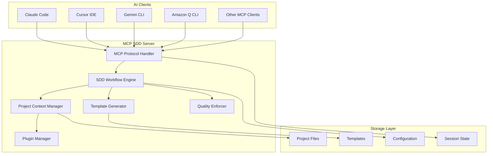
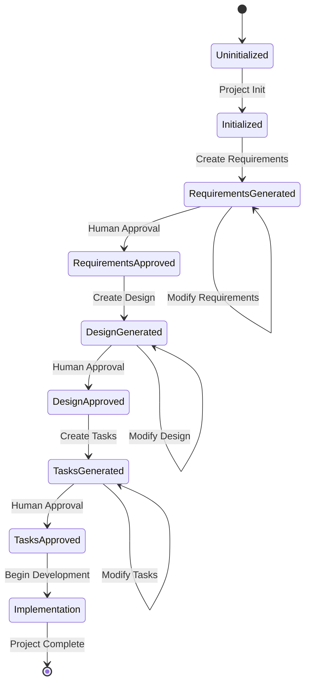
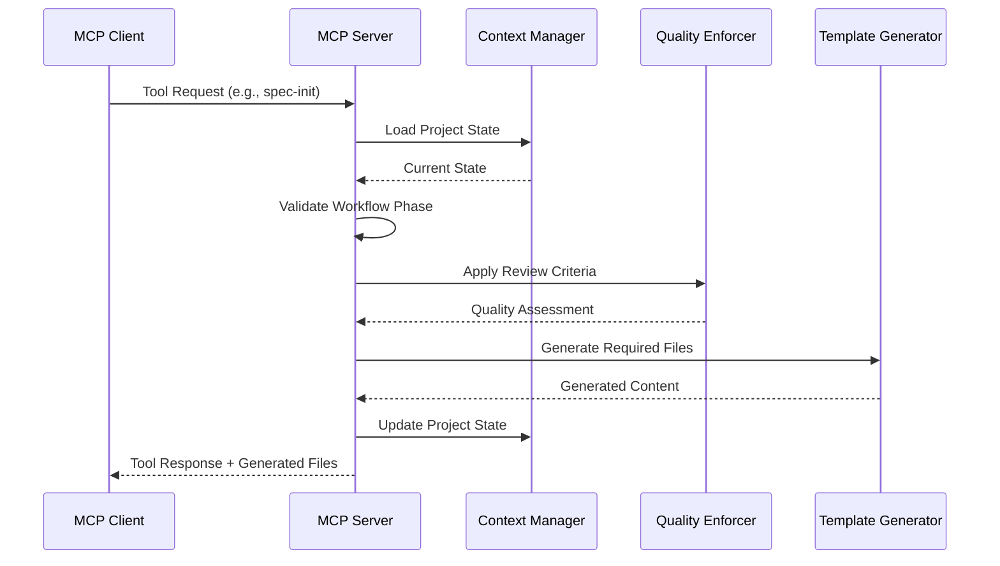

# Technical Design: MCP SDD Server

## Overview

The MCP SDD Server enables spec-driven development workflows across any MCP-compatible AI agent CLI or IDE by implementing a standardized Model Context Protocol server that provides structured development tools, project context management, and quality enforcement. This server transforms ad-hoc AI-assisted coding into systematic, production-ready development processes by exposing SDD workflow capabilities as MCP tools while maintaining project memory and enforcing quality gates throughout the development lifecycle.

**Users**: Developers using Claude Code, Cursor IDE, Gemini CLI, Amazon Q CLI, Codex CLI, or any MCP-compatible environment will utilize this server for structured development workflows, project initialization, requirements management, design specification, and task breakdown with automated quality enforcement.

**Impact**: Changes the current ad-hoc AI development approach by introducing structured, phased development with quality gates, project memory persistence, and consistent template-based documentation generation across all supported AI environments.

### Goals

- Implement complete MCP protocol compliance for cross-client compatibility  
- Provide equivalent functionality to all 10 cc-sdd slash commands via MCP tools
- Maintain persistent project context and memory across development sessions
- Enforce Linus-style code quality standards throughout development workflow
- Support multi-language development (English, Japanese, Traditional Chinese)
- Enable plugin extensibility for organizational customization

### Non-Goals

- Direct integration with version control systems (delegated to AI clients)
- Real-time collaboration features between multiple developers
- IDE-specific functionality beyond MCP protocol capabilities
- Database storage for project state (file-based persistence preferred)

## Architecture

### High-Level Architecture



### Technology Stack and Design Decisions

**Backend Framework**: Node.js with TypeScript
- **Selection**: TypeScript with strict type safety enabled
- **Rationale**: Full MCP SDK support, excellent tooling, static type checking prevents runtime errors
- **Alternatives**: Python (official MCP SDK available, but TypeScript chosen for better IDE integration)

**Architecture Pattern**: Clean Architecture with Hexagonal (Ports & Adapters)
- **Selection**: Clean Architecture with domain-driven design principles
- **Rationale**: Clear separation of concerns, high testability, framework independence, plugin extensibility
- **Alternatives**: MVC (insufficient separation), Microservices (overengineering for single server)

**Communication Protocol**: JSON-RPC 2.0 over stdin/stdout
- **Selection**: MCP-standardized JSON-RPC with stdio transport
- **Rationale**: MCP specification requirement, simplifies client integration, no network configuration needed
- **Alternatives**: HTTP REST (not MCP-compliant), WebSocket (adds complexity without benefit)

**Key Design Decisions**:

**Decision**: Plugin-First Architecture with Dependency Injection
- **Context**: Requirements specify extensibility for organizational customization and dynamic steering document loading
- **Alternatives**: Monolithic structure (easier but inflexible), Event-driven microservices (too complex), Configuration-only customization (insufficient)
- **Selected Approach**: Clean Architecture with dependency injection using TypeScript decorators and a plugin manager that dynamically loads extensions at runtime
- **Rationale**: Enables organizational customization while maintaining code quality standards, supports dynamic steering document integration, allows feature extensions without core modifications
- **Trade-offs**: Added architectural complexity vs. long-term extensibility and maintainability

**Decision**: File-Based Project State with JSON Schema Validation
- **Context**: Multi-session project context persistence with structured validation requirements
- **Alternatives**: In-memory state (lost on restart), Database storage (overkill for file-based projects), Simple JSON files (no validation)
- **Selected Approach**: Structured file system with JSON Schema validation for all metadata, project state stored in `.kiro` directory structure matching cc-sdd conventions
- **Rationale**: Maintains compatibility with existing cc-sdd tooling, enables version control integration, provides data integrity through schema validation, simplifies deployment
- **Trade-offs**: File I/O overhead vs. simplicity and cc-sdd compatibility

**Decision**: Template-Driven Code Generation with Handlebars
- **Context**: Requirement for standardized template generation across multiple languages and customizable formats
- **Alternatives**: String templating (limited features), React/JSX (overkill for text), Mustache (limited logic), Direct string manipulation (unmaintainable)
- **Selected Approach**: Handlebars templating engine with custom helpers for SDD-specific formatting, organized template hierarchies by language and document type
- **Rationale**: Logic-less templates enforce separation of concerns, excellent i18n support, extensive helper ecosystem, widely adopted with good TypeScript support
- **Trade-offs**: Template learning curve vs. powerful, maintainable template system

## System Flows

### SDD Workflow State Machine



### MCP Tool Execution Flow



## Requirements Traceability

| Requirement | Requirement Summary | Components | Interfaces | Flows |
|-------------|-------------------|------------|------------|-------|
| 1.1-1.5 | MCP Protocol Compliance | MCP Protocol Handler, Session Manager | MCPServer, ClientSession | MCP Tool Execution Flow |
| 2.1-2.7 | SDD Workflow Management | SDD Workflow Engine, State Manager | WorkflowEngine, StateManager | SDD Workflow State Machine |
| 3.1-3.6 | Project Context Management | Project Context Manager, File Monitor | ProjectContext, ContextPersistence | Context Loading/Saving |
| 4.1-4.6 | Code Quality Integration | Quality Enforcer, Linus Reviewer | QualityChecker, ReviewCriteria | Quality Assessment Flow |
| 5.1-5.5 | Multi-Language Support | i18n Manager, Locale Provider | InternationalizationService | Localization Flow |
| 6.1-6.6 | TypeScript Implementation | All Components | Typed Interfaces Throughout | All Flows |
| 7.1-7.7 | Template Management | Template Generator, File Manager | TemplateEngine, FileOperations | Template Generation Flow |
| 8.1-8.7 | Tool Integration | Tool Registry, Command Handler | ToolProvider, CommandInterface | Tool Registration/Execution |

## Components and Interfaces

### Core Layer

#### MCP Protocol Handler

**Responsibility & Boundaries**
- **Primary Responsibility**: Implements MCP protocol specification for JSON-RPC communication with AI clients
- **Domain Boundary**: Protocol layer - handles all MCP-specific communication and capability negotiation
- **Data Ownership**: Client sessions, protocol state, capability negotiation results
- **Transaction Boundary**: Per-client session with connection state management

**Dependencies**
- **Inbound**: AI clients (Claude Code, Cursor, etc.) via stdin/stdout JSON-RPC
- **Outbound**: SDD Workflow Engine for business logic execution
- **External**: @modelcontextprotocol/server-core TypeScript SDK

**Contract Definition**

```typescript
interface MCPServer {
  initialize(capabilities: ClientCapabilities): Promise<ServerCapabilities>;
  listTools(): Promise<Tool[]>;
  executeTool(request: ToolRequest): Promise<ToolResponse>;
  listResources(): Promise<Resource[]>;
  readResource(uri: string): Promise<ResourceContent>;
  listPrompts(): Promise<Prompt[]>;
  getPrompt(name: string, args?: Record<string, string>): Promise<PromptMessage>;
}

interface ClientSession {
  clientId: string;
  capabilities: ClientCapabilities;
  projectContext: ProjectContext;
  isActive: boolean;
  lastActivity: Date;
}
```

- **Preconditions**: Valid MCP client connection established via stdin/stdout
- **Postconditions**: All responses conform to MCP protocol specification
- **Invariants**: Session state consistency maintained throughout client lifecycle

#### SDD Workflow Engine

**Responsibility & Boundaries**
- **Primary Responsibility**: Orchestrates spec-driven development workflow phases and enforces progression rules
- **Domain Boundary**: Business logic - owns SDD workflow state transitions and validation
- **Data Ownership**: Workflow phase state, approval tracking, progression logic
- **Transaction Boundary**: Per-project workflow state with atomic phase transitions

**Dependencies**
- **Inbound**: MCP Protocol Handler for tool execution requests
- **Outbound**: Project Context Manager, Template Generator, Quality Enforcer
- **External**: JSON Schema validation library for spec.json validation

**Contract Definition**

```typescript
interface WorkflowEngine {
  initializeProject(description: string): Promise<ProjectInitResult>;
  generateRequirements(projectId: string): Promise<RequirementsResult>;
  generateDesign(projectId: string, autoApprove?: boolean): Promise<DesignResult>;
  generateTasks(projectId: string, autoApprove?: boolean): Promise<TasksResult>;
  validatePhaseTransition(from: WorkflowPhase, to: WorkflowPhase): ValidationResult;
  getProjectStatus(projectId: string): Promise<ProjectStatus>;
}

interface ProjectStatus {
  phase: WorkflowPhase;
  approvals: ApprovalState;
  readyForImplementation: boolean;
  lastUpdated: Date;
  completionPercentage: number;
}
```

- **Preconditions**: Valid project context exists for all operations except initialization
- **Postconditions**: Workflow state transitions maintain data consistency and approval requirements
- **Invariants**: Phase progression follows strict sequence (Requirements → Design → Tasks → Implementation)

### Context Management Layer

#### Project Context Manager

**Responsibility & Boundaries**
- **Primary Responsibility**: Maintains comprehensive project understanding and context across development sessions
- **Domain Boundary**: Context persistence - owns project memory, codebase analysis, and steering integration
- **Data Ownership**: Project metadata, codebase structure, steering documents, session context
- **Transaction Boundary**: Project-scoped consistency with atomic context updates

**Dependencies**
- **Inbound**: SDD Workflow Engine, MCP Protocol Handler
- **Outbound**: File system for persistence, Plugin Manager for steering document loading
- **External**: File system watchers, Git integration (optional)

**Contract Definition**

```typescript
interface ProjectContext {
  projectId: string;
  rootPath: string;
  metadata: ProjectMetadata;
  codebaseStructure: CodebaseStructure;
  steeringDocuments: SteeringDocument[];
  workflowState: WorkflowState;
  sessionHistory: SessionRecord[];
}

interface ContextPersistence {
  saveContext(context: ProjectContext): Promise<void>;
  loadContext(projectId: string): Promise<ProjectContext>;
  analyzeCodebase(rootPath: string): Promise<CodebaseStructure>;
  updateContext(projectId: string, updates: Partial<ProjectContext>): Promise<void>;
  refreshSteeringDocuments(projectPath: string): Promise<SteeringDocument[]>;
}
```

- **Preconditions**: Project root directory exists and is accessible
- **Postconditions**: Context changes persisted to file system with proper backup
- **Invariants**: Context consistency maintained across sessions and process restarts

#### Quality Enforcer

**Responsibility & Boundaries**
- **Primary Responsibility**: Applies Linus-style code review criteria and quality standards throughout development
- **Domain Boundary**: Quality assurance - owns review criteria, taste scoring, and improvement recommendations
- **Data Ownership**: Quality rules, review history, taste assessments, improvement suggestions
- **Transaction Boundary**: Per-review assessment with audit trail

**Dependencies**
- **Inbound**: SDD Workflow Engine during quality gate checks
- **Outbound**: Linus Review Steering Document for criteria, Logging for audit trail
- **External**: AST parsers for code analysis, Complexity analysis tools

**Contract Definition**

```typescript
interface QualityChecker {
  reviewCode(code: string, language: string): Promise<QualityAssessment>;
  reviewDesign(design: DesignDocument): Promise<QualityAssessment>;
  reviewRequirements(requirements: RequirementsDocument): Promise<QualityAssessment>;
  applyLinusReview(content: string, type: ReviewType): Promise<LinusAssessment>;
}

interface QualityAssessment {
  tasteScore: TasteScore; // Good, Passable, Garbage
  fatalIssues: Issue[];
  improvements: Improvement[];
  complexity: ComplexityMetrics;
  maintainabilityScore: number;
}

interface LinusAssessment {
  coreJudgment: 'Worth doing' | 'Not worth doing';
  reasoning: string;
  keyInsights: {
    dataStructure: string;
    complexity: string;
    riskPoints: string;
  };
  solution?: LinusSolution;
}
```

- **Preconditions**: Valid content provided for review with specified type/language
- **Postconditions**: Comprehensive quality assessment with actionable improvement recommendations
- **Invariants**: Review criteria consistent with Linus-style principles throughout all assessments

### Template and Generation Layer

#### Template Generator

**Responsibility & Boundaries**
- **Primary Responsibility**: Generates standardized SDD workflow files and maintains consistent project structure
- **Domain Boundary**: Template management - owns template definitions, rendering logic, and file generation
- **Data Ownership**: Template libraries, generation parameters, output formatting rules
- **Transaction Boundary**: Atomic file generation with rollback capability on failure

**Dependencies**
- **Inbound**: SDD Workflow Engine for file generation requests
- **Outbound**: File system for template storage and output, i18n Manager for localization
- **External**: Handlebars templating engine, File system utilities

**Contract Definition**

```typescript
interface TemplateEngine {
  generateSpec(projectData: ProjectData): Promise<SpecFiles>;
  generateRequirements(projectData: ProjectData): Promise<string>;
  generateDesign(designData: DesignData): Promise<string>;
  generateTasks(taskData: TaskData): Promise<string>;
  generateSteering(steeringType: SteeringType, context: ProjectContext): Promise<string>;
  customizeTemplate(templateId: string, customization: TemplateCustomization): Promise<void>;
}

interface SpecFiles {
  specJson: string;
  requirementsMd: string;
  directoryStructure: DirectorySpec[];
}

interface FileOperations {
  createDirectory(path: string): Promise<void>;
  writeFile(path: string, content: string): Promise<void>;
  ensureDirectoryStructure(structure: DirectorySpec[]): Promise<void>;
  backupExistingFiles(paths: string[]): Promise<BackupResult>;
}
```

- **Preconditions**: Valid template data provided with all required parameters
- **Postconditions**: Generated files conform to SDD standards and specified language/locale
- **Invariants**: Template consistency maintained across all generated files

### Extension Layer

#### Plugin Manager

**Responsibility & Boundaries**
- **Primary Responsibility**: Manages dynamic loading and execution of organizational customizations and extensions
- **Domain Boundary**: Extensibility - owns plugin lifecycle, custom steering integration, and feature extensions
- **Data Ownership**: Plugin registry, extension configurations, custom steering documents
- **Transaction Boundary**: Plugin-scoped operations with isolation between extensions

**Dependencies**
- **Inbound**: Project Context Manager for custom steering loading, All core components for extension points
- **Outbound**: File system for plugin discovery, Configuration system for plugin settings
- **External**: Dynamic import system, Plugin validation libraries

**Contract Definition**

```typescript
interface PluginManager {
  discoverPlugins(pluginPath: string): Promise<PluginInfo[]>;
  loadPlugin(pluginId: string): Promise<Plugin>;
  executePluginHook(hookName: string, context: HookContext): Promise<HookResult>;
  registerCustomSteering(steeringPath: string): Promise<CustomSteeringResult>;
  validatePlugin(plugin: Plugin): ValidationResult;
}

interface Plugin {
  id: string;
  version: string;
  hooks: PluginHook[];
  customTools?: CustomTool[];
  steeringDocuments?: CustomSteering[];
  initialize(context: PluginContext): Promise<void>;
  cleanup(): Promise<void>;
}

interface CustomSteering {
  filename: string;
  mode: 'Always' | 'Conditional' | 'Manual';
  patterns?: string[];
  content: string;
  priority: number;
}
```

- **Preconditions**: Plugin directory structure follows defined conventions
- **Postconditions**: Plugins loaded successfully with proper isolation and error handling
- **Invariants**: Core system functionality maintained regardless of plugin state

## Data Models

### Domain Model

**Core Concepts**:
- **Project Aggregate**: Root entity containing all project-related state, workflow phase, and metadata
- **Workflow Phase Entity**: Represents current development phase with approval states and transition rules
- **Context Entity**: Captures comprehensive project understanding including codebase structure and steering documents
- **Quality Assessment Value Object**: Immutable evaluation results with taste scoring and improvement recommendations

**Business Rules & Invariants**:
- Workflow phases must progress sequentially (Requirements → Design → Tasks → Implementation)
- Each phase requires explicit approval before progression to next phase
- Project context must remain consistent across all client sessions
- Quality assessments must apply Linus-style criteria consistently

### Logical Data Model

**Structure Definition**:

```typescript
interface ProjectMetadata {
  projectId: string;
  featureName: string;
  createdAt: Date;
  updatedAt: Date;
  language: 'en' | 'ja' | 'zh-TW';
  phase: WorkflowPhase;
  approvals: ApprovalState;
  readyForImplementation: boolean;
}

interface ApprovalState {
  requirements: PhaseApproval;
  design: PhaseApproval;
  tasks: PhaseApproval;
}

interface PhaseApproval {
  generated: boolean;
  approved: boolean;
  approvedBy?: string;
  approvedAt?: Date;
  version?: string;
}

interface CodebaseStructure {
  rootPath: string;
  fileTree: FileNode[];
  dependencies: DependencyInfo[];
  patterns: ArchitecturePattern[];
  technologies: TechnologyStack;
}

interface SteeringDocument {
  filename: string;
  mode: SteeringMode;
  patterns?: string[];
  content: string;
  lastUpdated: Date;
  checksum: string;
}
```

**Consistency & Integrity**:
- Foreign key relationships maintained between project phases and their generated files
- Temporal consistency enforced through audit trails and version tracking
- Cross-phase referential integrity through traceability mappings

### Physical Data Model

**File System Structure**:
```
.kiro/
├── steering/           # Steering documents
│   ├── product.md
│   ├── tech.md
│   ├── structure.md
│   ├── linus-review.md
│   └── custom/         # Organization-specific steering
├── specs/              # Specification documents
│   └── [feature-name]/
│       ├── spec.json   # Metadata and approval tracking
│       ├── requirements.md
│       ├── design.md
│       └── tasks.md
├── context/            # Project context cache
│   ├── codebase.json   # Analyzed codebase structure
│   └── sessions.json   # Session history
└── config/             # Server configuration
    ├── server.json     # MCP server settings
    ├── templates/      # Custom templates
    └── plugins/        # Plugin configurations
```

**JSON Schema Validation**:
- All `.json` files validated against strict schemas
- Schema versioning for backward compatibility
- Migration scripts for schema updates

## Error Handling

### Error Strategy

The MCP SDD Server implements layered error handling with graceful degradation, comprehensive logging, and user-friendly error messages that maintain development workflow continuity.

### Error Categories and Responses

**User Errors** (MCP Client Errors):
- Invalid tool parameters → Detailed parameter validation with suggested corrections
- Workflow phase violations → Clear explanation of required prerequisites and next steps
- Missing project context → Automatic project initialization guidance with template options

**System Errors** (Infrastructure Failures):
- File system access failures → Graceful fallback with temporary state management
- Template parsing errors → Default template fallback with error reporting
- Plugin loading failures → Plugin isolation with core functionality preservation

**Business Logic Errors** (Workflow Violations):
- Phase transition violations → State explanation with allowed next actions
- Quality gate failures → Detailed improvement recommendations with actionable steps
- Approval requirement violations → Clear approval workflow guidance

### Monitoring

- Structured logging with correlation IDs for cross-component tracing
- Error metrics aggregation for quality monitoring
- Health check endpoints for MCP client connectivity validation
- Performance monitoring for template generation and context loading

## Testing Strategy

### Unit Tests
- MCP Protocol Handler message parsing and response generation
- Workflow Engine state transitions and validation logic
- Template Generator rendering with various data inputs
- Quality Enforcer Linus-style assessment algorithms
- Plugin Manager dynamic loading and hook execution

### Integration Tests
- Full MCP tool execution workflows from client request to response
- Cross-component data flow from protocol handler through template generation
- File system persistence and context loading across server restarts
- Multi-language template generation with i18n integration
- Plugin system with custom steering document integration

### E2E Tests
- Complete SDD workflow execution via MCP protocol simulation
- Multi-client session management with independent project contexts
- Quality gate enforcement throughout development phases
- Template customization and organizational plugin integration
- Error recovery and graceful degradation scenarios

### Performance Tests
- Concurrent client session management under load
- Large codebase analysis and context loading performance
- Template generation speed with complex project structures
- Memory usage optimization for long-running server instances

## Security Considerations

### Threat Modeling
- **File System Access**: Restrict file operations to project directories with path validation
- **Plugin Execution**: Sandbox plugin execution with limited system access
- **Client Authentication**: Validate MCP client identity and authorize tool access

### Security Controls
- Input validation for all MCP tool parameters using JSON Schema
- File path sanitization to prevent directory traversal attacks
- Plugin signature verification for custom extensions
- Audit logging for all file system modifications and quality assessments

### Data Protection
- Project context encryption for sensitive organizational data
- Secure plugin loading with integrity verification
- Session isolation between concurrent clients
- Temporary file cleanup with secure deletion

## Performance & Scalability

### Target Metrics
- Tool execution response time: <500ms for simple operations, <2s for complex generation
- Concurrent client support: 10+ simultaneous sessions per server instance
- Memory usage: <500MB baseline, <50MB per active project context
- Template generation: <1s for standard templates, <5s for complex customizations

### Scaling Approaches
- **Horizontal Scaling**: Multiple server instances with shared file system for large teams
- **Vertical Scaling**: Memory optimization for large codebases and extensive context
- **Caching Strategy**: Template compilation caching, codebase analysis memoization
- **Lazy Loading**: On-demand plugin loading, progressive context building