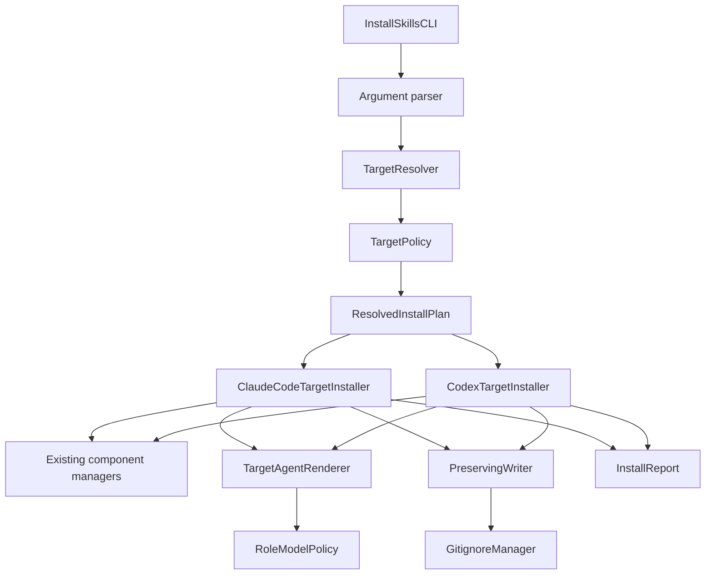
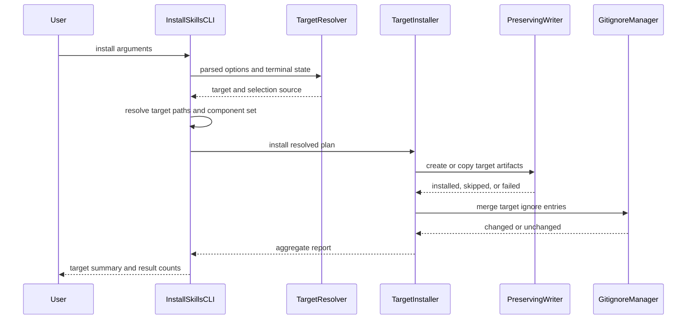

# Design: Target-Aware LLM Optimization

## Overview

This design extends the unified component installer with a target-resolution step and two native output strategies: Claude Code and Codex. Shared source assets remain canonical. A small target policy selects native paths, output formats, model routes, and ignore entries without introducing provider logic into the component managers.

The implementation preserves the existing CLI entry point and manager discovery logic. Target-specific rendering is isolated at the installer boundary, where Markdown agents can be rendered either as Claude Code Markdown or Codex TOML. File writes become preserve-first and report installed, skipped, and failed results. Compact SDD handoffs remain unchanged and are referenced by phase skills during delegated work.

## Goals

- Resolve `codex` or `claude-code` before the first filesystem write.
- Generate only native artifacts for the selected primary target.
- Route high-level roles to Sol or Opus and default implementation/TDD roles to Luna or Sonnet.
- Make phase skills request the specialist role so model metadata affects real work.
- Update `.gitignore` safely and idempotently.
- Preserve existing automation, custom paths, user-authored files, and unrelated integrations.

## Non-Goals

- Live model entitlement, pricing, or availability checks.
- Changes to compact handoff generation or token estimation.
- Automatic cleanup of artifacts from a prior target.
- Reinterpreting Codex command policy files as prompt guidance.

## Architecture Pattern

The design uses the repository's existing hexagonal structure with a strategy boundary inside the CLI layer:

- `InstallSkillsCLI` remains the orchestration entry point.
- Pure target policy resolves selection, default paths, model routes, and skill routes.
- Claude Code and Codex target installers adapt shared assets to native formats.
- A preserve-first writer owns filesystem safety and result classification.
- Component managers continue to discover packaged source assets.

This is an extension approach, not a second installer. It avoids provider conditionals throughout managers and keeps the target difference at one boundary.

## Architecture Decisions

### AD-1: Resolve the Primary Target Before Planning Writes

Argument parsing records an optional explicit target and which path flags were explicitly supplied. `TargetResolver` then resolves the primary target before components are selected or directories are created.

Resolution precedence is:

1. Explicit `--target`.
2. Legacy `--codex`, treated as a deprecated Codex target alias.
3. Interactive prompt for a full profile in a TTY.
4. Claude Code compatibility default for non-interactive or non-full installs.

A conflict between `--target claude-code` and `--codex` is a usage error. `--all-tools` remains an additive integration flag and does not change this precedence.

### AD-2: Keep Shared Assets Canonical

Root `skills/`, `agents/`, `rules/`, `contexts/`, `hooks/`, and `steering/` remain the source assets shipped in the package. Target installers render or copy them into native project locations. Separate provider-specific source trees are not introduced.

### AD-3: Use Native Discovery Locations

Claude Code keeps the current `.claude/` structure. Codex uses `.agents/skills/`, `.codex/agents/`, `.codex/hooks.json`, and `AGENTS.md`. Codex rules and contexts that are prompt guidance are stored below `.codex/guidance/` and referenced by `AGENTS.md`; they are not written below `.codex/rules/`.

### AD-4: Centralize Role Routing

One immutable role policy maps each supported role to a task class and provider-specific model settings. Renderers consume this policy. `gpt-5.6-luna` is the default Codex model for implementation and TDD roles, while `gpt-5.6-terra` remains supported without a default role.

### AD-5: Preserve Existing Files by Default

Create-only writes use exclusive file creation. Copies check the destination first and report a skip. Existing content is never compared and overwritten as part of a normal install. `.gitignore` is the sole merge operation and uses a managed block plus an atomic same-directory replacement.

### AD-6: Convert Only Executable Codex Hook Semantics

Codex hook configuration uses command handlers. Session-start context loading and stop-time repository reminders map to a small packaged Node.js hook runner. Hook guidance that has no reliable Codex lifecycle equivalent is referenced through `AGENTS.md` or the appropriate phase skill instead of being installed as inert lifecycle configuration.

## Component Diagram



## Installation Sequence



## Proposed Source Layout

```text
src/cli/
├── install-skills.ts                     # Existing orchestration entry point
├── install-target.ts                     # Target types, policy, paths, resolution
├── tool-support/
│   ├── claude-code.ts                    # Claude root and agent generation
│   ├── codex.ts                          # Codex root, guidance, agents, hooks
│   └── target-agent-renderer.ts           # Shared metadata/body rendering
├── hooks/
│   └── codex-hook-runner.ts               # Packaged command-hook runtime
└── utils/
    ├── preserving-writer.ts               # Create-only copy and write operations
    └── gitignore-manager.ts               # Managed ignore block and atomic update
```

Existing tests stay grouped below `src/__tests__/unit/cli/`, with focused suites for each new module and integration fixtures for complete output trees.

## Output Mapping

| Component | Claude Code target | Codex target | Conversion |
|---|---|---|---|
| Root guidance | `CLAUDE.md` | `AGENTS.md` | Generate only when absent |
| Skills | `.claude/skills/<name>/` | `.agents/skills/<name>/` | Preserve `SKILL.md` and resources |
| Steering | `.spec/steering/` | `.spec/steering/` | Target-independent copy |
| Rules | `.claude/rules/*.md` | `.codex/guidance/rules/*.md` | Codex root references guidance paths |
| Contexts | `.claude/contexts/*.md` | `.codex/guidance/contexts/*.md` | Codex root references on-demand guidance |
| Agents | `.claude/agents/*.md` | `.codex/agents/*.toml` | Render native model metadata and instructions |
| Hooks | `.claude/hooks/<event>/*.md` | `.codex/hooks.json` plus `.codex/hooks/sdd-hook-runner.mjs` | Native lifecycle mapping |

Custom path flags override the corresponding default after target resolution. An explicit Codex rules destination below `.codex/rules/` is rejected with guidance to use a prompt-guidance path, preventing a semantic collision with Codex command policy.

## Data Models

### InstallTarget and Selection

```typescript
export type InstallTarget = 'codex' | 'claude-code';

export type TargetSelectionSource =
  | 'explicit'
  | 'legacy-codex'
  | 'interactive'
  | 'compatibility-default';

export interface ResolvedTarget {
  target: InstallTarget;
  source: TargetSelectionSource;
  deprecationNotice?: string;
}
```

**Invariants:**

- `target` is one of the two supported values.
- `legacy-codex` always resolves to `codex`.
- An interactive cancellation produces no `ResolvedTarget` and no writes.

### Path Overrides and Resolved Paths

```typescript
export interface PathOverrides {
  skills?: string;
  steering?: string;
  rules?: string;
  contexts?: string;
  agents?: string;
  hooks?: string;
}

export interface ResolvedInstallPaths {
  skills: string;
  steering: string;
  rules: string;
  contexts: string;
  agents: string;
  hooks: string;
  rootGuidance: string;
}
```

**Invariants:**

- Defaults come from the selected target.
- An explicit override affects only its component.
- Generated child names are validated as single relative path segments.
- Codex prompt guidance never resolves below `.codex/rules/`.

### Role Model Policy

```typescript
export type AgentRole =
  | 'planner'
  | 'architect'
  | 'reviewer'
  | 'security-auditor'
  | 'implementer'
  | 'tdd-guide';

export type TaskClass = 'high-level' | 'implementation';

export interface RoleModelRoute {
  taskClass: TaskClass;
  codex: {
    model: 'gpt-5.6-sol' | 'gpt-5.6-terra' | 'gpt-5.6-luna';
    reasoningEffort: 'xhigh' | 'max';
  };
  claudeCode: {
    model: 'opus' | 'sonnet';
  };
}
```

**Invariants:**

- Planner, architect, reviewer, and security-auditor are `high-level`.
- Implementer and TDD-guide are `implementation` and use the default Luna/max route.
- The supported Codex model constants also contain `gpt-5.6-terra`, but no default role selects it.

### Installation Results

```typescript
export interface InstallFailure {
  name: string;
  path: string;
  error: string;
}

export interface InstallResult {
  installed: string[];
  skipped: string[];
  failed: InstallFailure[];
}

export interface InstallReport {
  target: InstallTarget;
  components: Partial<Record<ComponentType, InstallResult>>;
  gitignore: 'created' | 'updated' | 'unchanged' | 'failed';
  warnings: string[];
}
```

**Invariants:**

- One artifact appears in exactly one result category.
- A report with a failed artifact is not printed as a complete success.
- Skips are normal idempotent outcomes, not errors.

## Components

### TargetResolver

**Type:** CLI service

**Purpose:** Resolve and validate the primary installation target before filesystem mutation.

**Responsibilities:**

- Validate `--target` and missing option values during argument parsing.
- Detect a conflict with the legacy `--codex` flag.
- Prompt only for an interactive full-profile install.
- Select the Claude Code compatibility default without blocking non-interactive use.
- Return the selection source for notices and tests.

**Interface:**

```typescript
export interface TargetPromptIO {
  isInteractive(): boolean;
  chooseTarget(): Promise<InstallTarget | null>;
  writeNotice(message: string): void;
}

export function resolveInstallTarget(
  options: CLIOptions,
  io: TargetPromptIO,
): Promise<ResolvedTarget>;
```

**Dependencies:** Built-in `node:readline/promises` through the production `TargetPromptIO`; injected test doubles in unit tests.

**Error Handling:** Invalid values and conflicting flags raise `CliUsageError`. Cancellation raises `InstallCancelledError` and maps to exit code 130.

### TargetPolicy

**Type:** Pure configuration module

**Purpose:** Provide native path defaults, ignore entries, supported model identifiers, role routes, and skill routes.

**Responsibilities:**

- Resolve native default paths per target.
- Apply explicit component path overrides.
- Expose the immutable `ROLE_MODEL_ROUTES` map.
- Expose target-specific ignore entries.
- Expose phase-skill-to-role mappings.

**Interface:**

```typescript
export interface TargetPolicy {
  target: InstallTarget;
  defaultPaths: ResolvedInstallPaths;
  ignoreEntries: readonly string[];
}

export function getTargetPolicy(target: InstallTarget): TargetPolicy;
export function resolveInstallPaths(
  policy: TargetPolicy,
  overrides: PathOverrides,
): ResolvedInstallPaths;
```

**Dependencies:** None.

**Error Handling:** Invalid resolved path semantics produce `CliUsageError` before directory creation.

### PreservingWriter

**Type:** Filesystem adapter

**Purpose:** Make installation idempotent and protect user-authored files.

**Responsibilities:**

- Create a file with exclusive mode.
- Copy a file only when the destination is absent.
- Copy skill resource trees without replacing existing files.
- Validate generated child names before joining paths.
- Return installed or skipped outcomes rather than relying on thrown `EEXIST` errors.

**Interface:**

```typescript
export type WriteOutcome = 'installed' | 'skipped';

export interface PreservingWriter {
  writeIfAbsent(filePath: string, content: string): Promise<WriteOutcome>;
  copyIfAbsent(source: string, destination: string): Promise<WriteOutcome>;
  copyTreePreserving(source: string, destination: string): Promise<InstallResult>;
}
```

**Dependencies:** `node:fs/promises` and `node:path`.

**Error Handling:** Permission, invalid-path, and I/O errors retain the destination and return a path-aware failure.

### TargetAgentRenderer

**Type:** Format adapter

**Purpose:** Render one canonical Markdown agent as native Claude Code Markdown or Codex TOML.

**Responsibilities:**

- Parse source YAML frontmatter using the existing manager metadata behavior.
- Preserve `name`, `description`, `role`, `expertise`, and the complete instruction body.
- Add the model selected by `ROLE_MODEL_ROUTES`.
- Add Codex reasoning effort.
- Serialize TOML strings without interpolation or code execution.
- Reject an unknown role instead of silently inheriting an expensive model.

**Interface:**

```typescript
export interface SourceAgent {
  name: string;
  description: string;
  role: AgentRole;
  expertise: string;
  instructions: string;
}

export function renderClaudeCodeAgent(agent: SourceAgent): string;
export function renderCodexAgent(agent: SourceAgent): string;
```

**Dependencies:** `RoleModelPolicy`; source content from `AgentManager`.

**Error Handling:** Missing metadata, unknown roles, and serialization failures are scoped to the affected agent and recorded in `InstallResult.failed`.

### ClaudeCodeTargetInstaller

**Type:** Target strategy

**Purpose:** Install the selected components into Claude Code-native locations.

**Responsibilities:**

- Copy skills, rules, contexts, hooks, and steering through `PreservingWriter`.
- Render agents with `model: opus` or `model: sonnet`.
- Generate `CLAUDE.md` only when absent.
- Return `.claude/` as its generated local ignore entry.
- Avoid Codex artifacts unless an additive integration flag explicitly requests them.

**Interface:**

```typescript
export interface TargetInstaller {
  install(
    plan: ResolvedInstallPlan,
    components: readonly ComponentType[],
  ): Promise<InstallReport>;
}
```

**Dependencies:** Existing managers, `TargetAgentRenderer`, `PreservingWriter`, and root templates.

**Error Handling:** Component failures are aggregated and set a non-zero process exit code after the report is printed.

### CodexTargetInstaller

**Type:** Target strategy

**Purpose:** Convert and install shared SDD assets into Codex-native locations.

**Responsibilities:**

- Copy skills to `.agents/skills/`.
- Render agent TOML below `.codex/agents/`.
- Copy rules and contexts below `.codex/guidance/` for on-demand references.
- Generate concise `AGENTS.md` tables from installed component descriptors and effective paths.
- Install the compiled hook runner and generate `.codex/hooks.json`.
- Return `.agents/` and `.codex/` as generated local ignore entries.
- Avoid Claude Code artifacts unless an additive integration flag explicitly requests them.

**Dependencies:** Existing managers, `TargetAgentRenderer`, `PreservingWriter`, Codex template, and compiled hook runner.

**Error Handling:** Invalid TOML source metadata, hook configuration failures, and missing templates are reported per artifact. The root file can fall back to a minimal header, matching current behavior.

### GitignoreManager

**Type:** Filesystem service

**Purpose:** Add target-specific ignore entries without disturbing user content.

**Responsibilities:**

- Read an existing `.gitignore` or treat an absent file as empty.
- Detect equivalent forms with an optional root slash and trailing slash.
- Maintain one bounded SDD block.
- Preserve content and newline style outside the managed block.
- Write an updated file through an atomic same-directory replacement.
- Return unchanged when every required entry is already covered.

**Managed Block:**

```gitignore
# BEGIN sdd-mcp generated agent files
.agents/
.codex/
# END sdd-mcp generated agent files
```

**Interface:**

```typescript
export interface GitignoreUpdate {
  status: 'created' | 'updated' | 'unchanged';
  added: string[];
}

export function updateGeneratedIgnores(
  projectRoot: string,
  entries: readonly string[],
): Promise<GitignoreUpdate>;
```

**Dependencies:** `node:fs/promises`, `node:path`, and the same-directory atomic writer.

**Error Handling:** The temporary file is removed after failure. The original `.gitignore` remains intact, the report records failure, and the overall install exits non-zero.

### InstallSkillsCLI Integration

**Type:** CLI orchestrator

**Purpose:** Coordinate target resolution and delegate installation without owning provider-specific rendering.

**Responsibilities:**

- Parse `--target` and retain path override intent.
- Resolve target before computing default paths.
- Select one target installer from a fixed registry.
- Preserve component profile selection and additive integrations.
- Invoke `GitignoreManager` after target artifacts exist.
- Print target, source, installed, skipped, warning, and failure totals once.

**Dependencies:** `TargetResolver`, `TargetPolicy`, target installer registry, and `GitignoreManager`.

**Error Handling:** Usage and cancellation errors occur before writes. Install failures produce a complete report and a non-zero exit code.

## Model Routing

| Role | Task class | Codex model | Codex effort | Claude Code model |
|---|---|---|---|---|
| planner | high-level | `gpt-5.6-sol` | xhigh | `opus` |
| architect | high-level | `gpt-5.6-sol` | xhigh | `opus` |
| reviewer | high-level | `gpt-5.6-sol` | xhigh | `opus` |
| security-auditor | high-level | `gpt-5.6-sol` | xhigh | `opus` |
| implementer | implementation | `gpt-5.6-luna` | max | `sonnet` |
| tdd-guide | implementation | `gpt-5.6-luna` | max | `sonnet` |

`gpt-5.6-luna` is the default Codex model for implementation and TDD roles. `gpt-5.6-terra` remains supported but is not selected by a default role.

## Phase Skill Delegation

Shared skill instructions receive a compact, target-neutral delegation section. The host can interpret the instruction through its native subagent mechanism.

| Skill | Specialist role | Context input |
|---|---|---|
| `sdd-requirements`, `sdd-tasks`, `sdd-steering`, `sdd-steering-custom` | planner | Compact handoff plus steering needed for the phase |
| `sdd-design` | architect | Approved requirements handoff plus architecture steering |
| `sdd-implement`, `simple-task` | implementer | Approved task handoff and focused source files |
| `sdd-test-gen` | tdd-guide | Focused implementation and test conventions |
| `sdd-review` | reviewer | Diff, focused files, and acceptance criteria |
| `sdd-security-check` | security-auditor | Focused files, threat context, and security requirements |

Each instruction follows the same sequence:

1. Request the named specialist when the host supports configured subagents.
2. Pass compact context by default.
3. Wait for and integrate the specialist result.
4. If the specialist or configured model is unavailable, report the fallback and continue in the current agent.

The commit skill remains in the current agent because it is a deterministic repository operation and has no approved specialist route.

## Codex Hook Mapping

| Packaged hook intent | Codex representation | Rationale |
|---|---|---|
| Load project context at session start | `SessionStart` command handler | Reads workflow state and returns concise additional context |
| Remind about uncommitted changes at session end | `Stop` command handler | Read-only git status check with a concise message |
| Save session summary | `AGENTS.md` guidance | Codex transcript format is not a stable storage contract |
| Validate SDD phase order | Phase skill instructions and `AGENTS.md` | Skill invocation is not a stable tool matcher |
| Check test coverage before edits | TDD-guide and implementer instructions | Enforcement belongs with implementation workflow |
| Log tool execution | Not enabled by default | Avoids extra storage, privacy risk, and token noise |
| Update spec status after phase work | SDD MCP approval tools | Workflow state already has an authoritative mutation path |

The generated runner uses only Node.js built-ins, reads JSON from standard input, performs read-only repository inspection, and writes protocol output to standard output. Installation copies the compiled script but does not execute it. Codex still applies its normal project trust review before command hooks run.

## Gitignore Update Algorithm

1. Resolve the selected target's ignore entries.
2. Read `.gitignore` as UTF-8; record LF or CRLF style.
3. Parse an existing SDD managed block if present.
4. Normalize candidate patterns by removing one leading slash and trailing slashes.
5. Treat an existing equivalent pattern outside the block as coverage and do not duplicate it.
6. Union missing entries into the managed block in stable lexical order.
7. If content is unchanged, return `unchanged` without writing.
8. Write the complete new content to a unique sibling temporary file.
9. Preserve the original mode when replacing an existing file.
10. Rename the temporary file over `.gitignore` and remove the temporary file after failure.

The operation never removes ignore entries, comments, blank lines, negation patterns, or user ordering outside the managed block.

## Error Handling Strategy

| Error category | Example | Behavior | Exit status |
|---|---|---|---|
| Usage | Invalid target or missing value | Print usage error before writes | 1 |
| Conflict | `--target claude-code --codex` | Explain incompatible options before writes | 1 |
| Cancellation | User closes interactive selection | Print cancellation; create nothing | 130 |
| Existing destination | Agent or root guidance exists | Preserve and report skipped | 0 |
| Source format | Agent role missing from policy | Fail that artifact and continue report | 1 after report |
| Filesystem | Permission or invalid destination | Preserve existing data and report path | 1 after report |
| Gitignore update | Atomic replacement fails | Retain original and mark install incomplete | 1 after report |
| Optional integration | Antigravity link cannot be created | Keep existing scoped reporting behavior | 1 after report |

No catch block converts a failed target install into an unconditional success message.

## Security Considerations

- Target and profile values use fixed unions, not free-form dispatch names.
- Generated child names reject separators, `.` segments, and `..` segments.
- Explicit custom paths remain supported, but generated child paths cannot escape them.
- TOML and JSON generation uses serializers; source text is data and is never evaluated.
- Installation does not run model calls, hook scripts, or generated configuration.
- Hook commands use fixed executable and argument forms and receive no interpolated model output.
- Error reports include component and destination but omit environment values and unrelated content.
- Atomic replacement prevents partial `.gitignore` writes.
- Existing root guidance and agent files are treated as user-owned.

## Token Efficiency

- Only one primary target's discoverable directories are generated.
- `AGENTS.md` and `CLAUDE.md` list or reference components instead of copying full bodies.
- Codex rules and contexts remain reference files below `.codex/guidance/`.
- Skills retain progressive disclosure and load their full instructions only when invoked.
- Phase delegation passes compact handoffs by default.
- Sol and Opus are limited to approved high-level roles; Luna and Sonnet handle implementation and TDD roles.
- Terra remains supported but is not activated by default.

## Testing Strategy

### Unit Tests

**Target resolution matrix:**

- Explicit Codex and Claude Code values.
- Invalid and missing target values.
- Full-profile TTY prompt selection and cancellation.
- Non-interactive Claude Code fallback.
- Legacy `--codex` alias and conflict detection.
- Additive `--all-tools` behavior.

**Policy and paths:**

- Every default target path.
- One override at a time and combined overrides.
- Rejection of Codex prompt guidance below `.codex/rules/`, including normalized `..` traversal forms.
- Exact role-to-model and skill-to-role mappings.
- Luna/max is the default implementation route; Terra has no default role.

**Rendering:**

- Claude YAML frontmatter contains the correct model and preserved metadata.
- Codex TOML contains required fields, exact model, effort, and escaped instructions.
- Unknown roles fail without producing a partial file.
- Root guidance contains only selected component paths.

**File safety:**

- Existing destination returns skipped and preserves bytes.
- Skill trees install missing files without replacing existing files.
- `.gitignore` creation, update, equivalent-rule detection, CRLF preservation, managed-block reuse, and repeated-run stability.
- Atomic update failure retains the original file.

### Integration Tests

Use temporary repositories and packaged fixture assets to verify:

1. Full Claude Code output tree with no Codex primary artifacts.
2. Full Codex output tree with no Claude Code primary artifacts.
3. Native agent contents and model routes for all six roles.
4. Codex `hooks.json` references the installed runner.
5. A second identical run changes no file bytes.
6. Switching target adds the second target without removing the first.
7. Custom paths appear in generated root guidance.
8. A component failure yields a non-zero result and a path-aware report.

### Quality Gates

- `npm run typecheck`
- `npm run lint`
- Focused Jest unit and integration suites
- Project coverage thresholds from `jest.config.js`
- `npm pack --dry-run` verification that compiled target support and hook runner are published

## Migration and Compatibility

- The default lean install remains Claude Code-oriented when no target is supplied.
- A non-interactive full install remains Claude Code-oriented and emits a migration notice.
- An interactive full install introduces the target prompt.
- `--codex` becomes a deprecated target alias and prints its replacement.
- `--all-tools` and `--antigravity` remain explicit additive integrations.
- Existing `.claude/`, `.agents/`, `.codex/`, root guidance, and steering files are never removed.
- Custom path flags retain precedence over target defaults.
- Generated result reporting adds skipped entries while retaining installed and failed categories.

## Requirement Traceability

| Requirement | Design elements | Primary verification |
|---|---|---|
| FR-1 | Argument parser, TargetResolver | Explicit and invalid target tests |
| FR-2 | TargetPromptIO, TargetResolver | TTY prompt and cancellation tests |
| FR-3 | Resolution precedence, migration policy | Non-interactive and legacy flag tests |
| FR-4 | ClaudeCodeTargetInstaller | Claude full-tree integration test |
| FR-5 | CodexTargetInstaller, hook mapping | Codex full-tree integration test |
| FR-6 | TargetPolicy, target strategies | Cross-target absence assertions |
| FR-7 | RoleModelPolicy, Codex renderer | Exact Codex model-route tests |
| FR-8 | RoleModelPolicy, Claude renderer | Exact Claude model-route tests |
| FR-9 | Phase skill delegation map | Skill content and fallback tests |
| FR-10 | GitignoreManager | Create, update, and deduplication tests |
| FR-11 | PreservingWriter, InstallResult | Existing-file and repeated-run tests |
| FR-12 | Help text, README, install guide | Documentation checks |
| NFR-1 | Reference-only root guidance, target isolation | Output size and path assertions |
| NFR-2 | Pure local policy and rendering | Network-free integration tests |
| NFR-3 | Fixed unions, path validation, serializers | Invalid-input and escape tests |
| NFR-4 | Compatibility resolution and additive flags | Legacy command matrix |
| NFR-5 | Test suites and quality gates | CI validation |

## Risks and Mitigations

| Risk | Impact | Mitigation |
|---|---|---|
| GPT-5.6 preview access is unavailable | Spawned Codex specialist can fail | Generated skill reports fallback and continues with current agent |
| Codex hook schema evolves | Hook config can stop loading | Keep hook generation isolated and covered by golden fixtures |
| Existing automation depends on additive `--codex` semantics | Upgrade surprise | Deprecation notice, conflict tests, and release documentation |
| Guidance conversion loads too much context | Token savings regress | Store Codex guidance as referenced files and keep root summaries compact |
| Partial writes damage user configuration | Repository disruption | Exclusive creates and atomic `.gitignore` replacement |
| Custom paths point to misleading Codex locations | Incorrect runtime behavior | Validate semantic collisions and render effective paths in root guidance |

## Linus-Style Quality Review

### Data Structures First

One resolved plan contains the target, path set, component set, and selection source. The target strategy consumes that plan. This removes scattered provider booleans and path special cases.

### Eliminate Special Cases

Legacy `--codex`, prompt selection, and compatibility fallback all normalize to the same `ResolvedTarget`. Installed, skipped, and failed outcomes use one result structure across managers and renderers.

### Simplicity

The existing installer remains the sole orchestrator. Target differences live in two strategies and one immutable policy. No model provider SDK or remote discovery service is added.

### Never Break Userspace

Non-interactive defaults, lean behavior, custom path precedence, additive integrations, and existing files are preserved. New failures are raised before writes or reported without destructive cleanup.

### Final Assessment

The design is proportionate to the feature: one resolution boundary, two native adapters, one model policy, and one safe write path. It extends established managers without duplicating the SDD workflow or introducing a parallel configuration system.

## Dependencies

### External

- Node.js built-ins: `fs`, `path`, and `readline/promises`.
- Existing project dependencies only; no new runtime package is required.

### Internal

- `InstallSkillsCLI`
- `SkillManager`, `RulesManager`, `ContextManager`, `AgentManager`, and `HookLoader`
- `generateCodexAgentsMd` and existing root templates
- Packaged component asset directories
- SDD compact handoff and approval workflow
