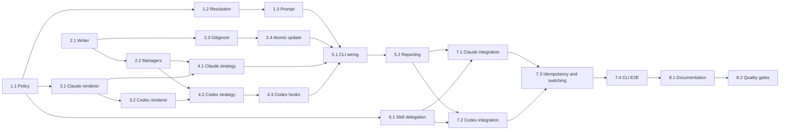

# Tasks: Target-Aware LLM Optimization

## Overview

Implement the approved design as test-first slices around the existing unified installer. Foundation tasks establish target policy and preserve-first writes. Format and target adapters follow. CLI wiring happens only after both target strategies are independently tested. Full-tree integration and CLI journey tests close the feature.

Every implementation task follows:

1. **RED:** Add focused tests and confirm the new assertions fail for the intended reason.
2. **GREEN:** Implement the smallest behavior that passes the new tests.
3. **REFACTOR:** Remove duplication and improve naming while the focused suite remains green.

## Test Pyramid Budget

The planned scenario budget is 60 focused scenarios:

| Level | Target share | Planned scenarios | Scope |
|---|---:|---:|---|
| Unit | 70% | 42 | Policy, resolution, rendering, file safety, reporting |
| Integration | 20% | 12 | Target strategies, output trees, switching, package assets |
| E2E | 10% | 6 | Interactive and automated CLI journeys |

Scenario counts can increase when defects reveal missing boundaries, but the suite SHALL retain a unit-heavy pyramid.

## Task Groups

### 1. Target Policy and Resolution

#### 1.1 Define target, path, model, and skill-routing policy

**Status:** [x]

**Component:** `src/cli/install-target.ts`

**Type:** Unit Test → Implementation

**Estimated Effort:** M

**Dependencies:** None

**Requirements:** FR-1, FR-4, FR-5, FR-6, FR-7, FR-8, FR-9, NFR-1, NFR-3

**Test Scenarios:**

1. Claude Code policy exposes the existing `.claude/` paths and `.claude/` ignore entry.
2. Codex policy exposes `.agents/skills/`, `.codex/agents/`, guidance, hooks, and root paths.
3. Every supported role has the exact approved model and Codex effort.
4. `gpt-5.6-sol` is the default implementation/TDD route with `medium` effort; `gpt-5.6-luna` and `gpt-5.6-terra` remain supported but have no default role.
5. Every routed skill maps to the approved specialist.
6. Explicit path overrides replace only their corresponding defaults.
7. A Codex guidance path below `.codex/rules/` is rejected.

**TDD Cycle:**

1. **RED:** Create `src/__tests__/unit/cli/install-target.test.ts` with exact policy, route, and invariant assertions.
2. **GREEN:** Add fixed union types, immutable policy constants, `getTargetPolicy()`, and `resolveInstallPaths()`.
3. **REFACTOR:** Freeze shared data, remove duplicated provider strings, and keep path validation pure.

**Acceptance Criteria:**

- [ ] All approved default paths and model routes are asserted exactly.
- [ ] Sol/medium is assigned to implementation and TDD roles; Luna and Terra have no default role.
- [ ] Invalid target and semantic path collisions are type-safe or rejected.
- [ ] The module has no filesystem or network dependency.

#### 1.2 Parse and resolve explicit, legacy, and compatibility targets

**Status:** [x]

**Component:** Argument parser and `TargetResolver`

**Type:** Unit Test → Implementation

**Estimated Effort:** M

**Dependencies:** 1.1

**Requirements:** FR-1, FR-3, NFR-3, NFR-4

**Test Scenarios:**

1. `--target codex` and `--target claude-code` resolve explicitly.
2. Missing and unsupported target values fail before a writer is invoked.
3. `--codex` resolves to Codex and returns a deprecation notice.
4. `--target claude-code --codex` fails as a conflict.
5. `--target codex --codex` resolves once without conflict.
6. A non-interactive full install defaults to Claude Code with a notice.
7. A lean install without a target retains the Claude Code compatibility default.
8. `--all-tools` remains additive and does not change the primary target.

**TDD Cycle:**

1. **RED:** Extend CLI argument tests and add pure resolver tests with a writer spy proving zero pre-resolution writes.
2. **GREEN:** Add target fields and path-override intent to `CLIOptions`; implement precedence and typed usage errors.
3. **REFACTOR:** Normalize every path to one `ResolvedTarget` result and remove downstream provider booleans from target choice.

**Acceptance Criteria:**

- [ ] Invalid commands exit through a usage error before mutation.
- [ ] Legacy behavior and warnings match the approved migration policy.
- [ ] Explicit target selection always wins over compatibility fallback.
- [ ] Existing component and integration flags retain their meanings.

#### 1.3 Implement the interactive full-profile prompt

**Status:** [x]

**Component:** `TargetPromptIO`

**Type:** Unit Test → Implementation

**Estimated Effort:** M

**Dependencies:** 1.2

**Requirements:** FR-2, FR-3, NFR-2

**Test Scenarios:**

1. A full profile in a TTY with no target prompts exactly once.
2. Codex and Claude Code selections resolve with source `interactive`.
3. Cancellation produces `InstallCancelledError` and no writes.
4. Non-interactive input never invokes the prompt.
5. Explicit target input never invokes the prompt.

**TDD Cycle:**

1. **RED:** Use injected prompt doubles to test selection, bypass, and cancellation behavior.
2. **GREEN:** Implement production prompt I/O with `node:readline/promises` and two choices.
3. **REFACTOR:** Keep terminal details behind `TargetPromptIO` so resolver tests remain deterministic.

**Acceptance Criteria:**

- [ ] Prompt text exposes only the two supported targets.
- [ ] Installation cannot begin before prompt resolution.
- [ ] Cancellation maps to exit code 130.
- [ ] No new runtime dependency is introduced.

### 2. Preserve-First Filesystem Operations

#### 2.1 Add skipped results and create-only file operations

**Status:** [x]

**Component:** `src/cli/utils/preserving-writer.ts`, shared `InstallResult`

**Type:** Unit Test → Implementation

**Estimated Effort:** M

**Dependencies:** None

**Requirements:** FR-6, FR-11, NFR-3, NFR-4

**Test Scenarios:**

1. `writeIfAbsent()` creates a missing file and reports installed.
2. `writeIfAbsent()` preserves existing bytes and reports skipped.
3. `copyIfAbsent()` preserves existing bytes and mode.
4. Invalid generated child names containing separators or traversal segments fail.
5. Permission and I/O errors include component and destination paths.
6. One artifact cannot appear in more than one result category.

**TDD Cycle:**

1. **RED:** Create writer tests in temporary directories and update result-shape assertions to require `skipped` and path-aware failures.
2. **GREEN:** Implement exclusive create/copy operations and extend `InstallResult`.
3. **REFACTOR:** Centralize destination validation and outcome conversion.

**Acceptance Criteria:**

- [ ] Existing destination content is byte-for-byte unchanged.
- [ ] Normal reruns produce skips, not failures.
- [ ] Errors contain no unrelated file or environment content.
- [ ] Existing tests compile with the extended result shape.

#### 2.2 Integrate preserve-first behavior into component managers

**Status:** [x]

**Component:** `BaseManager`, `SkillManager`, `HookLoader`, steering copy

**Type:** Unit Test → Implementation

**Estimated Effort:** M

**Dependencies:** 2.1

**Requirements:** FR-6, FR-11, NFR-4

**Test Scenarios:**

1. File-based managers skip an existing destination.
2. Skill copies install missing resources without replacing existing resources.
3. Nested Claude hook copies preserve existing event files.
4. Steering documents are not overwritten.
5. Mixed installed, skipped, and failed outcomes aggregate correctly.
6. A repeated manager install changes no destination bytes.

**TDD Cycle:**

1. **RED:** Extend manager, skill, hook, and steering tests with existing-file fixtures.
2. **GREEN:** Route copy operations through `PreservingWriter` or equivalent create-only helpers.
3. **REFACTOR:** Share result aggregation and remove repeated `EEXIST` handling.

**Acceptance Criteria:**

- [ ] All existing manager APIs remain source-compatible.
- [ ] Every manager reports skipped components.
- [ ] Repeated installation is idempotent.
- [ ] Missing source directories retain existing graceful behavior.

#### 2.3 Create and update the managed `.gitignore` block

**Status:** [x]

**Component:** `src/cli/utils/gitignore-manager.ts`

**Type:** Unit Test → Implementation

**Estimated Effort:** M

**Dependencies:** 2.1

**Requirements:** FR-10, FR-11, NFR-3

**Test Scenarios:**

1. An absent file is created with the managed header and selected entries.
2. Claude Code adds `.claude/`; Codex adds `.agents/` and `.codex/`.
3. Existing comments, ordering, blank lines, and negation rules remain unchanged.
4. Equivalent rooted and trailing-slash patterns prevent duplicates.
5. An existing managed block is updated instead of duplicated.
6. A repeated update returns unchanged and performs no write.

**TDD Cycle:**

1. **RED:** Add `.gitignore` content fixtures and exact output assertions.
2. **GREEN:** Implement normalization, managed-block parsing, stable union, and unchanged detection.
3. **REFACTOR:** Separate pure content transformation from filesystem I/O.

**Acceptance Criteria:**

- [ ] Only target-specific generated directories are added.
- [ ] Root guidance and `.spec/steering/` remain trackable.
- [ ] User content outside the block is preserved exactly.
- [ ] No duplicate entry or managed block appears after reruns.

#### 2.4 Make `.gitignore` replacement atomic and newline-safe

**Status:** [x]

**Component:** `GitignoreManager` filesystem boundary

**Type:** Unit Test → Implementation

**Estimated Effort:** M

**Dependencies:** 2.3

**Requirements:** FR-10, FR-11, NFR-3, NFR-4

**Test Scenarios:**

1. LF and CRLF files preserve their newline style.
2. Existing file mode is preserved after replacement.
3. A rename failure leaves the original file intact.
4. A write failure removes the temporary sibling file.
5. Concurrent temporary names do not collide.

**TDD Cycle:**

1. **RED:** Inject filesystem failures and assert original bytes and temporary cleanup.
2. **GREEN:** Write to a unique sibling, apply the original mode, and rename over the destination.
3. **REFACTOR:** Reuse the repository's atomic-write conventions where they fit without coupling CLI code to runtime state.

**Acceptance Criteria:**

- [ ] Interrupted updates do not truncate `.gitignore`.
- [ ] Failure is reported and makes the install incomplete.
- [ ] No temporary file remains after success or handled failure.

### 3. Native Agent Rendering

#### 3.1 Render Claude Code agents with approved model aliases

**Status:** [x]

**Component:** `src/cli/tool-support/target-agent-renderer.ts`

**Type:** Unit Test → Implementation

**Estimated Effort:** M

**Dependencies:** 1.1, 2.1

**Requirements:** FR-8, FR-11, NFR-3

**Test Scenarios:**

1. Source metadata and instruction body are parsed without loss.
2. Four high-level roles render `model: opus`.
3. Two implementation roles render `model: sonnet`.
4. Existing `name`, `description`, `role`, and `expertise` remain present.
5. An unknown or missing role fails before a partial destination is created.
6. Existing rendered agent files are skipped.

**TDD Cycle:**

1. **RED:** Add fixtures for all six packaged agents and malformed metadata.
2. **GREEN:** Implement source parsing and Claude YAML/body rendering from central policy.
3. **REFACTOR:** Share source parsing with the Codex renderer and keep provider output functions pure.

**Acceptance Criteria:**

- [ ] All six output agents are valid Claude Code Markdown.
- [ ] Exact model aliases match the approved policy.
- [ ] Source instructions remain semantically unchanged.
- [ ] No per-file model mapping is duplicated outside policy.

#### 3.2 Render Codex agents as valid TOML

**Status:** [x]

**Component:** `TargetAgentRenderer`

**Type:** Unit Test → Implementation

**Estimated Effort:** M

**Dependencies:** 3.1

**Requirements:** FR-5, FR-7, FR-11, NFR-3

**Test Scenarios:**

1. Every output contains `name`, `description`, and `developer_instructions`.
2. High-level roles render `gpt-5.6-sol` and xhigh effort.
3. Implementation roles render `gpt-5.6-sol` and medium effort.
4. Quotes, backslashes, Unicode, and multiline instructions are escaped as TOML data.
5. Terra never appears in a default agent file.
6. Unknown roles fail without writing partial TOML.

**TDD Cycle:**

1. **RED:** Add golden TOML fixtures and hostile-string serialization cases.
2. **GREEN:** Implement a minimal TOML string serializer and Codex rendering from central policy.
3. **REFACTOR:** Keep serialization isolated and deterministic; avoid a new runtime package.

**Acceptance Criteria:**

- [ ] Six standalone TOML files match the native Codex schema.
- [ ] Exact model and effort settings are covered by tests.
- [ ] Instruction text is treated as data and never evaluated.
- [ ] Output order is stable for golden tests.

### 4. Target-Specific Installation Strategies

#### 4.1 Implement the Claude Code target strategy

**Status:** [x]

**Component:** `src/cli/tool-support/claude-code.ts`

**Type:** Integration Test → Implementation

**Estimated Effort:** M

**Dependencies:** 1.1, 2.2, 3.1

**Requirements:** FR-4, FR-6, FR-8, FR-11, NFR-1

**Test Scenarios:**

1. Selected components use resolved `.claude/` paths.
2. Agents are rendered with Claude models instead of copied raw.
3. `CLAUDE.md` is created only when absent.
4. No Codex primary artifacts are created.
5. Custom component paths appear in the install report.
6. Existing files are reported as skipped.

**TDD Cycle:**

1. **RED:** Create a temporary-repository strategy suite with mocked source managers and real filesystem writes.
2. **GREEN:** Implement Claude component orchestration with existing managers, renderer, and writer.
3. **REFACTOR:** Keep strategy code declarative by using one component-to-operation table.

**Acceptance Criteria:**

- [ ] Full and component-specific plans install only selected components.
- [ ] Target isolation is asserted.
- [ ] Root and agent files are preserve-first.
- [ ] Report categories are complete and accurate.

#### 4.2 Extend Codex support for native skills, guidance, agents, and root instructions

**Status:** [x]

**Component:** `src/cli/tool-support/codex.ts`

**Type:** Integration Test → Implementation

**Estimated Effort:** L

**Dependencies:** 1.1, 2.2, 3.2

**Requirements:** FR-5, FR-6, FR-7, FR-11, NFR-1

**Test Scenarios:**

1. Skills install below `.agents/skills/`.
2. Rules and contexts install below `.codex/guidance/`.
3. Agents install as TOML below `.codex/agents/`.
4. `AGENTS.md` references effective installed paths and does not embed full bodies.
5. Partial component plans omit non-selected sections.
6. No `.claude/` or `CLAUDE.md` artifact is created.
7. Existing `AGENTS.md` and agent TOML are skipped.
8. A custom path is reflected in generated root guidance.

**TDD Cycle:**

1. **RED:** Extend Codex tool-support tests and add a temporary output-tree fixture.
2. **GREEN:** Add native copying, rendering, guidance sections, and concise root generation.
3. **REFACTOR:** Reuse current table generation and remove Claude-path assumptions from Codex output.

**Acceptance Criteria:**

- [ ] Codex output follows approved native paths.
- [ ] `.codex/rules/` is never used for prompt guidance.
- [ ] Root guidance references only installed components.
- [ ] Existing Codex tests remain green after path-default updates.

#### 4.3 Generate supported Codex hooks and package the runner

**Status:** [x]

**Component:** `src/cli/hooks/codex-hook-runner.ts`, Codex hook generator

**Type:** Unit + Integration Test → Implementation

**Estimated Effort:** M

**Dependencies:** 2.1, 4.2

**Requirements:** FR-5, FR-6, FR-11, NFR-2, NFR-3

**Test Scenarios:**

1. Generated `.codex/hooks.json` is deterministic valid JSON.
2. `SessionStart` references the installed runner and emits concise workflow context.
3. `Stop` references the runner and reports uncommitted changes read-only.
4. Installation copies but never executes the runner.
5. Unsupported source-hook intents are represented through guidance and not inert handlers.
6. The runner returns safe output for absent `.spec`, absent Git, and malformed stdin.

**TDD Cycle:**

1. **RED:** Add runner unit tests using controlled stdin/repository fixtures and hook-config golden tests.
2. **GREEN:** Implement the built-in-only runner and command-hook JSON generation.
3. **REFACTOR:** Share concise state formatting and keep event handlers read-only.

**Acceptance Criteria:**

- [ ] Hook installation requires no network and no new package.
- [ ] Generated commands contain no model-derived interpolation.
- [ ] The package includes the compiled runner.
- [ ] Privacy-sensitive tool logging remains disabled.

### 5. Unified CLI Orchestration and Reporting

#### 5.1 Wire resolved targets and paths into the unified installer

**Status:** [x]

**Component:** `src/cli/install-skills.ts`

**Type:** Integration Test → Implementation

**Estimated Effort:** M

**Dependencies:** 1.3, 2.4, 4.1, 4.3

**Requirements:** FR-1, FR-2, FR-3, FR-4, FR-5, FR-6, FR-10, NFR-4

**Test Scenarios:**

1. Target resolution occurs before component and root writes.
2. Full and explicit-component plans select the correct strategy.
3. Target defaults are applied only when their path was not overridden.
4. `.gitignore` updates after target artifacts are installed.
5. `--antigravity` and `--all-tools` remain explicit additive operations.
6. One completion summary is printed.

**TDD Cycle:**

1. **RED:** Expand `install-skills.test.ts` with injected resolver, strategy, and Gitignore collaborators.
2. **GREEN:** Replace direct provider-specific branches with resolved plan and strategy dispatch.
3. **REFACTOR:** Remove duplicate completion output and keep listing/help paths separate from install mutation.

**Acceptance Criteria:**

- [ ] No target-specific path is hardcoded in common orchestration.
- [ ] Existing profile component selection remains correct.
- [ ] Target-independent steering stays shared.
- [ ] Additive integrations do not silently become the primary target.

#### 5.2 Report skips, failures, notices, and exit status accurately

**Status:** [x]

**Component:** CLI reporting and main entry error mapping

**Type:** Unit Test → Implementation

**Estimated Effort:** M

**Dependencies:** 5.1

**Requirements:** FR-3, FR-6, FR-11, FR-12, NFR-4

**Test Scenarios:**

1. Summary includes selected target and selection source.
2. Installed, skipped, warning, and failed counts are printed separately.
3. A report with failures sets non-zero exit status and never claims complete success.
4. Normal skips keep a zero exit status.
5. Usage error maps to 1 and cancellation maps to 130.
6. Legacy alias and compatibility-default notices name `--target` replacements.

**TDD Cycle:**

1. **RED:** Add console and process-exit assertions for every report category.
2. **GREEN:** Implement one aggregate report formatter and typed top-level error mapping.
3. **REFACTOR:** Keep logging side effects at the CLI boundary and report data provider-neutral.

**Acceptance Criteria:**

- [ ] Failure output identifies target, component, and path.
- [ ] Successful reruns clearly report skips.
- [ ] Help and error output remain concise and actionable.

### 6. Phase Skill Delegation

#### 6.1 Add specialist delegation and fallback instructions to source skills

**Status:** [x]

**Component:** Root `skills/*/SKILL.md`

**Type:** Unit Content Test → Implementation

**Estimated Effort:** M

**Dependencies:** 1.1

**Requirements:** FR-7, FR-8, FR-9, NFR-1

**Test Scenarios:**

1. Requirements, tasks, steering, and custom steering request planner.
2. Design requests architect.
3. Implement and simple-task request implementer.
4. Test generation requests TDD-guide.
5. Review requests reviewer; security requests security-auditor.
6. Every routed skill instructs compact context, wait/integrate, and explicit fallback reporting.
7. Commit has no unapproved specialist route.

**TDD Cycle:**

1. **RED:** Add a table-driven test that reads packaged skill sources and asserts role and fallback clauses.
2. **GREEN:** Add concise, target-neutral delegation sections to the routed skill files.
3. **REFACTOR:** Use consistent language and avoid duplicating full agent instructions in skills.

**Acceptance Criteria:**

- [ ] Installed skills trigger the native configured specialist when supported.
- [ ] Fallback behavior is explicit and non-blocking.
- [ ] Compact handoff remains the default input.
- [ ] Skill metadata and phase workflow remain valid.

### 7. Full-Path Integration and E2E Verification

#### 7.1 Verify the complete Claude Code full-profile tree

**Status:** [x]

**Component:** Full-profile integration suite

**Type:** Integration

**Estimated Effort:** M

**Dependencies:** 5.2, 6.1

**Requirements:** FR-4, FR-6, FR-8, FR-10, FR-11, NFR-1, NFR-2

**Test Scenarios:**

1. Full output contains every selected Claude Code component and root guidance.
2. All six agents contain correct model aliases.
3. `.gitignore` contains `.claude/` and no implicit Codex entry.
4. No primary Codex output directory exists.
5. The install completes without network access.

**TDD Cycle:**

1. **RED:** Add a temporary-repository integration test invoking the real strategy through unified orchestration.
2. **GREEN:** Fix only missing wiring revealed by the full-tree assertions.
3. **REFACTOR:** Replace repeated tree checks with reusable fixture helpers.

**Acceptance Criteria:**

- [ ] Output tree and agent contents match approved mapping.
- [ ] Root guidance is concise and valid.
- [ ] No user file is overwritten.

#### 7.2 Verify the complete Codex full-profile tree

**Status:** [x]

**Component:** Full-profile integration suite

**Type:** Integration

**Estimated Effort:** L

**Dependencies:** 5.2, 6.1

**Requirements:** FR-5, FR-6, FR-7, FR-10, FR-11, NFR-1, NFR-2, NFR-3

**Test Scenarios:**

1. Full output contains native skills, guidance, agent TOML, hooks, runner, steering, and `AGENTS.md`.
2. Four agents use Sol/xhigh and two use Sol/medium.
3. Terra is absent from default agent output.
4. `.gitignore` contains `.agents/` and `.codex/` and no implicit Claude entry.
5. No `.codex/rules/`, `.claude/`, or `CLAUDE.md` primary artifact exists.
6. Hook configuration references the installed runner.

**TDD Cycle:**

1. **RED:** Add real packaged-asset integration fixtures for the complete Codex tree.
2. **GREEN:** Fix only conversion or orchestration gaps exposed by the assertions.
3. **REFACTOR:** Share target-neutral tree utilities while retaining native-format assertions.

**Acceptance Criteria:**

- [ ] Native paths and all model routes match the approved design.
- [ ] Prompt guidance never occupies Codex command-policy paths.
- [ ] Installation performs no hook or model execution.

#### 7.3 Verify idempotency, target switching, and custom paths

**Status:** [x]

**Component:** Cross-target integration suite

**Type:** Integration

**Estimated Effort:** M

**Dependencies:** 7.1, 7.2

**Requirements:** FR-6, FR-10, FR-11, NFR-4

**Test Scenarios:**

1. A second identical run changes no file bytes or modification times where unchanged writes are avoided.
2. A second run reports skips and unchanged `.gitignore`.
3. Switching from Claude Code to Codex adds Codex output without deleting Claude output.
4. Switching from Codex to Claude Code preserves Codex output.
5. Custom paths are used and referenced in root guidance.
6. Existing customized root and agent files remain byte-identical.

**TDD Cycle:**

1. **RED:** Snapshot file content and metadata across repeated and switched installs.
2. **GREEN:** Correct preservation or path-resolution gaps.
3. **REFACTOR:** Consolidate snapshot helpers and make nondeterministic metadata assertions robust.

**Acceptance Criteria:**

- [ ] Reruns are content-idempotent.
- [ ] Target switching is additive, never destructive.
- [ ] Custom path precedence is verified end to end.

#### 7.4 Exercise critical CLI journeys

**Status:** [x]

**Component:** CLI E2E suite

**Type:** E2E

**Estimated Effort:** M

**Dependencies:** 7.3

**Requirements:** FR-1, FR-2, FR-3, FR-12, NFR-4, NFR-5

**E2E Journeys:**

1. Explicit Codex full install.
2. Explicit Claude Code full install.
3. Interactive selection for each target.
4. Interactive cancellation with an empty output tree.
5. Non-interactive fallback with migration notice.
6. Invalid and conflicting options with non-zero exit and no writes.

**TDD Cycle:**

1. **RED:** Spawn the compiled CLI in temporary repositories with controlled stdin, TTY adapter, stdout, and stderr.
2. **GREEN:** Correct top-level process behavior and exit mappings.
3. **REFACTOR:** Keep E2E helpers isolated from unit-level policy tests.

**Acceptance Criteria:**

- [ ] All six critical journeys pass against compiled output.
- [ ] Failure journeys leave repositories unchanged.
- [ ] Output names the resolved target and next migration action.

### 8. Documentation, Packaging, and Final Quality

#### 8.1 Update help, README, installation guide, and compatibility notes

**Status:** [x]

**Component:** CLI help and user documentation

**Type:** Documentation + Unit Content Test

**Estimated Effort:** M

**Dependencies:** 5.2, 7.4

**Requirements:** FR-12, NFR-1, NFR-4

**Test Scenarios:**

1. Help lists `--target codex|claude-code` and target-aware path behavior.
2. README contains explicit and interactive full-profile examples.
3. Installation guide contains a target-to-output table.
4. Model tables list Sol/xhigh and Sol/medium plus Opus/Sonnet defaults; Luna and Terra remain supported-but-unassigned.
5. Preview access, compact handoffs, delegation token cost, and legacy `--codex` behavior are documented.

**TDD Cycle:**

1. **RED:** Extend help-text tests and add focused documentation-content assertions for required commands and model identifiers.
2. **GREEN:** Update help, README, install guide, and changelog entry.
3. **REFACTOR:** Remove stale Claude-only examples and keep one canonical mapping table per document.

**Acceptance Criteria:**

- [ ] Documentation matches implemented paths and CLI behavior.
- [ ] No example implies Terra is a default role model.
- [ ] Compatibility and access limitations are explicit.

#### 8.2 Run packaging, security, and quality gates

**Status:** [x]

**Component:** Whole feature

**Type:** Validation

**Estimated Effort:** M

**Dependencies:** 8.1

**Requirements:** NFR-2, NFR-3, NFR-4, NFR-5

**Validation Steps:**

1. Run focused unit, integration, and E2E suites; confirm each new test failed before its implementation slice.
2. Run `npm run typecheck` and `npm run lint`.
3. Run `npm run test:ci` and meet global 80% thresholds.
4. Run `npm run build`.
5. Run `npm pack --dry-run` and confirm target modules plus compiled hook runner are included.
6. Audit the diff for path traversal, unsafe interpolation, destructive writes, secret exposure, and unbounded context duplication.
7. Run a Linus-style review for unnecessary abstractions, provider branches, and compatibility regressions.
8. Run `sdd-quality-check` and the project security-check workflow on the final diff.

**TDD Cycle:**

1. **RED:** Verify the implementation record shows each new behavior test failing before its corresponding production change.
2. **GREEN:** Resolve feature regressions until all focused and project-wide gates pass.
3. **REFACTOR:** Remove test duplication and unnecessary implementation complexity, then rerun every gate.

**Acceptance Criteria:**

- [ ] All quality commands pass or a pre-existing failure is documented with evidence.
- [ ] Package contents support both target installations without source checkout files.
- [ ] No install path performs a network or model request.
- [ ] Security and code review findings at blocker or major severity are resolved.
- [ ] `spec.json` remains at the approved tasks/implementation workflow state.

## Implementation Order

Tasks 1.1 and 2.1 can begin independently. Tasks 1.2–1.3, 2.2–2.4, and 3.1–3.2 can proceed as separate streams until the target strategies need their outputs.

## Requirement-to-Task Traceability

| Requirement | Tasks |
|---|---|
| FR-1 | 1.2, 5.1, 7.4 |
| FR-2 | 1.3, 5.1, 7.4 |
| FR-3 | 1.2, 1.3, 5.1, 5.2, 7.4 |
| FR-4 | 1.1, 4.1, 5.1, 7.1 |
| FR-5 | 1.1, 3.2, 4.2, 4.3, 5.1, 7.2 |
| FR-6 | 1.1, 2.1, 2.2, 4.1, 4.2, 5.1, 7.1, 7.2, 7.3 |
| FR-7 | 1.1, 3.2, 4.2, 6.1, 7.2 |
| FR-8 | 1.1, 3.1, 4.1, 6.1, 7.1 |
| FR-9 | 1.1, 6.1 |
| FR-10 | 2.3, 2.4, 5.1, 7.1, 7.2, 7.3 |
| FR-11 | 2.1, 2.2, 2.3, 2.4, 3.1, 3.2, 4.1, 4.2, 4.3, 7.3 |
| FR-12 | 5.2, 7.4, 8.1 |
| NFR-1 | 1.1, 4.1, 4.2, 6.1, 7.1, 7.2, 8.1 |
| NFR-2 | 1.3, 4.3, 7.1, 7.2, 8.2 |
| NFR-3 | 1.1, 1.2, 2.1, 2.3, 2.4, 3.1, 3.2, 4.3, 7.2, 8.2 |
| NFR-4 | 1.2, 2.2, 5.1, 5.2, 7.3, 7.4, 8.1, 8.2 |
| NFR-5 | 7.4, 8.2 |

## Definition of Done

- [ ] Every task's RED test was observed failing for the expected reason before GREEN implementation.
- [ ] All approved requirements map to implemented code and automated tests.
- [ ] Unit, integration, and E2E coverage remains close to the 70/20/10 pyramid.
- [ ] Both full-profile output trees contain native files and no implicit primary artifacts for the other target.
- [ ] All six agent roles use the approved model mapping.
- [ ] Sol/medium is the default implementation route; Luna and Terra have no default role.
- [ ] Repeated installs preserve user files and make no redundant `.gitignore` edits.
- [ ] Interactive, non-interactive, legacy, cancellation, and invalid-option journeys behave as specified.
- [ ] Compact handoff delegation and fallback instructions are present in routed skills.
- [ ] `npm run typecheck`, `npm run lint`, `npm run test:ci`, and `npm run build` pass.
- [ ] `npm pack --dry-run` includes every required runtime artifact.
- [ ] Documentation matches the released command behavior and output paths.
- [ ] Code review and security review have no unresolved blocker or major findings.
