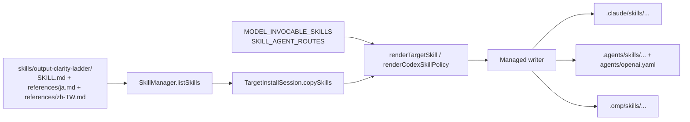

# Design: Output Clarity Ladder

## Overview

The feature has two parts. Part A adds one canonical skill, `output-clarity-ladder`. The existing installer renders it for Claude Code, Codex, and OMP. One named exception makes it model-invocable. Part B rewrites the human-facing text of MCP runtime blockers and errors to the same writing rules. Machine-readable codes and response shapes stay the same.

The feature adds no runtime state, no migration, no new MCP tool, and no network call.

## Requirements Traceability

| Requirement | Decisions |
|---|---|
| FR-1 Canonical skill content | D-1 |
| FR-2 Explainer video safety | D-1 |
| FR-3 Localized guidance | D-2 |
| FR-4 Model invocation exception | D-3 |
| FR-5 No agent route | D-4 |
| FR-6 Installation on all targets | D-5 |
| FR-7 Root guidance pointer | D-6 |
| FR-8 Validation blocker messages | D-7, D-8, D-9 |
| FR-9 Governance error messages | D-7, D-8, D-9 |
| NFR-1 Contract compatibility | D-10 |
| NFR-2 Skill size | D-11 |
| NFR-3 Honest claims | D-1, D-2, D-11 |
| NFR-4 Documentation | D-12 |

## Architecture and Data Flow

Data ownership:

- `skills/output-clarity-ladder/` owns the skill text. It is the only source. Installed copies are generated.
- `src/cli/install-target.ts` owns the per-skill policy: agent routes (`SKILL_AGENT_ROUTES`) and the new model-invocation exception (`MODEL_INVOCABLE_SKILLS`).
- `src/cli/tool-support/target-installer.ts` owns rendering. It reads the policy and the source. It writes target files through the managed writer.
- `src/cli/tool-support/root-guidance.ts` owns the generated root guidance for all three targets.
- `WorkflowValidationService`, `WorkflowEngineService`, `SDDToolAdapter`, and `ToolRegistry` own their message strings. `GovernanceErrorCode` and blocker codes stay the contract.

Install flow (unchanged shape):

Runtime use: the host lists the skill by its `description`. The model loads `SKILL.md` for an explanation, summary, or teaching reply. For a Japanese or Traditional Chinese request it also reads the matching reference file. The skill runs in the current reply. No agent starts.

Message flow (unchanged shape): a service builds a blocker or `GovernanceError` with a code and a message. Only the message string changes.

## Components and Interfaces

### D-1: Canonical English skill
**Covers:** FR-1, FR-2, NFR-3
**Decision:** Add `skills/output-clarity-ladder/SKILL.md`. Frontmatter has `name: output-clarity-ladder` and `description: Use on every explanation, summary, or teaching reply. Write about 80% of the way to ASD-STE100, and move to a diagram, HTML page, or video only when it is easier to understand.` The frontmatter has no `disable-model-invocation` line. The body keeps the user's document structure: scope and exceptions, `## 1. Writing (default)` with the six rules, `## 2. Diagram`, `## 3. Web page`, `## 4. Explainer video` with the routine-reply limit, stored-key or free local narration, and the no-secret-in-chat rule, `## Order`, and `## Languages` (D-2). It keeps the source citation line. It states "There is no approved-word check" and does not claim certification.
**Failure behavior:** If a host does not auto-load the skill, the user can still invoke it by name. The content is self-contained, so a missing reference file never removes the English rules.
**Verification:** A content test in `canonical-assets.test.ts` checks the name, the description phrase, the four step headings in order, the six rules, the order rule, the requested-artifact exception, the three video rules, and the no-approved-word-check sentence.

### D-2: Localized references
**Covers:** FR-3, NFR-3
**Decision:** Add `skills/output-clarity-ladder/references/ja.md` and `references/zh-TW.md`. Each is written in its own language. Each covers the writing rules, the four steps, the order rule, and the video safety rule. ASD-STE100 is English only, so each file adapts the principles (one idea per sentence, named actor, one term for one thing, kept numbers and conditions) and says it is not ASD-STE100 conformant. `SKILL.md` `## Languages` links both files with the `references/*.md` link form that the existing link test checks. The rule is: Japanese request → read `references/ja.md`; Traditional Chinese request → read `references/zh-TW.md`; any other language, including Simplified Chinese → use the English rules and reply in the user's language. The installer already copies non-`SKILL.md` files byte for byte through `copySkillTree`. No installer change is needed.
**Failure behavior:** If the language is unclear or mixed, the model uses the English rules and replies in the language of the request. If a reference file is missing in an installed copy, the English rules still apply.
**Verification:** The test checks that both files exist and stay inside the skill directory. It checks each file for a script marker (Japanese kana for `ja`, Traditional-only characters such as `體` or `說` for `zh-TW`), the four step headings, and the non-conformance sentence. An installer test checks that both files are byte-identical after install on all three targets.

### D-3: Model-invocation exception
**Covers:** FR-4
**Decision:** Add `export const MODEL_INVOCABLE_SKILLS: ReadonlySet<string> = new Set(['output-clarity-ladder']);` in `src/cli/install-target.ts`, next to `SKILL_AGENT_ROUTES`. This is the only place that declares the exception. In `renderTargetSkill`, when the skill is in the set, `extra` does not get `disable-model-invocation: true`. Any source `disable-model-invocation` line is still stripped. In `renderCodexSkillPolicy`, a skill in the set gets `allow_implicit_invocation: true` and the description `"Apply automatically to explanation, summary, and teaching replies."`. OMP uses the same `SKILL.md` frontmatter. Without the disable flag, OMP lists the skill for the model. All other skills keep the current output byte for byte. An invariant test checks that the set and `SKILL_AGENT_ROUTES` share no skill name.
**Failure behavior:** If a later host version ignores the flag, the skill stays manual-only, and nothing else changes. Rollback: remove the set entry. The next install renders the skill manual-only.
**Verification:** `target-installers.test.ts` renders the skill for each target. It asserts no `disable-model-invocation: true` (Claude, OMP) and `allow_implicit_invocation: true` (Codex). It renders all 11 workflow skills for each target and asserts that each is still manual-only.

### D-4: No agent route
**Covers:** FR-5
**Decision:** Do not add the skill to `SKILL_AGENT_ROUTES`. `renderTargetSkill` then emits no `model:`, `effort:`, ask-once, or `specialistDepth` text, because the route is `undefined`. `renderOmpSkillRouting` builds its selectors from `SKILL_AGENT_ROUTES`, so the OMP extension does not switch models for this skill. Source text in `SKILL.md` has no delegation wording.
**Failure behavior:** None at runtime. A test failure blocks a future change that adds a route by mistake.
**Verification:** A test asserts no route entry and no `model:`, `effort:`, `ask once`, or `specialistDepth` in the rendered output for all three targets.

### D-5: Installation through existing paths
**Covers:** FR-6
**Decision:** Make no new install code. `install` (`claude-code.ts`, `codex.ts`, `omp.ts`) and `setup-global` both call `copySkills`, which lists every directory under `skills/` that has a `SKILL.md`. The managed writer reports `written`, `unchanged`, or `conflict` per file. Check that `package.json` `files` already ships `skills/**`, including nested `references/`.
**Failure behavior:** Existing behavior applies. A write error goes to `report.failed` with the skill name. A user-edited managed file goes to `report.conflicts` and is not overwritten.
**Verification:** Installer tests run a project install for each target into a temp directory. They assert the skill path and report entries. A second run reports `unchanged` and makes no file change. A `setup-global` test asserts the personal skill path for each target.

### D-6: Root guidance sentence
**Covers:** FR-7
**Decision:** In `buildCompactRootGuidance`, add one line in `## Workflow` after the Skills line: "The `output-clarity-ladder` skill applies automatically to explanation, summary, and teaching replies; it is the only model-invocable skill." This covers Claude Code, Codex, and OMP root guidance. Update `templates/CLAUDE.md` and `templates/codex-AGENTS.md` with the same sentence. Also change "manual-only Skills" to "manual-only workflow Skills", so the existing statement stays true. The sentence does not repeat ladder rules.
**Failure behavior:** If the root guidance is user-owned and conflicts, the existing conflict report applies. The skill still works because the host lists it by description.
**Verification:** Root-guidance tests assert the sentence for all three targets. They assert that no ladder rule text (for example "ASD-STE100") appears in root guidance. They assert the manual-only statement for workflow skills still appears.

### D-7: Clarity bound checker (test helper)
**Covers:** FR-8, FR-9
**Decision:** Add `src/__tests__/helpers/message-clarity.ts` with `splitSentences(text)`, `countWords(sentence)`, and `checkClarity(text, { maxSentences: 2, maxWords: 25 })`. A sentence ends at `.`, `?`, or `!` followed by whitespace or end of text. So `spec.json`, `FR-1.2`, and `5.0.1` do not split. A word is a whitespace-separated token. A template placeholder counts as one word. The helper is test-only and adds no runtime dependency.
**Failure behavior:** `checkClarity` returns the failing sentence and its word count, so the test failure names the message to fix.
**Verification:** Unit tests for the helper cover dotted identifiers, version numbers, a placeholder, a 25-word pass, a 26-word fail, and a three-sentence fail.

### D-8: Message extraction for full coverage
**Covers:** FR-8, FR-9
**Decision:** A test uses the TypeScript compiler API (`typescript` is already a dev dependency) to parse `WorkflowValidationService.ts`, `WorkflowEngineService.ts`, `SDDToolAdapter.ts`, and `ToolRegistry.ts`. It collects the message argument of every `blocker(code, message, ...)` call and every `new GovernanceError(code, message, ...)`. A string literal gives its text. A template literal gives its text with each `${...}` replaced by `X`. A non-literal argument (for example a forwarded `error.message`) is allowed only if it appears in an explicit allowlist with file, code, and reason. Any other non-literal argument fails the test, so a new message cannot skip the check. Each extracted message must pass `checkClarity`.
**Failure behavior:** An unparsable file or an empty extraction fails the test with the file name. This prevents a silent pass after a refactor.
**Verification:** The test asserts at least one extracted message per file. It asserts that every message passes the bounds and that every allowlisted forward still exists.

### D-9: Message rewrite rules and glossary
**Covers:** FR-8, FR-9
**Decision:** Rewrite each message to this pattern: sentence 1 states the fact and names the item (section ID, label, phase, task number, or limit). Sentence 2, when a next action exists, names it in host-neutral words (for example "Revise the requirements and submit them again." or "Run the design Skill after requirements approval."). The runtime does not know the host prefix, so messages never include `/`, `$`, or `/skill:`. Keep every number, limit, and identifier. Use one term per element: "requirement section", "EARS Specification", "Acceptance Criteria", "design decision", "task", "phase", "revision", "artifact", "approval". Use active voice when an actor exists. Exact old-text assertions in existing tests (about 37) are updated to the new text in the same change.
**Failure behavior:** If a message needs more than two sentences, move the detail to the existing `details` object. Do not add a field.
**Verification:** D-7 and D-8 tests check the bounds. A review checks the glossary and next-action rule. The full test suite passes.

### D-10: Contract baseline
**Covers:** NFR-1, FR-9
**Decision:** Before any message edit, generate `src/__tests__/fixtures/message-contract-baseline.json` with the D-8 extractor. It holds, per file: the sorted set of codes, and per code the multiset of numeric tokens in its messages (for example `2000` from "2000 characters"). Commit the baseline in the first task. A contract test asserts that the current code sets equal the baseline. It also asserts that each code's numeric tokens contain the baseline tokens. Formatting such as `2,000` is normalized to `2000`. `GovernanceErrorCode`, `ValidationBlocker`, and response types are not edited, so `tsc` checks the shapes.
**Failure behavior:** A removed or renamed code fails the test. A dropped number fails the test. A deliberate future change must update the baseline in a reviewed diff.
**Verification:** The contract test passes with the baseline. `npm run build` passes with no type change in `WorkflowEngineService.ts` exports.

### D-11: Size and honesty tests
**Covers:** NFR-2, NFR-3
**Decision:** Add a separate `modelInvocableSkills` list in `canonical-assets.test.ts`. The existing manual-only test keeps its 11 names and its verb-prefix description rule. The new test asserts `SKILL.md`, `references/ja.md`, and `references/zh-TW.md` are each at most 4,096 UTF-8 bytes. The honesty check asserts the English skill contains "no approved-word check". It also asserts that no file in the skill directory matches `certified` or `conformant` unless a negation (`not`, `no`, `ない`, `不`) appears in the same sentence.
**Failure behavior:** An oversize file or an unnegated claim fails the test with the file name.
**Verification:** The tests run in `npm test`.

### D-12: Documentation
**Covers:** NFR-4
**Decision:** Update `docs/WORKFLOW.md` with a short section that names the skill, says it is the only model-invocable skill, and lists `en`, `ja`, and `zh-TW`. Add a row to the README skill table. Correct the two statements that would become false: `docs/INSTALL-GUIDE.md` ("All SDD skills are manual-only") and `docs/MODEL-ROUTING.md` (Codex implicit invocation). Each one names the single exception.
**Failure behavior:** Not applicable.
**Verification:** A docs test, or review, confirms the skill name appears in `docs/WORKFLOW.md` and `README.md`. A grep finds no remaining unqualified "All SDD skills are manual-only".

## Failure Handling

- **Unknown or mixed language:** use the English rules and reply in the user's language (D-2).
- **Host ignores model invocation:** the skill stays manual-only, and the user can call it by name (D-3).
- **Install write error or user-edited file:** existing `failed` and `conflicts` reporting. The installer never overwrites a conflict (D-5, D-6).
- **New message with no literal text:** the extraction test fails until the message is a literal or allowlisted (D-8).
- **Code or limit lost in a rewrite:** the contract test fails (D-10).
- **Rollback:** remove the `MODEL_INVOCABLE_SKILLS` entry, or delete the skill directory. Message rewrites revert as one commit, because the codes did not change.
- **Security:** the skill forbids asking for secrets in chat. The feature stores no key and makes no network call. Installed paths go through the existing `validateDestinationPath` and `validateChildName` checks. The `references/` names are fixed.
- **Concurrency and persistence:** none. The feature adds no durable state and no migration.

## Verification

1. `npx jest src/__tests__/unit/cli/canonical-assets.test.ts` covers D-1, D-2, D-11.
2. `npx jest src/__tests__/unit/cli/target-installers.test.ts src/__tests__/unit/cli/install-target.test.ts src/__tests__/unit/cli/setup-global.test.ts` covers D-3, D-4, D-5, D-6.
3. Message tests: the helper unit test (D-7), the extraction test (D-8), and the contract test (D-10).
4. `npm run build` and the full `npm test`, including the updated old-text assertions (D-9).
5. Manual check: install to a temp project for each target, then confirm the rendered frontmatter, `agents/openai.yaml`, and root guidance sentence.
