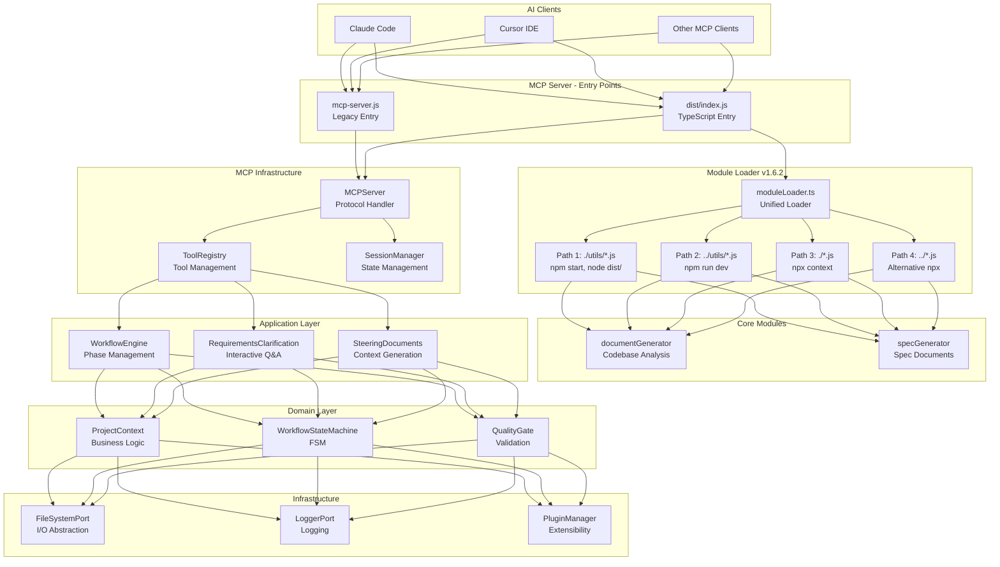
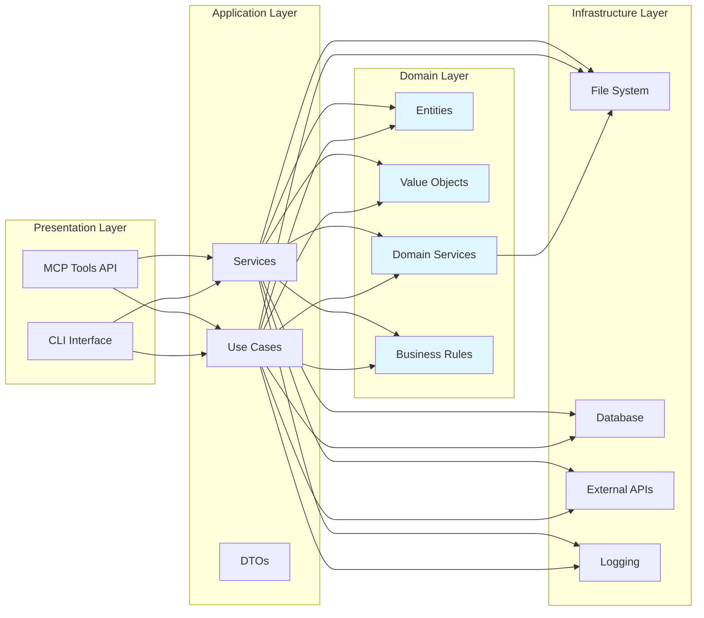
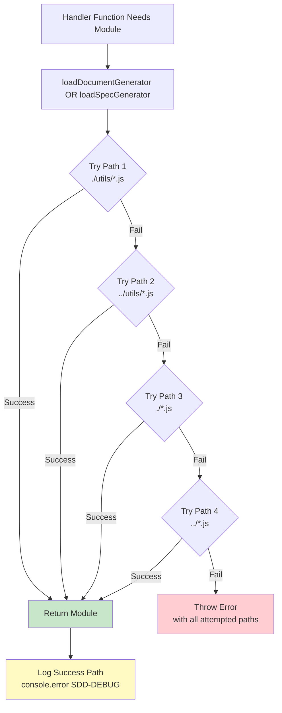
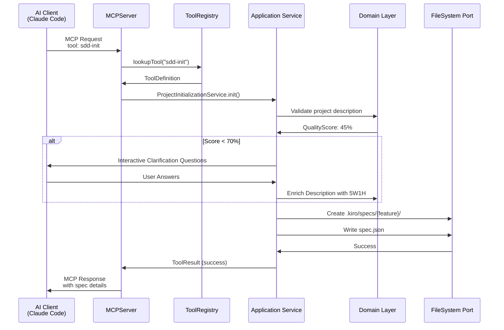
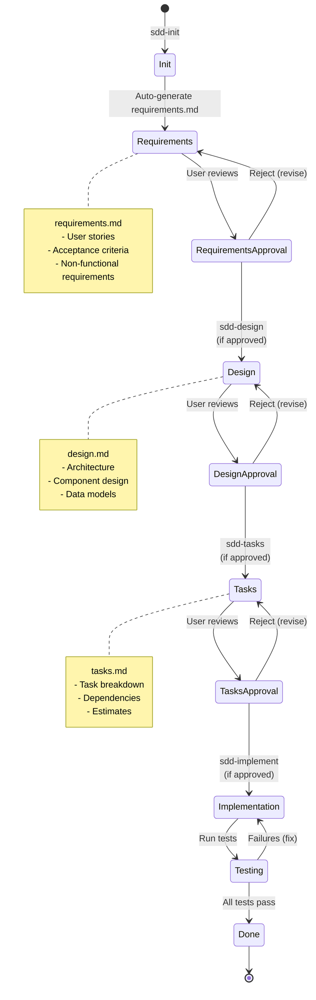
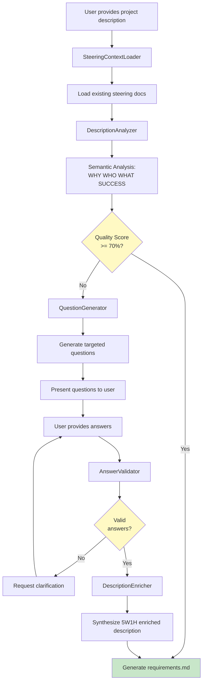
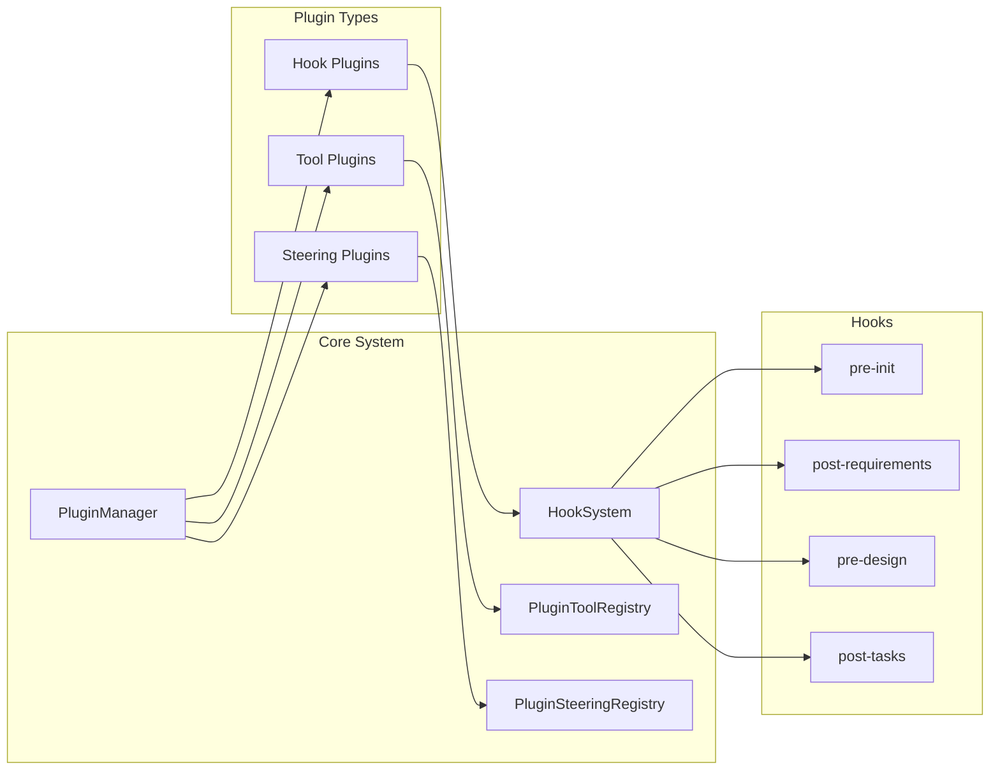
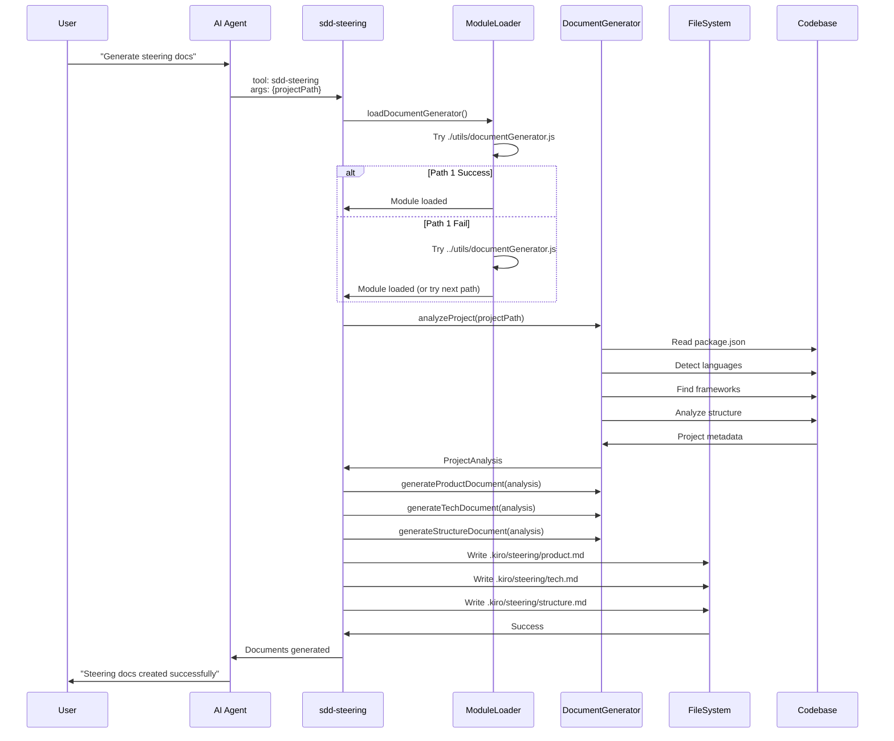
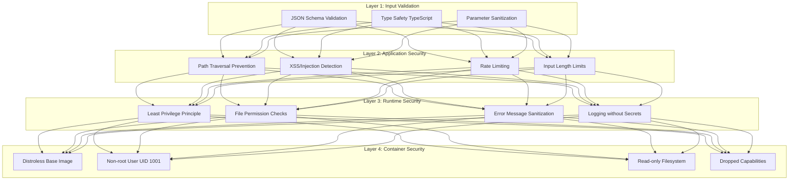
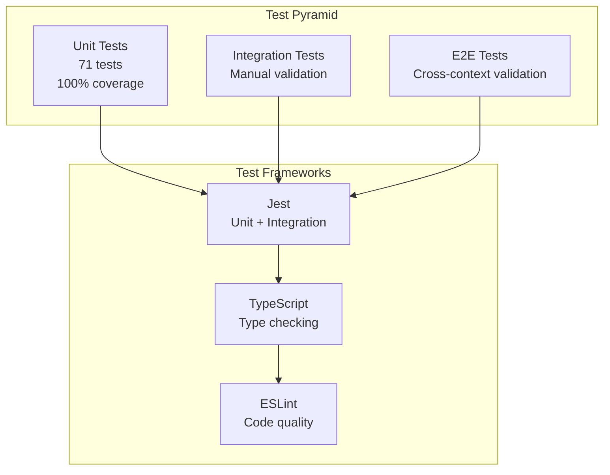

# MCP SDD Server Architecture

**Version**: 1.6.2  
**Last Updated**: 2025-11-05  
**Status**: Production

---

## Table of Contents

1. [Overview](#overview)
2. [System Architecture](#system-architecture)
3. [Layered Architecture](#layered-architecture)
4. [Module Loading System](#module-loading-system)
5. [MCP Protocol Integration](#mcp-protocol-integration)
6. [Workflow Engine](#workflow-engine)
7. [Requirements Clarification System](#requirements-clarification-system)
8. [Plugin System](#plugin-system)
9. [Data Flow](#data-flow)
10. [Security Architecture](#security-architecture)
11. [Deployment Models](#deployment-models)

---

## Overview

The MCP SDD Server is a **Model Context Protocol (MCP)** server that implements **Spec-Driven Development (SDD)** workflows for AI-agent CLIs and IDEs. It provides a structured approach to software development through:

- **Automated Requirements Clarification**: Analyzes project descriptions and interactively gathers missing information
- **Steering Document Generation**: Creates context-rich documentation from codebase analysis
- **Workflow State Management**: Guides teams through Requirements → Design → Tasks → Implementation phases
- **Cross-Context Compatibility**: Unified module loading supporting npx, npm, node, and Docker execution

### Key Design Principles

- **Domain-Driven Design (DDD)**: Clear separation between domain logic, application services, and infrastructure
- **SOLID Principles**: Single Responsibility, Open/Closed, Liskov Substitution, Interface Segregation, Dependency Inversion
- **Dependency Injection**: Inversify container for loose coupling and testability
- **Test-Driven Development (TDD)**: 100% test coverage for critical paths
- **Security by Design**: OWASP Top 10 aligned, input sanitization, least privilege

---

## System Architecture



---

## Layered Architecture

The system follows a **4-layer hexagonal architecture** pattern:



### Layer Responsibilities

#### 1. Presentation Layer (`/src/infrastructure/mcp`, `/src/adapters`)
- **MCP Protocol Handling**: Translates MCP requests to application commands
- **Tool Registration**: Exposes SDD tools (sdd-init, sdd-steering, etc.)
- **Session Management**: Maintains client connection state
- **Error Formatting**: Converts internal errors to MCP error responses

#### 2. Application Layer (`/src/application/services`)
- **Orchestration**: Coordinates domain services and infrastructure
- **Use Case Implementation**: Implements business workflows
- **Data Transformation**: Converts between DTOs and domain objects
- **Transaction Management**: Ensures consistency across operations

Key Services:
- `RequirementsClarificationService`: Orchestrates the 5 specialized services
- `WorkflowEngineService`: Manages SDD phase transitions
- `SteeringDocumentService`: Generates steering documents
- `ProjectInitializationService`: Initializes new SDD projects

#### 3. Domain Layer (`/src/domain`)
- **Business Logic**: Core business rules and validation
- **Domain Models**: Entities, value objects, aggregates
- **Domain Services**: Business operations that don't belong to entities
- **Workflow State Machine**: Finite state machine for SDD phases

Domain Components:
- `ProjectContext`: Root aggregate for project state
- `WorkflowStateMachine`: FSM (requirements → design → tasks → implementation)
- `QualityGate`: Validation rules for phase transitions

#### 4. Infrastructure Layer (`/src/infrastructure`)
- **Ports & Adapters**: Implements domain interfaces
- **External Services**: File I/O, logging, databases
- **Framework Integration**: MCP SDK, Inversify DI container
- **Plugin System**: Dynamic tool and steering document loading

---

## Module Loading System

**Introduced in v1.6.2** to fix cross-context module loading issues.

### Problem Statement

Prior to v1.6.2, hardcoded import paths in `src/index.ts` failed when run via npx:

```typescript
// ❌ OLD: Breaks in npx context
const { analyzeProject } = await import("./utils/documentGenerator.js");
```

**Root Cause**: Different execution contexts have different working directories:
- `npm start`: CWD = `/dist/`
- `npm run dev`: CWD = `/dist/tools/`
- `node dist/index.js`: CWD = `/dist/`
- `npx sdd-mcp-server`: CWD = `/node_modules/.bin/`

### Solution Architecture



### Implementation Details

**File**: `src/utils/moduleLoader.ts`

```typescript
export async function loadDocumentGenerator(): Promise<DocumentGeneratorModule> {
  const paths = [
    './utils/documentGenerator.js',    // Priority 1: npm start, node dist/index.js
    '../utils/documentGenerator.js',   // Priority 2: npm run dev (CWD=dist/tools/)
    './documentGenerator.js',          // Priority 3: npx (CWD=node_modules/.bin/)
    '../documentGenerator.js'          // Priority 4: Alternative npx context
  ];

  const errors: string[] = [];

  for (const path of paths) {
    try {
      const module = await import(path);
      console.error(`[SDD-DEBUG] ✅ Loaded documentGenerator from: ${path}`);
      return module as DocumentGeneratorModule;
    } catch (error) {
      const errorMessage = error instanceof Error ? error.message : String(error);
      errors.push(`${path}: ${errorMessage}`);
    }
  }

  throw new Error(
    `Failed to load documentGenerator. Attempted paths:\n${errors.map(e => `  - ${e}`).join('\n')}`
  );
}
```

**Key Features**:
- ✅ **Sequential Fallback**: Tries 4 paths in priority order
- ✅ **Comprehensive Error Messages**: Lists all attempted paths on failure
- ✅ **Debug Logging**: Logs successful path with `console.error` for troubleshooting
- ✅ **Type Safety**: Strong TypeScript interfaces for loaded modules
- ✅ **Zero Dependencies**: Pure ES module imports, no external libraries

### Integration Points

Updated 4 handler functions in `src/index.ts`:

1. **handleSteeringSimplified** (line ~436): Uses `loadDocumentGenerator()`
2. **handleRequirementsSimplified** (line ~1189): Uses `loadSpecGenerator()`
3. **handleDesignSimplified** (line ~1350): Uses `loadSpecGenerator()`
4. **handleTasksSimplified** (line ~1476): Uses `loadSpecGenerator()`

---

## MCP Protocol Integration



### MCP Server Components

#### MCPServer (`/src/infrastructure/mcp/MCPServer.ts`)
- **Responsibilities**: Protocol translation, error handling, capability negotiation
- **Dependencies**: ToolRegistry, SessionManager, LoggerPort
- **Lifecycle**: Singleton, initialized via DI container

#### ToolRegistry (`/src/infrastructure/mcp/ToolRegistry.ts`)
- **Responsibilities**: Tool registration, lookup, parameter validation
- **Tool Definition**: JSON Schema validation for tool parameters
- **Extensibility**: Supports plugin-provided tools

#### SessionManager (`/src/infrastructure/mcp/SessionManager.ts`)
- **Responsibilities**: Client session tracking, state persistence
- **State Storage**: In-memory with optional Redis backend
- **Session Lifecycle**: Create → Active → Closed

---

## Workflow Engine

The SDD workflow follows a finite state machine with 5 phases:



### Workflow State Persistence

**File**: `.kiro/specs/{feature-name}/spec.json`

```json
{
  "feature_name": "user-authentication",
  "phase": "design-approved",
  "approvals": {
    "requirements": {
      "generated": true,
      "approved": true,
      "approved_at": "2025-11-05T10:30:00Z"
    },
    "design": {
      "generated": true,
      "approved": true,
      "approved_at": "2025-11-05T14:20:00Z"
    },
    "tasks": {
      "generated": false,
      "approved": false
    }
  },
  "metadata": {
    "created_at": "2025-11-05T09:00:00Z",
    "updated_at": "2025-11-05T14:20:00Z",
    "project_path": "/path/to/project"
  }
}
```

---

## Requirements Clarification System

**Introduced in v1.5.0, refactored in v1.6.0** following Single Responsibility Principle.

### Architecture (v1.6.0+)



### 5 Specialized Services

#### 1. SteeringContextLoader
- **Purpose**: Load existing steering documents (product.md, tech.md)
- **Input**: Project path
- **Output**: SteeringContext (flags for existing docs)
- **Location**: `src/application/services/SteeringContextLoader.ts`

#### 2. DescriptionAnalyzer
- **Purpose**: Analyze project description quality (0-100 score)
- **Scoring Factors**:
  - WHY present (+30 points): Business justification
  - WHO present (+20 points): Target users
  - WHAT present (+20 points): Core features
  - SUCCESS present (+15 points): Metrics
  - Ambiguity penalty (-5 per term, max -15)
  - Length bonus (+5 per threshold: 100, 300, 500 chars)
- **Location**: `src/application/services/DescriptionAnalyzer.ts`

#### 3. QuestionGenerator
- **Purpose**: Generate targeted clarification questions
- **Question Selection**: Based on analysis gaps and steering context
- **Configuration**: Externalized to `clarification-questions.ts`
- **Location**: `src/application/services/QuestionGenerator.ts`

#### 4. AnswerValidator
- **Purpose**: Validate and sanitize user answers
- **Validations**:
  - Required fields present
  - Minimum length (10 chars)
  - XSS/injection detection
  - Path traversal prevention
- **Location**: `src/application/services/AnswerValidator.ts`

#### 5. DescriptionEnricher
- **Purpose**: Synthesize enriched description with 5W1H structure
- **Output Format**:
  ```
  WHY: {business justification}
  WHO: {target users}
  WHAT: {core features}
  HOW: {technical approach}
  SUCCESS: {metrics and KPIs}
  ```
- **Location**: `src/application/services/DescriptionEnricher.ts`

---

## Plugin System



### Plugin Development

**Location**: `.kiro/plugins/`

**Example Tool Plugin**:
```typescript
// .kiro/plugins/custom-validator/index.ts
export default {
  name: 'custom-validator',
  type: 'tool',
  version: '1.0.0',
  
  tool: {
    name: 'validate-requirements',
    description: 'Custom requirements validator',
    inputSchema: {
      type: 'object',
      properties: {
        featureName: { type: 'string' }
      },
      required: ['featureName']
    },
    
    async execute(args: any) {
      // Custom validation logic
      return { valid: true, issues: [] };
    }
  }
};
```

---

## Data Flow

### Document Generation Flow



---

## Security Architecture

### Defense in Depth Layers



### OWASP Top 10 Alignment

| OWASP Risk | Mitigation | Implementation |
|------------|-----------|----------------|
| A01: Broken Access Control | Path traversal prevention | `src/application/services/AnswerValidator.ts` |
| A02: Cryptographic Failures | No sensitive data storage | Stateless design, no credentials |
| A03: Injection | Input sanitization | Regex-based XSS/SQL detection |
| A04: Insecure Design | Security by design | `.kiro/steering/security-check.md` |
| A05: Security Misconfiguration | Secure defaults | Docker distroless, non-root user |
| A06: Vulnerable Components | Dependency scanning | `npm audit` in CI/CD |
| A07: Authentication Failures | N/A | No authentication (local tool) |
| A08: Software & Data Integrity | Immutable builds | Distroless read-only filesystem |
| A09: Logging Failures | Structured logging | LoggerPort with correlation IDs |
| A10: SSRF | No external requests | Offline-first design |

---

## Deployment Models

### 1. NPX (Recommended)

```bash
npx -y sdd-mcp-server@latest
```

**Advantages**:
- ✅ No installation required
- ✅ Always uses latest version
- ✅ No version conflicts
- ✅ Secure: npm registry verification

**Module Loading**: Path 3 (`./documentGenerator.js`) or Path 4 (`../documentGenerator.js`)

### 2. Global Installation

```bash
npm install -g sdd-mcp-server@latest
sdd-mcp-server
```

**Advantages**:
- ✅ Persistent installation
- ✅ Faster startup (no download)
- ✅ Offline usage after install

**Module Loading**: Path 1 (`./utils/documentGenerator.js`)

### 3. Docker

```bash
docker run -p 3000:3000 ghcr.io/yi-john-huang/sdd-mcp:latest
```

**Advantages**:
- ✅ Isolated environment
- ✅ Reproducible builds
- ✅ Security hardened (distroless)

**Module Loading**: Path 1 (`./utils/documentGenerator.js`)

### 4. Local Development

```bash
git clone https://github.com/yi-john-huang/sdd-mcp.git
npm run dev
```

**Advantages**:
- ✅ Fastest development cycle
- ✅ Hot reload with tsx
- ✅ Full debugging support

**Module Loading**: Path 2 (`../utils/documentGenerator.js`)

---

## Performance Characteristics

### Module Loading Performance

| Execution Context | First Import (ms) | Cached Import (ms) | Fallback Attempts |
|------------------|-------------------|--------------------|--------------------|
| npm start | 10-20 | <5 | 1 (Path 1) |
| npm run dev | 15-25 | <5 | 2 (Path 2) |
| node dist/index.js | 10-20 | <5 | 1 (Path 1) |
| npx | 50-100* | <5 | 3-4 (Path 3-4) |

*Includes npm package download on first run

### Document Generation Performance

| Operation | Time (ms) | Notes |
|-----------|-----------|-------|
| Analyze project | 200-500 | Depends on project size |
| Generate product.md | 50-100 | Template rendering |
| Generate tech.md | 100-200 | Framework detection |
| Generate structure.md | 150-300 | Directory traversal |
| **Total** | **500-1100** | ~1 second end-to-end |

### Memory Usage

| Component | Heap (MB) | Notes |
|-----------|-----------|-------|
| Base server | 20-30 | MCP SDK + Inversify |
| Document generation | +10-20 | File I/O buffers |
| Requirements clarification | +5-10 | Analysis state |
| **Peak** | **40-60** | Typical usage |

---

## Testing Strategy



### Test Coverage (v1.6.2)

- **Unit Tests**: 71 tests passing
  - moduleLoader: 6 tests (100% coverage)
  - RequirementsClarification: 62 tests (95% coverage)
  - Existing: 3 tests
- **Integration Tests**: Manual cross-context validation
  - npm start ✅
  - npm run dev ✅
  - node dist/index.js ✅
  - npx ✅
- **E2E Tests**: Production npx validation ✅

---

## Future Architecture Considerations

### Planned Improvements (v1.7.0+)

1. **Distributed Workflow State**
   - Redis backend for SessionManager
   - Multi-instance coordination
   - Shared workflow state

2. **Enhanced Plugin System**
   - TypeScript plugin development
   - Plugin dependency resolution
   - Sandboxed plugin execution

3. **GraphQL API**
   - Alternative to MCP for web clients
   - Real-time subscriptions
   - Schema introspection

4. **AI Model Integration**
   - Local LLM support (Ollama, LM Studio)
   - Semantic analysis improvements
   - Automated code review

5. **Telemetry & Observability**
   - OpenTelemetry integration
   - Distributed tracing
   - Performance metrics

---

## References

- **MCP Specification**: https://modelcontextprotocol.io
- **Source Code**: https://github.com/yi-john-huang/sdd-mcp
- **npm Package**: https://www.npmjs.com/package/sdd-mcp-server
- **Issue Tracker**: https://github.com/yi-john-huang/sdd-mcp/issues

---

**Maintained by**: SDD MCP Server Team  
**License**: MIT  
**Last Review**: 2025-11-05
