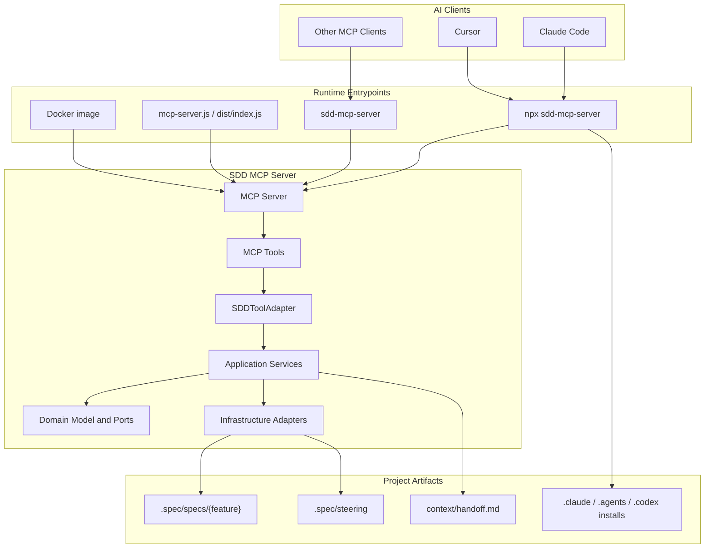
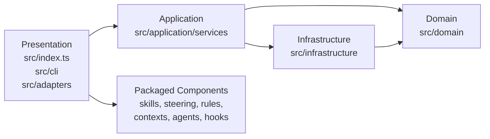
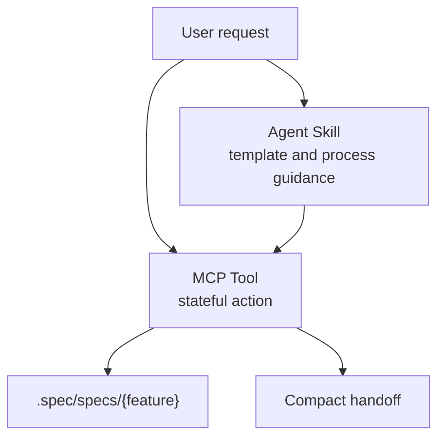
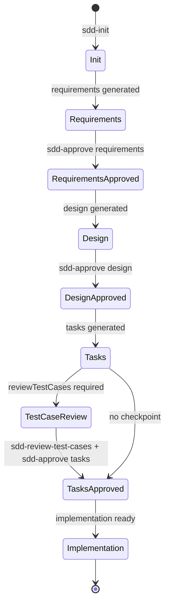
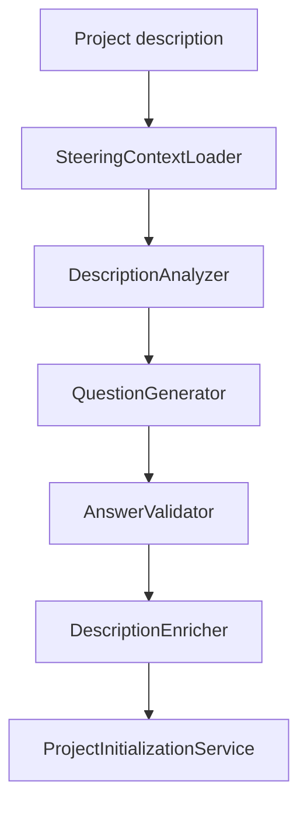
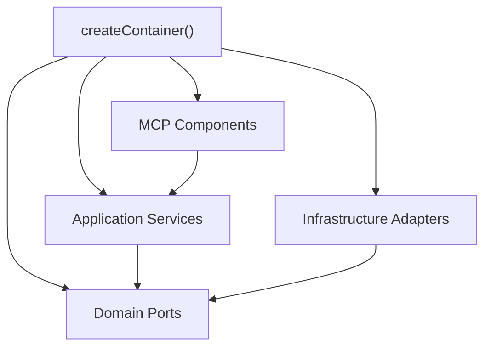
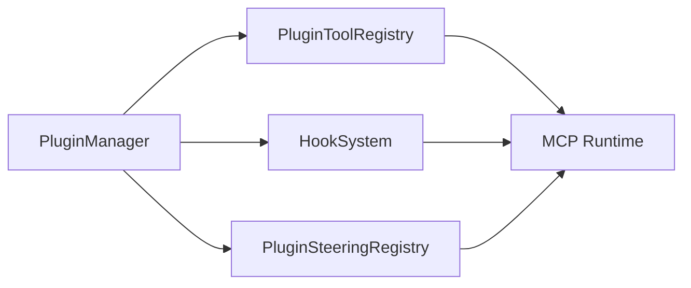
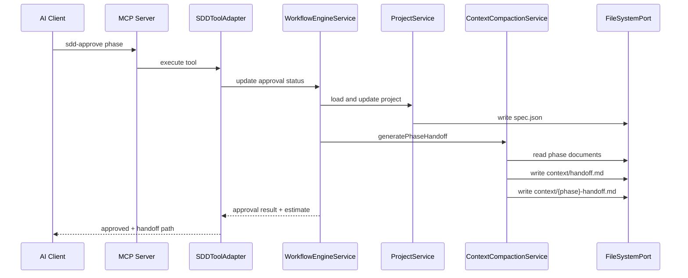
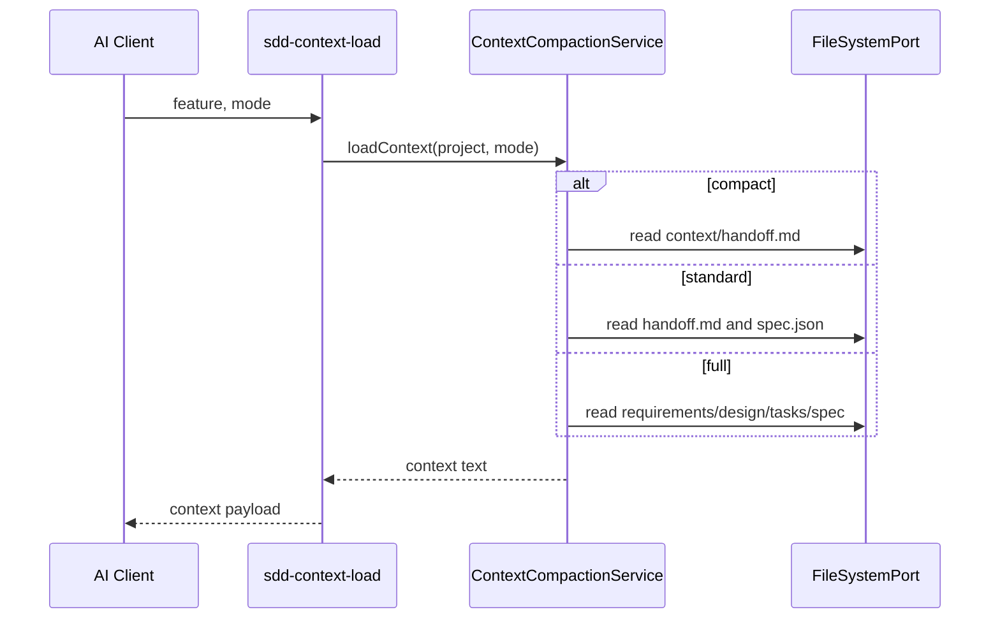

# MCP SDD Server Architecture

**Version**: 3.4.0  
**Last Updated**: 2026-06-22  
**Status**: Production

---

## Overview

SDD MCP Server is a Model Context Protocol server and companion CLI for spec-driven development workflows. It gives AI-agent clients a structured path from project intent to requirements, design, TDD tasks, implementation, review, and commit guidance.

The current architecture is hybrid:

- **MCP tools** execute stateful actions: initialize specs, approve phases, inspect status, load context, validate, and run quality checks.
- **Agent skills** carry template-heavy guidance: requirements, design, tasks, implementation, steering, review, security, tests, and commits.
- **Installable components** package optional rules, contexts, agents, hooks, skills, and steering templates for consuming projects.
- **Compact handoffs** preserve workflow continuity without repeatedly loading full phase documents.

This split exists to keep workflow behavior deterministic while reducing always-on context usage.

---

## System Context


```mermaid
graph TB
    subgraph "AI Clients"
        Claude["Claude Code"]
        Cursor["Cursor"]
        Other["Other MCP Clients"]
    end

    subgraph "Runtime Entrypoints"
        NPX["npx sdd-mcp-server"]
        Global["sdd-mcp-server"]
        Local["mcp-server.js / dist/index.js"]
        Docker["Docker image"]
    end

    subgraph "SDD MCP Server"
        MCP["MCP Server"]
        Tools["MCP Tools"]
        Adapter["SDDToolAdapter"]
        Services["Application Services"]
        Domain["Domain Model and Ports"]
        Infra["Infrastructure Adapters"]
    end

    subgraph "Project Artifacts"
        Specs[".spec/specs/{feature}"]
        Steering[".spec/steering"]
        Handoffs["context/handoff.md"]
        Components[".claude / .agents / .codex installs"]
    end

    Claude --> NPX
    Cursor --> NPX
    Other --> Global
    NPX --> MCP
    Global --> MCP
    Local --> MCP
    Docker --> MCP
    MCP --> Tools
    Tools --> Adapter
    Adapter --> Services
    Services --> Domain
    Services --> Infra
    Infra --> Specs
    Infra --> Steering
    Services --> Handoffs
    NPX --> Components
```

---

## Layered Architecture

The codebase follows a clean architecture / hexagonal style.


```mermaid
graph LR
    Presentation["Presentation<br/>src/index.ts<br/>src/cli<br/>src/adapters"]
    Application["Application<br/>src/application/services"]
    Domain["Domain<br/>src/domain"]
    Infrastructure["Infrastructure<br/>src/infrastructure"]
    Assets["Packaged Components<br/>skills, steering, rules,<br/>contexts, agents, hooks"]

    Presentation --> Application
    Application --> Domain
    Application --> Infrastructure
    Infrastructure --> Domain
    Presentation --> Assets
```

### Presentation

Primary locations:

- `src/index.ts`
- `src/cli/`
- `src/adapters/cli/SDDToolAdapter.ts`
- `src/infrastructure/mcp/`

Responsibilities:

- Start the MCP server and simplified stdio mode.
- Register and execute MCP tools.
- Expose CLI commands such as `install`, `install-skills`, `migrate-kiro`, and `migrate-steering`.
- Convert tool arguments and service results into MCP-compatible responses.

### Application

Primary location: `src/application/services/`

Responsibilities:

- Orchestrate SDD use cases.
- Coordinate domain state, filesystem writes, templates, validation, and quality checks.
- Generate compact context handoffs after approvals.
- Manage project initialization, workflow progression, status, and checkpoints.

Important services:

- `ProjectService`
- `WorkflowService`
- `WorkflowEngineService`
- `TemplateService`
- `ContextCompactionService`
- `ProjectInitializationService`
- `RequirementsClarificationService`
- `SteeringDocumentService`
- `QualityService`

### Domain

Primary location: `src/domain/`

Responsibilities:

- Define workflow types, project metadata, approvals, checkpoints, tasks, quality reports, and ports.
- Enforce workflow transition rules through `WorkflowStateMachine`.
- Keep business contracts independent from MCP, filesystem, and package runtime details.

Key files:

- `src/domain/types.ts`
- `src/domain/ports.ts`
- `src/domain/workflow/WorkflowStateMachine.ts`
- `src/domain/quality/`
- `src/domain/plugins/`
- `src/domain/templates/`

### Infrastructure

Primary location: `src/infrastructure/`

Responsibilities:

- Implement domain ports for filesystem, logging, validation, templates, repositories, quality analysis, and configuration.
- Own the Inversify container and runtime bindings.
- Implement MCP server components such as tool registry, prompt manager, resource manager, sessions, and capability negotiation.
- Provide plugin and hook infrastructure.

Key files:

- `src/infrastructure/di/container.ts`
- `src/infrastructure/di/types.ts`
- `src/infrastructure/mcp/ToolRegistry.ts`
- `src/infrastructure/mcp/MCPServer.ts`
- `src/infrastructure/adapters/NodeFileSystemAdapter.ts`
- `src/infrastructure/schemas/project.schema.ts`

---

## Hybrid Tool and Skill Model

The project intentionally separates action execution from guidance loading.


```mermaid
graph TB
    Request["User request"]
    Skill["Agent Skill<br/>template and process guidance"]
    Tool["MCP Tool<br/>stateful action"]
    Spec[".spec/specs/{feature}"]
    Handoff["Compact handoff"]

    Request --> Skill
    Request --> Tool
    Skill --> Tool
    Tool --> Spec
    Tool --> Handoff
```

### MCP Tools

MCP tools are for operations that mutate state, inspect state, validate, or load context.

| Tool | Role |
|------|------|
| `sdd-init` | Create a feature spec and metadata |
| `sdd-status` | Report workflow progress |
| `sdd-approve` | Approve requirements, design, or tasks |
| `sdd-review-test-cases` | Mark optional TDD test-case review as complete |
| `sdd-quality-check` | Run code quality analysis |
| `sdd-context-load` | Load compact, standard, or full project context |
| `sdd-validate-design` | Validate design quality |
| `sdd-validate-gap` | Compare requirements/design against implementation |
| `sdd-spec-impl` | Execute implementation tasks with TDD methodology |
| `sdd-list-skills` | List installable skills |

Compatibility handlers may still exist for template-oriented operations in adapter code, but the user-facing architecture treats guidance-heavy workflows as skills.

### Agent Skills

Skills are loaded only when invoked by the user or agent client.

| Skill | Role |
|-------|------|
| `/simple-task` | Small changes with best-practice guidance |
| `/sdd-requirements` | EARS requirements generation |
| `/sdd-design` | Architecture design guidance |
| `/sdd-tasks` | TDD task breakdown |
| `/sdd-implement` | Implementation guidance |
| `/sdd-steering` | Project-specific steering updates |
| `/sdd-steering-custom` | Specialized steering |
| `/sdd-review` | Linus-style review |
| `/sdd-security-check` | OWASP-oriented review |
| `/sdd-test-gen` | TDD test generation |
| `/sdd-commit` | Commit and PR guidance |

---

## Component Installation Architecture

The package ships source assets for installable agent components:

```text
skills/      -> .claude/skills/ or .agents/skills/
steering/    -> .spec/steering/
rules/       -> .claude/rules/
contexts/    -> .claude/contexts/
agents/      -> .claude/agents/
hooks/       -> .claude/hooks/
```

The installer is implemented in `src/cli/install-skills.ts`.

### Install Profiles

| Profile | Components | Purpose |
|---------|------------|---------|
| `lean` | skills, steering, hooks | Default lower-context setup |
| `full` | skills, steering, rules, contexts, agents, hooks | Complete component installation |

Examples:

```bash
npx sdd-mcp-server install
npx sdd-mcp-server install --profile full
npx sdd-mcp-server install --skills --rules --agents
npx sdd-mcp-server install --list
```

Generated local installs under `.claude/`, `.agents/`, and `.codex/` are project outputs. Source assets live in the root component directories and are included in the npm package.

---

## Workflow Engine

The core workflow is requirements -> design -> tasks -> implementation.


```mermaid
stateDiagram-v2
    [*] --> Init: sdd-init
    Init --> Requirements: requirements generated
    Requirements --> RequirementsApproved: sdd-approve requirements
    RequirementsApproved --> Design: design generated
    Design --> DesignApproved: sdd-approve design
    DesignApproved --> Tasks: tasks generated
    Tasks --> TestCaseReview: reviewTestCases required
    TestCaseReview --> TasksApproved: sdd-review-test-cases + sdd-approve tasks
    Tasks --> TasksApproved: no checkpoint
    TasksApproved --> Implementation: implementation ready
    Implementation --> [*]
```

### Project Metadata

Workflow state is stored in `.spec/specs/{feature}/spec.json`.

Important fields:

```json
{
  "approvals": {
    "requirements": { "generated": true, "approved": true },
    "design": { "generated": true, "approved": true },
    "tasks": { "generated": true, "approved": false }
  },
  "workflow_options": {
    "review_test_cases": true
  },
  "checkpoints": {
    "test_cases": {
      "required": true,
      "reviewed": false
    }
  },
  "ready_for_implementation": false
}
```

### TDD Test-Case Review Checkpoint

The optional checkpoint can be enabled at initialization or task generation time. When enabled:

- Tasks can be generated normally.
- `sdd-approve tasks` is blocked until test cases are reviewed.
- `sdd-review-test-cases` marks the checkpoint as reviewed.
- Implementation readiness requires approved requirements, approved design, approved tasks, and a reviewed checkpoint.

This keeps the default workflow lightweight while allowing teams to require human review before implementation begins.

---

## Context Management

Long SDD workflows can become context intensive if every phase reloads all steering and spec documents. The current architecture reduces this with automatic handoffs.

### Automatic Handoff Generation

When a phase is approved, `WorkflowEngineService` calls `ContextCompactionService.generatePhaseHandoff`.

```text
sdd-approve requirements -> .spec/specs/{feature}/context/requirements-handoff.md
sdd-approve design       -> .spec/specs/{feature}/context/design-handoff.md
sdd-approve tasks        -> .spec/specs/{feature}/context/tasks-handoff.md
latest handoff           -> .spec/specs/{feature}/context/handoff.md
```

The handoff contains:

- Current workflow state.
- Approval status.
- TDD test-case checkpoint status.
- Compact summaries of available phase documents.
- Next actions.
- Source references.
- Estimated context reduction.

### Context Load Modes

`sdd-context-load` supports three modes:

| Mode | Contents | Use case |
|------|----------|----------|
| `compact` | `context/handoff.md` | Routine continuation |
| `standard` | handoff plus `spec.json` | Status-sensitive continuation |
| `full` | requirements, design, tasks, and spec metadata | Audits or ambiguous decisions |

Compact mode is the default. Full mode is explicit so agents do not accidentally reload every phase document for routine work.

### Quantitative Target

Token estimates use a deterministic `characters / 4` approximation. Typical compact handoffs target a 60-85% reduction compared with loading `requirements.md`, `design.md`, `tasks.md`, and `spec.json` in full. Actual savings depend on spec length and document structure.

---

## Requirements Clarification

`RequirementsClarificationService` is composed from smaller services:


```mermaid
graph TB
    Input["Project description"]
    Steering["SteeringContextLoader"]
    Analyze["DescriptionAnalyzer"]
    Questions["QuestionGenerator"]
    Validate["AnswerValidator"]
    Enrich["DescriptionEnricher"]
    Init["ProjectInitializationService"]

    Input --> Steering
    Steering --> Analyze
    Analyze --> Questions
    Questions --> Validate
    Validate --> Enrich
    Enrich --> Init
```

Responsibilities:

- Load existing product and technical steering.
- Score descriptions for why, who, what, and success criteria.
- Ask targeted clarification questions when needed.
- Validate answer quality and reject unsafe content.
- Synthesize an enriched 5W1H description for downstream requirements generation.

---

## Module Loading

The runtime includes a small compatibility loader in `src/utils/moduleLoader.ts` for document and spec generator modules. It exists because local development, compiled execution, and npx execution can resolve files from different package-relative paths.

The loader:

- Attempts known relative paths in order.
- Logs the successful path to stderr for MCP-safe debugging.
- Reports all attempted paths on failure.
- Keeps the public handler code independent from one execution layout.

This remains a compatibility layer, not the central architecture boundary.

---

## Dependency Injection

Inversify wires application services to domain ports and infrastructure adapters.


```mermaid
graph TB
    Container["createContainer()"]
    Ports["Domain Ports"]
    Adapters["Infrastructure Adapters"]
    Services["Application Services"]
    MCP["MCP Components"]

    Container --> Ports
    Container --> Adapters
    Container --> Services
    Container --> MCP
    Services --> Ports
    Adapters --> Ports
    MCP --> Services
```

Typical bindings:

- `ProjectRepository` -> `InMemoryProjectRepository`
- `FileSystemPort` -> `NodeFileSystemAdapter`
- `TemplateEngine` -> `HandlebarsTemplateEngine`
- `ValidationPort` -> `AjvValidationAdapter`
- `LoggerPort` -> `ConsoleLoggerAdapter`
- `QualityAnalyzer` -> `LinusQualityAnalyzer`
- `ContextCompactionService` -> application service binding

When adding a new cross-cutting dependency, prefer adding a domain port and infrastructure adapter instead of importing concrete infrastructure directly into domain or application code.

---

## Plugin and Hook System

The plugin architecture is split across:

- `PluginManager`
- `HookSystem`
- `PluginToolRegistry`
- `PluginSteeringRegistry`


```mermaid
graph LR
    Manager["PluginManager"]
    Hooks["HookSystem"]
    Tools["PluginToolRegistry"]
    Steering["PluginSteeringRegistry"]
    Runtime["MCP Runtime"]

    Manager --> Hooks
    Manager --> Tools
    Manager --> Steering
    Tools --> Runtime
    Hooks --> Runtime
    Steering --> Runtime
```

Hooks can support event-driven behavior such as pre-tool validation, post-tool status updates, and session lifecycle reminders. Installable hook definitions are packaged under root `hooks/`.

---

## Data Flow

### Phase Approval and Handoff


```mermaid
sequenceDiagram
    participant Client as AI Client
    participant MCP as MCP Server
    participant Adapter as SDDToolAdapter
    participant Workflow as WorkflowEngineService
    participant Project as ProjectService
    participant Context as ContextCompactionService
    participant FS as FileSystemPort

    Client->>MCP: sdd-approve phase
    MCP->>Adapter: execute tool
    Adapter->>Workflow: update approval status
    Workflow->>Project: load and update project
    Project->>FS: write spec.json
    Workflow->>Context: generatePhaseHandoff
    Context->>FS: read phase documents
    Context->>FS: write context/handoff.md
    Context->>FS: write context/{phase}-handoff.md
    Workflow-->>Adapter: approval result + estimate
    Adapter-->>Client: approved + handoff path
```

### Context Restore


```mermaid
sequenceDiagram
    participant Client as AI Client
    participant Tool as sdd-context-load
    participant Context as ContextCompactionService
    participant FS as FileSystemPort

    Client->>Tool: feature, mode
    Tool->>Context: loadContext(project, mode)
    alt compact
        Context->>FS: read context/handoff.md
    else standard
        Context->>FS: read handoff.md and spec.json
    else full
        Context->>FS: read requirements/design/tasks/spec
    end
    Context-->>Tool: context text
    Tool-->>Client: context payload
```

---

## Security Architecture

Security is mostly local-tool hardening rather than network perimeter security.

| Area | Approach |
|------|----------|
| Input validation | JSON schema and service-level validation |
| Description answers | XSS, JavaScript URL, path traversal, and minimum-quality checks |
| Filesystem writes | Scoped project artifact paths and explicit directory creation |
| MCP output | Structured tool responses and error handling |
| Dependencies | npm lockfile and audit-friendly package structure |
| Container runtime | Multi-stage build with distroless Node.js runtime |
| Secrets | No credential storage by design |

The Dockerfile builds with Node 18 Alpine and runs the production artifact in `gcr.io/distroless/nodejs18-debian11`.

---

## Deployment Models

### NPX

```bash
npx -y sdd-mcp-server@latest
```

Recommended for most MCP client configuration because it avoids manual global installs.

### Global Install

```bash
npm install -g sdd-mcp-server@latest
sdd-mcp-server
```

Useful for persistent local environments.

### Local Development

```bash
npm install
npm run build
npm start
```

For Claude Code local development:

```bash
claude mcp add sdd "$(pwd)/mcp-server.js" -s local
```

### Docker

```bash
docker build --target production -t sdd-mcp-server .
docker run -p 3000:3000 sdd-mcp-server
```

---

## Testing Strategy

Test and validation commands:

| Command | Purpose |
|---------|---------|
| `npm run typecheck` | TypeScript compile validation |
| `npm run lint` | ESLint over source |
| `npm run test` | Jest test suite |
| `npm run test:unit` | Unit tests |
| `npm run test:coverage` | Coverage reports |
| `npm run validate` | Typecheck, lint, and CI coverage run |

In zsh, quote the unit test patterns when invoking Jest directly:

```bash
npx jest '--testPathPattern=__tests__.*\.test\.ts$' '--testPathIgnorePattern=integration|e2e'
```

Coverage thresholds are configured in `jest.config.js` at 80% for branches, functions, lines, and statements.

---

## Evolution Notes

Important architecture shifts:

- `.kiro` compatibility remains, but `.spec` is the current project artifact standard.
- Static steering guidance was consolidated into installable skills, rules, agents, and hooks.
- The default install profile is lean to reduce always-on context.
- Phase approvals now write compact context handoffs automatically.
- Optional TDD test-case review is represented as workflow metadata and enforced before tasks approval when enabled.
- Generated local agent installs are ignored; root component directories are the package source assets.

---

## References

- [README.md](README.md)
- [AGENTS.md](AGENTS.md)
- [.spec/steering/product.md](.spec/steering/product.md)
- [.spec/steering/tech.md](.spec/steering/tech.md)
- [.spec/steering/structure.md](.spec/steering/structure.md)
- [Model Context Protocol](https://modelcontextprotocol.io)
- [npm package](https://www.npmjs.com/package/sdd-mcp-server)
- [GitHub repository](https://github.com/yi-john-huang/sdd-mcp)

---

**Maintained by**: SDD MCP Server Team  
**License**: MIT  
**Last Review**: 2026-06-22
