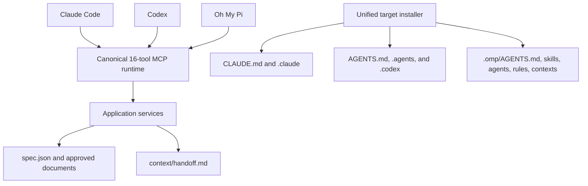

# MCP SDD Server Architecture

**Version**: 4.0.0
**Last Updated**: 2026-07-19

## Overview

SDD-MCP combines one packaged MCP runtime with target-native, progressively loaded guidance for Claude Code, Codex, and Oh My Pi (OMP). Durable workflow state lives under `.spec/specs/<featureName>/`; generated host guidance is not the authority.

```mermaid
graph TB
    Claude[Claude Code] --> Runtime[Canonical 16-tool MCP runtime]
    Codex[Codex] --> Runtime
    OMP[Oh My Pi] --> Runtime
    Runtime --> Services[Application services]
    Services --> Spec[spec.json and approved documents]
    Services --> Handoff[context/handoff.md]
    Installer[Unified target installer] --> ClaudeTree[CLAUDE.md and .claude]
    Installer --> CodexTree[AGENTS.md, .agents, and .codex]
    Installer --> OMPTree[.omp/AGENTS.md, skills, agents, rules, contexts]
```

The package separates four concerns:

1. **MCP tools** perform stateful operations and validation.
2. **Skills** carry concise, manual-only workflow instructions.
3. **Application services** enforce approval, checkpoint, path, and context invariants.
4. **Target renderers** translate canonical assets and role routes into host-native files.

## Layered architecture

- **Presentation** (`src/index.ts`, `src/infrastructure/mcp/`, `src/adapters/cli/`): validates public schemas, injects the workspace root, and formats MCP responses.
- **Application** (`src/application/services/`): coordinates workflow transitions, context selection, project initialization, templates, steering, and quality checks.
- **Domain** (`src/domain/`): workflow entities, value objects, ports, and errors.
- **Infrastructure** (`src/infrastructure/`): filesystem, persistence, MCP transport, template, validation, and atomic-write adapters.
- **Installer** (`src/cli/`): target resolution, recursive rendering, managed ownership, backups, and root guidance.

Both `sdd-entry.js` and the documented `mcp-server.js` launcher call the compiled TypeScript runtime; neither maintains a second handler implementation.

## Canonical MCP surface

v4 exposes exactly 16 tools through every runtime surface:

| Workflow | Context and status | Validation and project guidance |
|---|---|---|
| `sdd-init` | `sdd-status` | `sdd-quality-check` |
| `sdd-requirements` | `sdd-context-load` | `sdd-template-render` |
| `sdd-design` | `sdd-approve` | `sdd-steering` |
| `sdd-tasks` | `sdd-review-test-cases` | `sdd-steering-custom` |
| `sdd-implement` |  | `sdd-validate-design` |
| `sdd-spec-impl` |  | `sdd-validate-gap` |

Every existing-feature operation uses `featureName`. The server supplies the validated project root internally; public `projectId` locators no longer exist. `sdd-status` may omit `featureName` to list contained specs. `sdd-list-skills` was removed because native hosts discover skills and the installer already provides `--list`.

One `SpecPathResolver` applies child-name validation, canonical `realpath` containment, and symlink-escape rejection. Disk `spec.json` is durable authority, so approval and test-case review continue to work after an MCP restart.

## Workflow engine

The ordered phases are requirements → design → tasks → implementation. `WorkflowEngineService` serializes transitions per feature and re-reads state after acquiring the feature lock.

Approval invariants include:

- the requested document must exist;
- prior phases must be approved;
- tasks approval honors the optional test-case review checkpoint;
- `spec.json` is atomically committed before the derived handoff is published;
- a post-commit handoff failure returns an approved transition with `pending-regeneration`, never stale content;
- repeated approval is idempotent and repairs only a missing or stale cache.

Rollback is an internal disk-addressable service operation. It atomically resets affected approvals and invalidates the rebuildable handoff cache; v4 does not expose a public rollback tool.

## Phase-aware context

`ContextCompactionService` accepts an internal request containing `projectRoot` and public options centered on `featureName`. It derives the latest approved phase unless a phase is requested explicitly. Draft/future artifacts are excluded from compact and standard context; full mode can include an explicitly requested draft only with `includeUnapproved: true`.

Default bounds are:

| Mode | Default bound | Behavior |
|---|---:|---|
| compact | 2,048 `estimatedTokens` | bounded state and selected approved context |
| standard | 4,096 `estimatedTokens` | broader approved context |
| full | 16,384 `estimatedTokens` | selected raw documents; never silently truncated |

`estimatedTokens` is deterministic `ceil(characters / 4)`, not a provider tokenizer count. A request below the mandatory envelope fails with a typed budget error. Full overflow also fails instead of truncating.

Two hashes have distinct roles:

- `sourceFingerprint` hashes normalized workflow state, selected source names and bytes, and the handoff schema;
- `fingerprint` additionally hashes mode, budget, inclusion options, and selection algorithm and acts as the exact-response ETag.

A request whose `ifNoneMatch` equals `fingerprint` returns `cacheStatus: not-modified` without `content`. Only the canonical default compact payload is persisted at `.spec/specs/<featureName>/context/handoff.md`; standard, full, and custom-budget responses are deterministic, on-demand results. There are no duplicate phase handoff files.

## Target installation architecture

The resolver chooses one of three targets before writing:

| Target | Root | Skills | Rules | Agents | Context references |
|---|---|---|---|---|---|
| Claude Code | `CLAUDE.md` | `.claude/skills` | `.claude/rules` | `.claude/agents` | `.claude/contexts` |
| Codex | `AGENTS.md` | `.agents/skills` | `.codex/guidance/rules` | `.codex/agents` | `.codex/guidance/contexts` |
| OMP | `.omp/AGENTS.md` | `.omp/skills` | `.omp/rules` | `.omp/agents` | `.omp/contexts` |

Lean/full selection is target-aware. OMP lean includes skills, steering, and agents; full adds rules and contexts. Claude Code and Codex retain their supported hook components. OMP Markdown is guidance only and is never described or installed as an executable native hook.

All SDD skills are manual-only and use progressive loading. Invocation is `/<name>` for Claude Code, `$<name>` for Codex, and `/skill:<name>` for OMP. Claude rules have native `paths`; OMP rules use bounded metadata plus `globs` and `alwaysApply: false`; Codex uses compact guidance pointers.

### Managed ownership

`.sdd-mcp/install-manifest.json` records hashes by target. Unchanged generated outputs upgrade automatically, modified outputs remain untouched, and obsolete unchanged assets are backed up before removal. `--refresh-generated` backs selected assets up under `.sdd-mcp/backups/<timestamp>/<target>/` and then rebuilds only the recognized package-owned set. Shared mutable steering remains user-owned.

## Model routing boundary

Route tables and execution classes are centralized beside target resolution. See [docs/MODEL-ROUTING.md](docs/MODEL-ROUTING.md).

- Claude applies Opus/Sonnet to the current invoked skill turn and does not create a redundant specialist.
- Codex high-level skills may request one custom Sol/xhigh advisor; this remains instruction-driven host orchestration.
- OMP performs high-level work inline on Sol/medium by default. `.omp/agents` Sol/xhigh advisors are explicit opt-in, one child maximum, with no spawn capability, retry, or nesting.
- Implementation, TDD, and simple tasks run inline on Sol/medium unless at least two truly independent slices run concurrently.

This inline-default OMP policy follows real A/B evidence: automatic Sol/xhigh child requests increased median cost. Static route metadata cannot inspect the active parent model or guarantee a Codex spawn. The repository cannot force a model switch when a host cannot apply the requested route.

## Measurement model

The packaged `npx sdd-mcp-server context-report` keeps these categories separate:

1. repository static payload;
2. repository dynamic/invoked payload;
3. provider-reported usage and cost;
4. unobservable host payload, reported as unknown.

Fresh full-install static reductions versus v3.5.1 were **74.37% Codex**, **83.21% OMP**, and **95.64% Claude Code**. These are exact repository byte measurements, not provider token claims.

Comparable provider-reported three-run median costs improved **6.83% simple**, **11.79% medium**, **14.09% requirements**, **9.12% design**, **1.74% security**, and **1.87% repeated context**. All task-quality checks passed. Static reductions and observed costs remain separate evidence classes.
