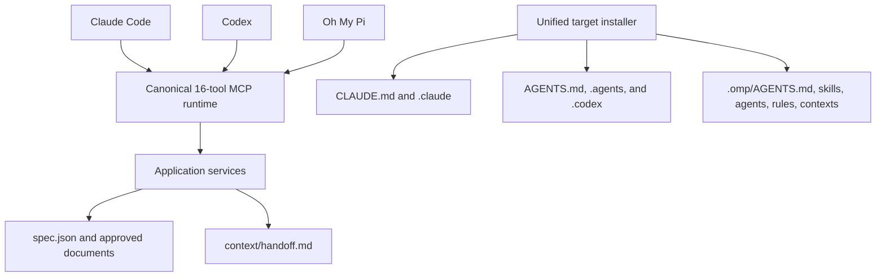

# MCP SDD Server Architecture

**Version**: 4.0.0
**Last Updated**: 2026-07-19

## Overview

SDD-MCP combines one packaged MCP runtime with target-native, progressively loaded guidance for Claude Code, Codex, and Oh My Pi (OMP). Durable workflow state lives under `.spec/specs/<featureName>/`. Generated host guidance is not the authority.

```mermaid
graph TB
    Claude[Claude Code] --> Runtime[Canonical 16-tool MCP runtime]
    Codex[Codex] --> Runtime
    OMP[Oh My Pi] --> Runtime
    Runtime --> Services[Application services]
    Services --> Spec[spec.json and approved documents]
    Services --> Handoff[context/handoff.md]
    Installer[Unified target installer] --> ClaudeTree[CLAUDE.md and .claude]
    Installer --> CodexTree[AGENTS.md, .agents, and .codex]
    Installer --> OMPTree[.omp/AGENTS.md, skills, agents, rules, contexts]
```

The package separates four concerns:

1. **MCP tools** perform stateful operations and validation.
2. **Skills** carry short, manual-only workflow instructions.
3. **Application services** enforce the rules for approval, checkpoint, path, and context.
4. **Target renderers** turn canonical assets and role routes into host-native files.

## Layered architecture

- **Presentation** (`src/index.ts`, `src/infrastructure/mcp/`, `src/adapters/cli/`): validates public schemas, adds the workspace root, and formats MCP responses.
- **Application** (`src/application/services/`): coordinates workflow transitions, context selection, project initialization, templates, steering, and quality checks.
- **Domain** (`src/domain/`): workflow entities, value objects, ports, and errors.
- **Infrastructure** (`src/infrastructure/`): filesystem, persistence, MCP transport, template, validation, and atomic-write adapters.
- **Installer** (`src/cli/`): target resolution, recursive rendering, managed ownership, backups, and root guidance.

Both `sdd-entry.js` and the documented `mcp-server.js` launcher call the compiled TypeScript runtime. Neither launcher keeps a second handler implementation.

## Canonical MCP surface

v4 exposes exactly 16 tools on every runtime surface:

| Workflow | Context and status | Validation and project guidance |
|---|---|---|
| `sdd-init` | `sdd-status` | `sdd-quality-check` |
| `sdd-requirements` | `sdd-context-load` | `sdd-template-render` |
| `sdd-design` | `sdd-approve` | `sdd-steering` |
| `sdd-tasks` | `sdd-review-test-cases` | `sdd-steering-custom` |
| `sdd-implement` |  | `sdd-validate-design` |
| `sdd-spec-impl` |  | `sdd-validate-gap` |

Every operation on an existing feature uses `featureName`. The server supplies the validated project root internally. Public `projectId` locators no longer exist. `sdd-status` may omit `featureName` to list the specs it contains. The project removed `sdd-list-skills`. Native hosts discover skills, and the installer already provides `--list`.

One `SpecPathResolver` validates child names, checks canonical `realpath` containment, and rejects symlink escapes. The `spec.json` file on disk is the durable authority. Approval and test-case review therefore keep working after an MCP restart.

## Workflow engine

The ordered phases are requirements → design → tasks → implementation. `WorkflowEngineService` serializes transitions for each feature. It re-reads state after it acquires the feature lock.

Approval invariants include these rules:

- The requested document must exist.
- Prior phases must be approved.
- Tasks approval follows the optional test-case review checkpoint.
- The service commits `spec.json` atomically before it publishes the derived handoff.
- If the handoff fails after the commit, the service returns an approved transition with `pending-regeneration`. It never returns stale content.
- Repeated approval is idempotent. It repairs only a missing or stale cache.

Rollback is an internal, disk-addressable service operation. It atomically resets the affected approvals and invalidates the rebuildable handoff cache. v4 does not expose a public rollback tool.

## Phase-aware context

`ContextCompactionService` accepts an internal request that contains `projectRoot` and public options based on `featureName`. It derives the latest approved phase unless the caller requests a phase explicitly. Compact and standard context exclude draft and future artifacts. Full mode includes an explicitly requested draft only with `includeUnapproved: true`.

Default bounds are:

| Mode | Default bound | Behavior |
|---|---:|---|
| compact | 2,048 `estimatedTokens` | bounded state and selected approved context |
| standard | 4,096 `estimatedTokens` | broader approved context |
| full | 16,384 `estimatedTokens` | selected raw documents; never silently truncated |

`estimatedTokens` is the deterministic value `ceil(characters / 4)`. It is not a provider tokenizer count. A request below the mandatory envelope fails with a typed budget error. A full-mode overflow also fails. It does not truncate.

Two hashes have different roles:

- `sourceFingerprint` hashes the normalized workflow state, the names and bytes of the selected sources, and the handoff schema.
- `fingerprint` also hashes the mode, the budget, the inclusion options, and the selection algorithm. It acts as the exact-response ETag.

A request whose `ifNoneMatch` equals `fingerprint` returns `cacheStatus: not-modified` without `content`. The service saves only the canonical default compact payload, at `.spec/specs/<featureName>/context/handoff.md`. Standard, full, and custom-budget responses are deterministic results that the service builds on demand. There are no duplicate phase handoff files.

## Target installation architecture

The resolver chooses one of three targets before writing:

| Target | Root | Skills | Rules | Agents | Context references |
|---|---|---|---|---|---|
| Claude Code | `CLAUDE.md` | `.claude/skills` | `.claude/rules` | `.claude/agents` | `.claude/contexts` |
| Codex | `AGENTS.md` | `.agents/skills` | `.codex/guidance/rules` | `.codex/agents` | `.codex/guidance/contexts` |
| OMP | `.omp/AGENTS.md` | `.omp/skills` | `.omp/rules` | `.omp/agents` | `.omp/contexts` |

Lean and full selection depend on the target. OMP lean includes skills, steering, and agents. OMP full adds rules and contexts. Claude Code and Codex keep their supported hook components. OMP Markdown is guidance only. The project never describes or installs it as an executable native hook.

All SDD skills are manual-only and use progressive loading. The user invokes a skill with `/<name>` in Claude Code, `$<name>` in Codex, and `/skill:<name>` in OMP. Claude rules have native `paths`. OMP rules use bounded metadata plus `globs` and `alwaysApply: false`. Codex uses compact guidance pointers.

### Managed ownership

`.sdd-mcp/install-manifest.json` records hashes for each target. The installer upgrades unchanged generated outputs automatically. It leaves modified outputs untouched. It backs up obsolete unchanged assets before it removes them. `--refresh-generated` backs up the selected assets under `.sdd-mcp/backups/<timestamp>/<target>/`. It then rebuilds only the recognized package-owned set. The user owns shared mutable steering.

## Model routing boundary

`ROLE_MODEL_ROUTES` and `SKILL_AGENT_ROUTES` own the defaults. At installation, `loadModelRoutes` validates the optional `--model-roles <file>` YAML once. It passes the resolved SDD role table to the skill and agent renderers. Host-global settings and the persistent parent-session model do not change. Claude's skill override applies only for the invoked turn. See [docs/MODEL-ROUTING.md](docs/MODEL-ROUTING.md).

- Claude gets native skill `model`/`effort` overrides for the invoked turn. It also gets matching subagent frontmatter. The installer does not create a redundant specialist.
- Codex gets generated custom agent TOML with per-role `model`/`model_reasoning_effort`. High-level skills may request one advisor. Instructions drive that selection, and it cannot change an inline parent.
- OMP does high-level work inline on the parent by default. `.omp/agents` advisors are explicit opt-in. They allow one child at most, with no spawn capability, no retry, and no nesting. The installer generates their model and thinking fields from the resolved role route.
- Implementation, TDD, and simple tasks run inline. They run in parallel only when at least two truly independent slices exist.

This inline-default OMP policy follows real A/B evidence. Automatic high-effort child requests increased the median cost. Static route metadata cannot inspect the active parent model. It cannot guarantee a Codex spawn. Model availability and effort support depend on the host and provider. The installer does not check them.

## Measurement model

The packaged `npx sdd-mcp-server context-report` keeps these categories separate:

1. repository static payload;
2. repository dynamic/invoked payload;
3. provider-reported usage and cost;
4. unobservable host payload, reported as unknown.

Fresh full-install static reductions versus v3.5.1 were **74.37% Codex**, **83.21% OMP**, and **95.64% Claude Code**. These are exact repository byte measurements. They are not provider token claims.

Comparable provider-reported three-run median costs improved by these amounts: **6.83% simple**, **11.79% medium**, **14.09% requirements**, **9.12% design**, **1.74% security**, and **1.87% repeated context**. All task-quality checks passed. Static reductions and observed costs stay in separate evidence classes.
