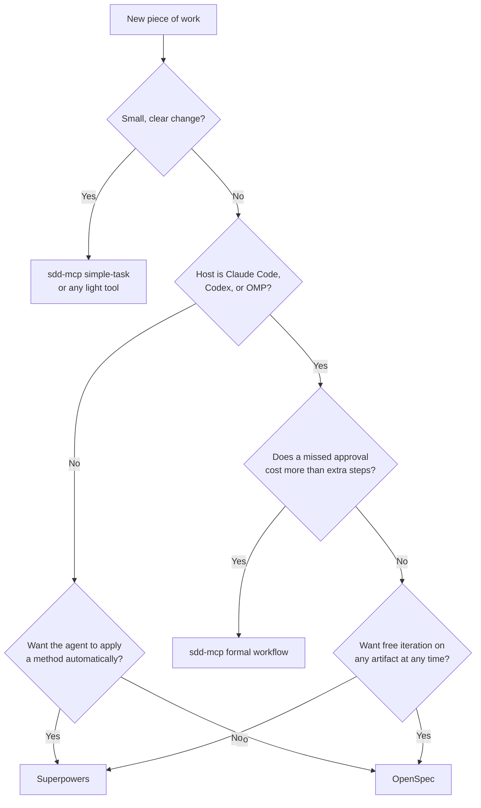

# MCP SDD Server

[](https://www.npmjs.com/package/sdd-mcp-server)
[](https://modelcontextprotocol.io)

A Model Context Protocol server and target-native installer for governed Spec-Driven Development (SDD) in Claude Code, Codex, and Oh My Pi (OMP).

> **v5.3.0** — Review, security, and multi-slice implementation skills ask once per session whether to run inline or use project agents. Every skill reports agents, parallelism, configured model/effort, and fallbacks. Installed guidance forbids commit/PR attribution lines. Claude Code requires 2.1.284+ for the pinned 5.5 defaults.

## Why sdd-mcp?

Skills own the requirements, design, task-planning, and TDD method. Skills also own the user conversation. The MCP runtime stays behind the Skill boundary. The runtime owns feature identity, canonical artifact writes, deterministic validation, revision-bound approvals, optional test review, implementation progress, and restart-safe context.

```text
User -> Skill -> MCP -> .spec
```

## Is sdd-mcp the right fit?

No workflow tool is best for every team. Each one makes a different trade-off between control, speed, and reach. Pick the option that matches your situation.

### Which option fits

Answer these questions in order. Each path ends at one option.



On the sdd-mcp path, you also get these properties:

- The runtime binds each approval to an exact revision and artifact hash.
- A later phase Skill stops when the earlier phase is not approved.
- Durable state in `.spec/specs/<feature>/spec.json` lets any session or person resume the same feature.
- Validation checks that EARS requirements, design decisions, and tasks trace to each other.

sdd-mcp does not support other hosts, for example Cursor or GitHub Copilot. Superpowers and OpenSpec support many more hosts.

### Comparison with Superpowers and OpenSpec

This table uses each project's own README as of October 2026. Check the linked projects for current details.

| | sdd-mcp | [Superpowers](https://github.com/obra/superpowers) | [OpenSpec](https://github.com/Fission-AI/OpenSpec) |
|---|---|---|---|
| Core idea | Governed phases with a state runtime | A development method built from composable skills | Lightweight specs organized as changes |
| Hosts | Claude Code, Codex, OMP | 18+ coding agents | 30+ AI tools |
| How it starts | You invoke a phase Skill | Skills activate automatically before a task | You run slash commands such as `/opsx:propose` |
| Phase gates | Enforced by the MCP runtime | Approval asked in the conversation | None by design ("no rigid phase gates") |
| Approval record | Revision and hash in `spec.json` | Not described as a stored record | No approval record in the core workflow |
| Artifacts | `requirements.md`, `design.md`, `tasks.md` per feature | Design document and implementation plan | `proposal.md`, delta specs, `design.md`, `tasks.md` per change, then archive |
| Implementation method | Test-first tasks with recorded RED and GREEN evidence | TDD, git worktrees, subagent per task with review | `/opsx:apply` works through tasks |
| Extra moving parts | MCP server plus installed Skills | Plugin or skill install | CLI plus generated commands |
| License | MIT | MIT | MIT |

### Trade-offs

| Choice | What you gain | What you pay |
|---|---|---|
| sdd-mcp | Enforced gates, an auditable approval record, and resumable state | More ceremony, an MCP runtime to install, and only three hosts |
| Superpowers | A strong default method that the agent applies without commands, on many hosts | Gates live in the conversation, so nothing outside the agent enforces them |
| OpenSpec | Low ceremony, free iteration, change history through archive, and many hosts | Alignment depends on team discipline, because no tool blocks a skipped step |

A short rule: choose sdd-mcp when a missed approval costs more than the extra steps. Choose a lighter tool when speed of iteration matters more than proof of approval.

## One-time personal setup

Install the runtime and manual Skills for Claude Code, Codex, and OMP once per local user/profile, from any directory:

```bash
npx -y sdd-mcp-server@latest setup-global
# Optional: configure only one host
npx -y sdd-mcp-server@latest setup-global --target codex

# Equivalent POSIX wrapper from a source checkout
./bootstrap.sh
```

The wrapper requires Node.js/npm (`npx`), not `sudo` or a global npm install. `SDD_MCP_PACKAGE` can select a version or an explicit npm file spec, for example `SDD_MCP_PACKAGE=file:/absolute/package.tgz ./bootstrap.sh`. For a local archive without the wrapper, use `npx -y file:/absolute/package.tgz setup-global`; npm 11.12.1 treats a bare absolute archive path as an executable instead.

| Host | Personal runtime configuration | Personal Skills |
|---|---|---|
| Claude Code | `~/.claude.json`; with nonempty `CLAUDE_CONFIG_DIR`: `<CLAUDE_CONFIG_DIR>/.claude.json` | `~/.claude/skills/` or `<CLAUDE_CONFIG_DIR>/skills/` |
| Codex | `~/.codex/config.toml` or `<CODEX_HOME>/config.toml` | `~/.agents/skills/` (not relocated by `CODEX_HOME`) |
| OMP | `<omp config path>/mcp.json` | `<omp config path>/skills/` |

OMP defaults to `~/.omp/agent`; named profiles need their own setup. [The installation guide](docs/INSTALL-GUIDE.md#one-time-personal-setup) details discovery, environment fallback, separate ownership stores, and safe upgrades.

Global setup changes **no Claude permission file** and installs no root guidance, agents, rules, hooks, steering, or repository files. These are local-machine assets, not Claude cloud/Cowork Skills. Reload the host and accept its normal trust/permission prompts.

From a directory that is not this package checkout and has no shadowing project registration, verify `claude mcp get sdd-mcp`, `codex mcp get sdd-mcp`, or OMP `/mcp test sdd-mcp`. Two local conditions make that check fail even after a successful `setup-global`:

- A project `install` in this checkout writes `.mcp.json`, `.codex/config.toml`, or `.omp/mcp.json`. Those same-name entries hide the personal runtime. Remove only the project's `sdd-mcp` entry; setup does not do that.
- While the host's working directory is this checkout, the pinned `npx -y sdd-mcp-server@<version>` command exits with `sh: sdd-mcp-server: command not found` before the handshake. npm resolves the package name to this tree, and `npm install` does not put this package's own bin on `PATH`. After `npm install && npm run build`, link it once:

```bash
mkdir -p node_modules/.bin
printf '%s\n' '#!/bin/sh' 'cd "$(dirname "$0")/../.." && exec node ./sdd-entry.js "$@"' > node_modules/.bin/sdd-mcp-server
chmod +x node_modules/.bin/sdd-mcp-server
```

Reload the host after that link. Any other project directory can use the published command without it. An older user server named `sdd` is not this entry; remove it with `claude mcp remove sdd -s user` if Claude reports `ENOENT` for a bare `sdd-mcp-server` executable.

Existing project-scoped `sdd-mcp` entries still take precedence; remove only that project entry yourself if you want the personal runtime. Skill precedence is separate and host-specific. Global setup never scans or migrates repositories.

The repository installer below remains an **optional team/project-scoped alternative**, not a required follow-up. Do not run it in this checkout when the goal is personal scope.

## New project installation

Use this path when the repository has never had sdd-mcp-generated guidance. The `npx` commands below run from the **destination project's root**, not from this `sdd-mcp-server` source checkout. Running them here, or running the local `install` entrypoint here, registers a project server that hides personal setup.

1. Open a terminal at the project root.
2. Choose the host that will execute the workflow.
3. Install the lean profile for the smallest default guidance surface, or choose `full` when the project needs target-native rules, contexts, and agents.

```bash
# Recommended explicit lean installation
npx sdd-mcp-server@5.3.0 install --profile lean --target claude-code
npx sdd-mcp-server@5.3.0 install --profile lean --target codex
npx sdd-mcp-server@5.3.0 install --profile lean --target omp

# Interactive full installation: choose Claude Code, Codex, or OMP
npx sdd-mcp-server@5.3.0 install --profile full
```

Use the local entrypoint only when this checkout itself is the intended project install. It does not repair personal runtime connection. Build once, then install explicitly:

```bash
npm install
npm run build
node ./sdd-entry.js install --profile lean --target omp
# Or, for interactive full installation:
node ./sdd-entry.js install --profile full
```

Do not use `--refresh-generated` for a new project. A normal installation records package ownership in `.sdd-mcp/install-manifest.json` and registers the project runtime. That registration is what a host in this directory will prefer over `setup-global`.

After installation, restart or reload the host and accept its project trust prompt. Then invoke the native requirements Skill with a feature name and goal; the Skill initializes or resumes durable state automatically.

A non-interactive install without `--target` retains the compatibility default, `claude-code`, and prints a notice. `--codex` remains a deprecated Codex-only alias. `--all-tools` installs all three native targets plus Antigravity; it does not make Codex artifacts executable by OMP.

### Configure SDD models and efforts

Optionally create `models.yaml` in the project root and pass it on each install:

```yaml
modelRoles:
  planner:
    claudeCode: { model: claude-opus-5-5, effort: high }
    codex: openai-codex/gpt-6-sol:high
    omp: openai-codex/gpt-6-sol:high
  implementer:
    claudeCode: { model: claude-sonnet-5-5, effort: medium }
    codex: openai-codex/gpt-6-luna:max
    omp: openai-codex/gpt-6-luna:max
```

```bash
npx sdd-mcp-server install --profile full --target claude-code --model-roles models.yaml
npx sdd-mcp-server install --profile full --target codex --model-roles models.yaml
npx sdd-mcp-server install --target omp --model-roles models.yaml
```

The six SDD roles are `planner`, `architect`, `reviewer`, `security-auditor`, `implementer`, and `tdd-guide`. Omitted roles keep the package defaults. Claude Code routes installed skills and subagents by model and effort. Codex routes generated custom agents by model and reasoning effort. This cannot change the model of the inline parent. OMP routes its generated agents, not host-level `default`/`smol`/`slow`/`plan`/`task`/`advisor` roles. `--model-roles` reads project YAML. It does not change host configuration, and it does not validate model availability. See [Model Routing](docs/MODEL-ROUTING.md) for selector syntax and host-specific limits.

## Manual workflow invocation

SDD workflow skills are explicit commands and do not activate implicitly from ordinary prose. The one exception is `output-clarity-ladder`, which the model applies on its own (see the last row).

| Path | Claude Code | Codex | Oh My Pi |
|---|---|---|---|
| Small task | `/simple-task` | `$simple-task` | `/skill:simple-task` |
| Formal SDD | `/sdd-requirements` → `/sdd-design` → `/sdd-tasks` → `/sdd-implement` | `$sdd-requirements` → `$sdd-design` → `$sdd-tasks` → `$sdd-implement` | `/skill:sdd-requirements` → `/skill:sdd-design` → `/skill:sdd-tasks` → `/skill:sdd-implement` |
| Clearer replies (automatic) | `/output-clarity-ladder` | `$output-clarity-ladder` | `/skill:output-clarity-ladder` |

`output-clarity-ladder` makes explanation, summary, and teaching replies easier to check. It writes about 80% of the way to ASD-STE100 and uses a diagram, HTML page, or video only when that format is easier to understand. It ships English rules plus Japanese (`ja`) and Traditional Chinese (`zh-TW`) guidance. It does not check an approved-word list, and it does not make output ASD-STE100 conformant.

Approvals and optional test-case review are explicit questions inside the relevant Skill flow. Status, context, validation, persistence, and progress recording happen internally.

## Profiles and native paths

| Component | Claude Code | Codex | Oh My Pi |
|---|---|---|---|
| Root guidance | `CLAUDE.md` | `AGENTS.md` | `.omp/AGENTS.md` |
| Skills | `.claude/skills/` | `.agents/skills/` | `.omp/skills/` |
| Agents | `.claude/agents/` | `.codex/agents/` | `.omp/agents/` |
| Rules | `.claude/rules/` | `.codex/guidance/rules/` | `.omp/rules/` |
| Context references | `.claude/contexts/` | `.codex/guidance/contexts/` | `.omp/contexts/` |
| Steering | `.spec/steering/` | `.spec/steering/` | `.spec/steering/` |

Claude Code and Codex lean profiles install skills, steering, and their supported hook guidance. OMP lean installs skills, steering, and agents. Full profiles add rules, contexts, and agents as supported by each host. OMP does not install Markdown as an executable hook; `--target omp --hooks` fails with an explanation.

**Project agents and execution mode.** Whether a skill can use project agents depends on the profile. With no agents installed (Claude Code/Codex `lean`), every skill runs inline and does not ask. With agents installed (`full`; OMP always), these skills ask once per session, inline or project agent: `sdd-review`, `sdd-security-check`, and any run with at least two independent implementation slices. Planning skills (requirements, design, tasks, steering) never ask. Every skill reports the mode, agents started, parallelism, configured model/effort, and fallbacks. To verify on each host, see [Model Routing](docs/MODEL-ROUTING.md#execution-mode-and-reporting). SDD agents are subagents, not the Claude Code `/advisor` tool.

See [Installation Guide](docs/INSTALL-GUIDE.md) and [Model Routing](docs/MODEL-ROUTING.md).

## Upgrade from sdd-mcp 3.x or 4.x

Use this path when the project already contains generated sdd-mcp files from an earlier release.

1. Commit or otherwise preserve the current repository state.
2. Select the v5 target that the host actually uses. Existing Claude Code and Codex projects keep their native target; an OMP project previously using Codex files must select `omp`.
3. Run one reversible refresh:

```bash
# Replace <target> with claude-code, codex, or omp
npx sdd-mcp-server@5.3.0 install \
  --profile full \
  --target <target> \
  --refresh-generated
```

The refresh backs up selected generated files under `.sdd-mcp/backups/<timestamp>/<target>/`, removes recognized obsolete package output, and establishes `.sdd-mcp/install-manifest.json`. Project source, `.spec/specs/`, user steering, unknown files, and modified generated files remain untouched; modified files are reported as conflicts for manual review.

For an OMP migration, Codex TOML agents remain preserved but are not executable OMP agents. The new native files are written under `.omp/`.

After this one-time migration, use a normal install without `--refresh-generated` for subsequent v5 updates. Review conflicts, then reload/restart the host and accept project trust before invoking a native phase Skill.

## Integrator/runtime reference: canonical v5 inventory
Every packaged entrypoint exposes the same 16 tools:

1. `sdd-init`
2. `sdd-requirements`
3. `sdd-design`
4. `sdd-tasks`
5. `sdd-implement`
6. `sdd-status`
7. `sdd-approve`
8. `sdd-review-test-cases`
9. `sdd-quality-check`
10. `sdd-context-load`
11. `sdd-template-render`
12. `sdd-steering`
13. `sdd-steering-custom`
14. `sdd-validate-design`
15. `sdd-validate-gap`
16. `sdd-spec-impl`

Feature-scoped tools use `featureName`; v5 payloads bind phase mutations and approvals to exact revisions and artifact hashes. This inventory is for MCP integrators and runtime maintainers—not end-user workflow instructions. Hosts discover installed Skills, and the installer supports `--list`.

## Integrator/runtime reference: compact continuation

The runtime's context API defaults to bounded approved context and supports exact-response ETags. Phase Skills manage fingerprints and draft opt-in internally. Integrators that call the protocol directly must follow three rules. Preserve the returned fingerprint for `ifNoneMatch`. Request unapproved source only explicitly in full mode. Treat `.spec/specs/<feature>/spec.json` as workflow authority. Compact, standard, and full default bounds are 2,048, 4,096, and 16,384 `estimatedTokens`. Full mode never silently truncates raw documents.

## Context and usage measurement

Run the packaged offline reporter:

```bash
npx sdd-mcp-server context-report
npx sdd-mcp-server context-report --before ./baseline-sessions --after ./v4-sessions
npx sdd-mcp-server context-report --json
```

The deterministic repository estimate is `ceil(characters / 4)` and is always labeled `estimatedTokens`; it is not an actual GPT or Claude tokenizer count. Reports keep repository static payload, invoked/dynamic payload, provider-reported usage, and unobservable host payload separate. Provider input, output, cache, reasoning-normalization, and monetary cost are only compared when the adapters and billing data are comparable.

Fresh full-install static payload measurements versus the v3.5.1 baseline fell by **74.37% for Codex**, **83.21% for OMP**, and **95.64% for Claude Code**. These are byte-derived repository static reductions, not provider token or cost claims.

Three-run fresh-session A/B comparisons used comparable provider-reported median cost. v4 improved simple task by **6.83%**, medium implementation by **11.79%**, requirements by **14.09%**, design by **9.12%**, security by **1.74%**, and repeated context by **1.87%**. All task-quality checks passed. Static and observed measurements are reported separately because installed bytes cannot predict hidden host prompts, caching, reasoning, or orchestration cost.

## Routing summary

Claude executes a skill in the current turn with its configured model and effort. The defaults are Claude Opus 5.5/high for high-level work and Claude Sonnet 5.5/medium for implementation/TDD. Installed Claude subagents have matching metadata.

Codex runs inline by default. It may use one configured GPT-6 Sol/xhigh custom agent for review and security, after the user chooses it once per session. Its agent metadata does not change the parent turn.

OMP executes invoked SDD skills inline. The installed `.omp/extensions/sdd-skill-routing.js` switches the parent to the configured model/thinking level for the turn, then restores it afterward. The defaults are GPT-6 Sol/xhigh for high-level work and GPT-6 Luna/medium for implementation/TDD. OMP’s `.omp/agents` advisors remain explicit opt-in only. They allow one child, and they cannot nest or retry.

Implementation, TDD, and simple tasks remain inline unless genuinely independent parallel slices justify delegation.

See [docs/MODEL-ROUTING.md](docs/MODEL-ROUTING.md) for enforcement and fallback boundaries.

## Project guidance sources

- **Design Principles**: `rules/coding-style.md`
- **TDD Methodology**: `agents/tdd-guide.md`
- **Security Guidance**: `rules/security.md`
- **Workflow**: [docs/WORKFLOW.md](docs/WORKFLOW.md)
- **Architecture**: [ARCHITECTURE.md](ARCHITECTURE.md)

## Development

```bash
git clone https://github.com/yi-john-huang/sdd-mcp.git
cd sdd-mcp
npm install
npm run build
npm test
```

MIT licensed. See [CHANGELOG.md](CHANGELOG.md) for release history.
