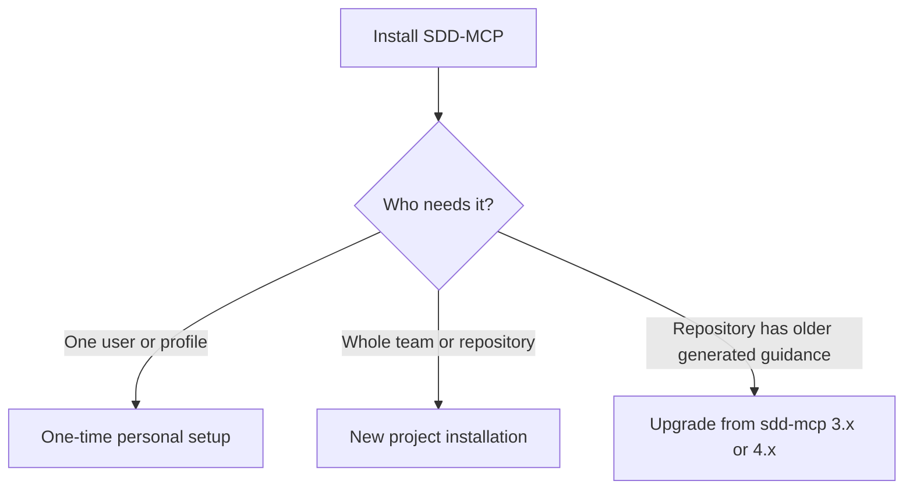

# SDD-MCP Installation Guide

Use one-time personal setup for a local user or profile. Use the optional project installer for shared repository guidance. Neither one invokes a model. Neither one inspects authentication. Neither one grants host or project trust.



## One-time personal setup

From any directory with Node.js >=18 and npm available:

```bash
npx -y sdd-mcp-server@latest setup-global
npx -y sdd-mcp-server@latest setup-global --target claude-code
npx -y sdd-mcp-server@latest setup-global --target codex
npx -y sdd-mcp-server@latest setup-global --target omp
```

Without `--target`, setup processes Claude Code, Codex, then OMP. The only option is one `--target` with one of those values. Setup does not accept project install flags such as `--all-tools` and `--profile`.

The equivalent source-checkout wrapper is `./bootstrap.sh`. Only the wrapper requires POSIX `sh`. The wrapper runs `npx -y "${SDD_MCP_PACKAGE:-sdd-mcp-server@latest}" setup-global "$@"`. It keeps the arguments and the exit status. It needs neither `sudo` nor `npm install -g`. Setup pins the exact version of the resolved package in all runtime entries.

### Native personal paths

`H` is the user home. `P` is nonempty `CLAUDE_CONFIG_DIR`, otherwise `H/.claude`. `C` is nonempty `CODEX_HOME`, otherwise `H/.codex`. `A` is the discovered or fallback OMP agent directory.

| Host | Runtime configuration | Runtime ownership directory | Skills | Skills ownership directory |
|---|---|---|---|---|
| Claude, no override | `H/.claude.json` | `H/.claude/.sdd-mcp/global-runtime` | `H/.claude/skills/` | `H/.claude/.sdd-mcp/global-skills` |
| Claude, nonempty override | `P/.claude.json` | `P/.sdd-mcp/global-runtime` | `P/skills/` | `P/.sdd-mcp/global-skills` |
| Codex | `C/config.toml` | `C/.sdd-mcp/global-runtime` | `H/.agents/skills/` | `H/.agents/.sdd-mcp/global-skills` |
| OMP | `A/mcp.json` | `A/.sdd-mcp/global-runtime` | `A/skills/` | `A/.sdd-mcp/global-skills` |

Each ownership directory contains `install-manifest.json`, the transient `install.lock`, and any `backups/<timestamp>/<target>/...`. Runtime ownership and Skills ownership use separate stores. `CODEX_HOME` does not move personal Skills. A nonempty Claude override equal to `H/.claude` still selects the override row.

Explicit directory overrides must be absolute after setup expands only `~` or `~/...`. Setup keeps spaces. Relative paths, control characters, escaping destinations, and managed symlink traversal fail. Setup does not select the current directory instead.

### OMP discovery and profiles

For a selected OMP target, setup calls `omp config path` once without a shell. A single absolute output line selects `A`. If discovery is missing or unusable, setup prints a fallback notice and applies these rules:

1. A defined `OMP_PROFILE` wins over `PI_PROFILE`, including an explicitly empty value. An empty value, a whitespace-only value, or `default` selects the default profile.
2. The default profile uses nonempty `PI_CODING_AGENT_DIR` when you supply it. Otherwise it uses `H/<config-dir>/agent`.
3. A named profile uses `H/<config-dir>/profiles/<profile>/agent` and ignores `PI_CODING_AGENT_DIR`. Run setup once per named profile.
4. `<config-dir>` is nonempty `PI_CONFIG_DIR` or `.omp`, relative to home. Setup rejects absolute config directories, escaping config directories, and unsafe profile names.

If successful discovery returns an unsafe path, setup fails. Setup does not replace that path with a guessed fallback.

### Scope, preservation, and verification

Personal setup installs only the runtime and the target-rendered Skills. It also installs their supporting references and the Codex invocation policy. The workflow Skills are manual-only. `output-clarity-ladder` is the only model-invocable Skill. Setup creates no `CLAUDE.md`, `AGENTS.md`, agents, rules, contexts, hooks, steering, `.gitignore`, or project installation files. Setup neither creates nor changes **any Claude permission settings**, even if an existing settings file is malformed. Existing user, project, and managed permission policy continues to apply.

These Skills are local-machine and user-profile assets. Claude cloud and Cowork sessions do not read these local personal Skills. Reload or restart the host. Then accept its normal trust and tool permission prompts.

Run the verification from a directory that meets two conditions. It is not the `sdd-mcp-server` source checkout. It does not already contain a same-name project runtime entry.

```text
claude mcp get sdd-mcp
codex mcp get sdd-mcp
# In OMP:
/mcp test sdd-mcp
```

`setup-global` can succeed and the host can still fail to connect. Two checks explain this:

1. Project registration wins. `install` in a repository writes `.mcp.json`, `.codex/config.toml`, or `.omp/mcp.json`. Remove only that project's `sdd-mcp` entry. Keep the other entries and settings. Review an owned Codex marked block before you remove it. Setup does not scan repositories and does not perform this migration. Do not run the project installer in the source checkout as a substitute for personal setup. That action creates the shadowing entry.
2. The pinned runtime command is `npx -y sdd-mcp-server@<version>`. When the host working directory is this package checkout, npm 11 resolves that name to the local tree. It then exits with `sh: sdd-mcp-server: command not found` (`CONNECTION_CLOSED` in Claude). `npm install` does not link the bin of this package. Build the checkout. Then create `node_modules/.bin/sdd-mcp-server` as a `node ./sdd-entry.js` shim. Then reload the host. Other project directories do not need the shim. A user server named `sdd` with command `sdd-mcp-server` is a different, broken entry. Remove it with `claude mcp remove sdd -s user`.

Runtime scope precedence is not Skill precedence. Each host applies its own discovery rules to Skill-name collisions. Inspect the Skill source. Do not assume that a runtime switch selects a different Skill copy.

Rerunning setup upgrades unmodified owned runtime entries and Skills. Setup preserves user-modified or unknown conflicting content and lists it under **Preserved conflicts**. Malformed configuration, unsafe paths, and I/O or state errors appear under **Failures**. Either category gives exit status 1. Independent hosts continue. **Installed / unchanged** lists retained results, not rolled-back attempts. A Skills failure does not remove a runtime that setup already committed. Fix the reported path and rerun setup explicitly. Concurrent setup versions hold the runtime lock through the nested Skills pass.

Workflow state stays project-local. A nonempty `CLAUDE_PROJECT_DIR` selects the project. Otherwise the runtime uses its process working directory. If you supply an invalid root, the runtime fails. It does not fall back.

### Packed-package and host acceptance

For local release testing, use an absolute npm **file spec**. Do not use a bare archive path.

```bash
npm run build
npm pack --pack-destination /absolute/temp
SDD_MCP_PACKAGE=file:/absolute/temp/sdd-mcp-server-5.4.0.tgz ./bootstrap.sh
# Independent cross-platform path, without the wrapper:
npx -y file:/absolute/temp/sdd-mcp-server-5.4.0.tgz setup-global
```

Use fresh, distinct temporary home, config, and project directories for each path. Pass `HOME`, `CLAUDE_CONFIG_DIR`, `CODEX_HOME`, and the OMP profile and agent settings to the child process. Control `omp` discovery on `PATH`. Then an unrelated installed host cannot select real user state. Rerun both commands. Check the pinned entries, the rendered references, and the unchanged Claude settings. Then exercise conflicts and Skills failures. Native npm 11.12.1 attempts to execute a bare `/absolute/package.tgz` (exit 126). The explicit `file:` syntax is the verified package-resolution path.

Earlier release acceptance exercised these host versions:

- Claude Code 2.1.181 (`claude mcp get`: user scope, connected).
- Codex 0.147.0 (`codex mcp get`: pinned stdio entry).
- OMP 18.3.0 (`/mcp test`: connected).

The Claude check verified MCP discovery only. The pinned Opus/Sonnet 5.5 skill defaults require Claude Code 2.1.284 or newer. The isolated Claude check specifically confirmed `<CLAUDE_CONFIG_DIR>/.claude.json`. File existence alone is not this host-discovery check. Revalidate native discovery and model routing when you release against different host versions.

Upstream references: [Claude MCP](https://code.claude.com/docs/en/mcp), [Claude Skills](https://code.claude.com/docs/en/skills), [Claude environment variables](https://code.claude.com/docs/en/env-vars), [Codex MCP](https://developers.openai.com/codex/mcp/), [Codex Skills](https://developers.openai.com/codex/skills), [Codex advanced configuration](https://developers.openai.com/codex/config-advanced/), [OMP MCP configuration](https://github.com/can1357/oh-my-pi/blob/main/docs/mcp-config.md), [OMP Skills](https://github.com/can1357/oh-my-pi/blob/main/docs/skills.md), and [OMP configuration discovery](https://github.com/can1357/oh-my-pi/blob/main/docs/config-usage.md).

## New project installation

The following project-scoped path is optional. Use it for team or repository guidance. You do not need it after personal setup.

Use this procedure when the repository does not contain guidance that an earlier sdd-mcp release generated:

1. Start in the project root.
2. In automation, choose the host target explicitly.
3. For the smallest guidance surface, keep the default lean profile. For additional target-native rules, contexts, and agents, select `full`. Runtime registration is mandatory in both profiles and in the `install-skills` alias.
4. Restart or reload the host. Accept project trust. Claude `ask`/`deny` or organization policy may still override the installed allow rule.
5. Invoke the native requirements Skill with a feature name and goal. The Skill initializes or resumes state. It submits artifacts, presents validation, and asks for approval internally.

Do not use `--refresh-generated` for a new project. A normal installation creates generated files, the runtime registration, and the `.sdd-mcp/install-manifest.json` ownership record.

**Source checkout exception:** Do not treat `node ./sdd-entry.js install` as personal setup. That command writes project runtime files in this checkout and hides `setup-global`. The pinned `npx` runtime also fails here with `sh: sdd-mcp-server: command not found`. It fails until `node_modules/.bin/sdd-mcp-server` runs `node ./sdd-entry.js`. Use the local entrypoint only when you intend to install project guidance into this checkout. In another project, run `npx` from the root of that project, as shown below.

### Choose a target

In an interactive terminal, a full install shows three choices:

```bash
npx sdd-mcp-server install --profile full
```

```text
Choose the primary LLM agent target:
  1) Claude Code
  2) Codex
  3) Oh My Pi
Selection:
```

For automation, select exactly one target:

```bash
npx sdd-mcp-server install --target claude-code
npx sdd-mcp-server install --target codex
npx sdd-mcp-server install --target omp
```

Without a target in non-interactive mode, the compatibility default remains `claude-code`. The installer prints a notice. Deprecated `--codex` means Codex only. `--all-tools` installs the native Claude Code, Codex, and OMP trees plus the existing Antigravity integration. The installer rejects generic path overrides with `--all-tools`. One override cannot safely identify three roots.

## Profiles and components

Profiles depend on the target:

| Target | Lean (default) | Full |
|---|---|---|
| Claude Code | runtime, skills, steering, supported hook guidance | lean + rules, contexts, agents |
| Codex | runtime, skills, steering, supported lifecycle hooks | lean + rules, contexts, agents |
| OMP | runtime, skills, steering, agents | lean + rules, contexts |

OMP has no executable Markdown hook integration. `--target omp --hooks` fails fast. The installer does not install guidance and call it a native hook.

Examples:

```bash
npx sdd-mcp-server install --target omp
npx sdd-mcp-server install --profile full --target omp
npx sdd-mcp-server install --target codex --skills --rules --agents
npx sdd-mcp-server install --list
```

`--all` selects every component that the chosen target supports. `install-skills` is an alias for the unified target-aware installer with `--skills`. It uses the same target resolution and the same recursive renderer.

## Configuring model routes

If the package defaults do not match the available models, pass a project YAML file on each install. For example:

```yaml
modelRoles:
  planner:
    claudeCode: { model: claude-opus-5-5, effort: high }
    codex: openai-codex/gpt-6-sol:high
    omp: xai-oauth/grok-4.7:xhigh
  reviewer:
    claudeCode: { effort: low }
  implementer: openai-codex/gpt-6-luna:max
```

```bash
npx sdd-mcp-server install --profile full --target claude-code --model-roles models.yaml
npx sdd-mcp-server install --profile full --target codex --model-roles models.yaml
npx sdd-mcp-server install --target omp --model-roles models.yaml
```

The path is relative to the project root. The installer reads the YAML. It does not copy or modify it. Valid SDD keys are `planner`, `architect`, `reviewer`, `security-auditor`, `implementer`, and `tdd-guide`. A scalar `provider/model:effort` sets **both Codex and OMP** agents, not Claude Code. Use a host mapping when providers differ. `claudeCode` accepts a model name or a `{ model, effort }` mapping. Either field is optional. Codex and OMP selector efforts are `minimal`, `low`, `medium`, `high`, `xhigh`, and `max`. Claude efforts are `low`, `medium`, `high`, `xhigh`, and `max`. Unknown roles, duplicate keys, and invalid selectors fail before the installer writes anything. Unspecified roles and hosts use the default route. `--all-tools` uses the same overrides for all targets.

Claude Code lean installs skills with native current-turn model and effort overrides. Full (or `--agents`) also installs matching subagents. Codex lean installs skills but **not** agent TOML. To install custom agents with model and reasoning effort, use full or `--agents`. OMP lean includes agents. After you change overrides, reinstall with the file. The installer updates package-owned, unmodified generated files. It leaves user-modified files untouched and reports them as conflicts. This option never configures generic host subagents or the interactive parent session. The OMP roles `default`, `smol`, `slow`, `plan`, `task`, and `advisor` belong to OMP host settings, not to this SDD role map.

## Generated files

| Component | Claude Code | Codex | OMP |
|---|---|---|---|
| Root guidance | `CLAUDE.md` | `AGENTS.md` | `.omp/AGENTS.md` |
| Skills | `.claude/skills/<name>/` | `.agents/skills/<name>/` | `.omp/skills/<name>/` |
| Agents | `.claude/agents/<role>.md` | `.codex/agents/<role>.toml` | `.omp/agents/<role>.md` |
| Rules | `.claude/rules/` with native `paths` | `.codex/guidance/rules/` | `.omp/rules/` with `globs` and `alwaysApply: false` |
| Context references | `.claude/contexts/` | `.codex/guidance/contexts/` | `.omp/contexts/` |
| Steering | `.spec/steering/` | `.spec/steering/` | `.spec/steering/` |
| Runtime registration | `.mcp.json` plus `.claude/settings.json` allow | `.codex/config.toml` | `.omp/mcp.json` |

The installer merges only its `sdd-mcp` entry. It preserves unrelated config, comments, and Claude permission rules. The installer preserves a malformed config or a conflicting same-name server byte-for-byte. The installation is then incomplete.

After reload and trust, use `/sdd-requirements <feature>` in Claude Code, `$sdd-requirements <feature>` in Codex, or `/skill:sdd-requirements <feature>` in OMP. Continue with the native design, tasks, and implement Skills after each explicit human gate. End users do not call MCP tools or paste workflow JSON.

Manual skill syntax is `/skill:<name>` in OMP, `/<name>` in Claude Code, and `$<name>` in Codex. All SDD workflow skills are manual-only. Prose does not activate them implicitly. The only exception is `output-clarity-ladder`. The model applies it to explanation, summary, and teaching replies.

### Published-host smoke

This smoke requires `npx` to resolve `sdd-mcp-server@5.4.0`. The package must be published or otherwise resolvable. Repository CI cannot substitute a real host trust prompt. Follow these steps:

1. In a clean temporary repository, run `npx sdd-mcp-server@5.4.0 install --profile lean --target <claude-code|codex|omp>`.
2. Reload the selected host. Accept project trust once.
3. Invoke only the host-native requirements Skill shown above.
4. Approve the artifact explicitly.
5. Restart the host. Then invoke only its design Skill.
6. Verify that `.spec/specs/<feature>/spec.json` retains the requirements revision, hash, and approval.
7. Verify that `requirements.md` contains the content that the Skill produced.
8. Verify that `context/handoff.md` is repairable without any user-facing raw MCP instruction.

## Managed ownership and reruns

The installer stores a merge-safe ownership manifest at `.sdd-mcp/install-manifest.json`. It updates only the chosen target record:

- Missing output: the installer installs it and records its SHA-256.
- Unchanged managed output: the installer upgrades it automatically.
- User-modified managed output: the installer preserves it and reports a conflict.
- Unknown legacy output: the installer preserves it unless it exactly matches a recognized generated asset.
- Obsolete unchanged managed output: the installer backs it up, then removes it.
- Mutable `.spec/steering/` content: the installer records provenance. It never auto-replaces or tombstones this content.

The installer adds `.sdd-mcp/` and the target-generated trees to its managed `.gitignore` block. It does not rewrite unrelated entries.

## Upgrade from sdd-mcp 3.x or 4.x

Use this procedure when the repository contains generated guidance from an earlier release. The governed runtime of v5 normalizes existing `.spec/specs/` workflow documents when needed.

### Map the existing installation to a v5 target

| Existing target | v5 target | Guidance |
|---|---|---|
| Claude Code (`.claude/`, `CLAUDE.md`) | `claude-code` | Refresh the Claude-native generated set and register its project runtime. |
| Codex (`.agents/`, `.codex/`, `AGENTS.md`) | `codex` | Refresh the Codex-native generated set and register its project runtime. |
| Native OMP (`.omp/`) | `omp` | Refresh the OMP-native generated set and register its project runtime. |
| OMP previously using Codex files | `omp` | Install native `.omp/` files; preserved Codex TOML agents are not executable by OMP. |

Do not select a target only because its files already exist. Select the host that will execute the workflow after the upgrade.

### Run one reversible migration

1. Commit or otherwise preserve the current repository state.
2. Run one refresh for the selected target and desired profile:

```bash
# Replace <target> with claude-code, codex, or omp
npx sdd-mcp-server@5.4.0 install \
  --profile full \
  --target <target> \
  --refresh-generated
```

3. Inspect the installer report. The installer upgrades unchanged generated files. It preserves and reports modified or unknown files. It backs up selected replaced files under:

```text
.sdd-mcp/backups/<timestamp>/<target>/...
```

4. Review conflicts before you manually remove any old target directory.
5. Restart or reload the host. Confirm that it discovers the selected native root guidance and skills.

The refresh rebuilds only the selected package-owned set. It removes recognized legacy tombstones after backup. It does not replace project source, `.spec/specs/`, user steering, unknown custom files, or modified generated files.

### v5 behavior changes

- The four Formal SDD phase Skills are the complete public workflow. The backend lifecycle is hidden.
- Requirements owns feature initialization and cross-session resume.
- Approvals and optional test review are explicit human decisions inside Skill flows.
- The runtime persists and resumes the RED, GREEN, block, and final evidence of implementation.
- Runtime registration is mandatory for every install profile.

### Subsequent v5 updates

After the one-time migration, rerun the install with the same target and profile. Omit `--refresh-generated`:

```bash
npx sdd-mcp-server@5.4.0 install --profile full --target <target>
```

The ownership manifest then upgrades unchanged package files automatically. It continues to preserve modified files.

For an update from 5.0.0 to 5.0.1, use the profile and target that you already installed. Review any conflicts. Reload or restart the host so its registered runtime uses 5.0.1. No specification migration is required. The runtime rejected some requirements because `**Acceptance Criteria:**` was followed by a numbered list on separate lines. You can resubmit those requirements through the requirements Skill without rewriting that format.

For an update from 5.0.1 to 5.1.0, rerun the project installer with the same target and profile. This upgrades unmodified managed assets and the pinned runtime entry. To choose custom SDD role models, pass `--model-roles models.yaml` on every project install and rerun. Otherwise the existing defaults apply. Personal setup is a separate, optional user or profile scope. Run `npx -y sdd-mcp-server@5.1.0 setup-global` once per chosen host or profile. Then reload the host and accept host trust. Personal setup does not migrate project entries or change Claude permissions. No specification migration is required.

For an update from 5.1.0 to 5.1.1, rerun the same project installer from the root of the destination project. Inside the source checkout of this package, use the built local entrypoint instead. This release changes documentation and package version only. No specification migration is required.

For an update from 5.1.1 to 5.2.0, rerun the project installer for each selected target. Then unchanged managed skills, the model-routing extension of OMP, and the pinned MCP runtime upgrade together. Restart the host. Claude Code needs version 2.1.284 or newer for the pinned Sonnet 5.5 default. On older hosts, override the role model. Also rerun personal `setup-global` installations separately to update their pinned runtime.

For an update from 5.2.0 to 5.3.0, rerun the project installer for each selected target. Then the regenerated skills and root guidance (`CLAUDE.md`/`AGENTS.md`) pick up three items: the once-per-session execution-mode choice, the execution report, and the commit/PR attribution rule. Codex planning skills now run inline. They no longer request a custom agent. No specification migration is required.

## Model routing and availability

- Claude Code uses native model **and effort** overrides for the invoked skill turn and the installed project subagents. Defaults: `claude-opus-5-5`/high for high-level roles, and `claude-sonnet-5-5`/medium for implementation/TDD.
- Codex generated custom agents carry model and `model_reasoning_effort`. Defaults: `gpt-6-sol`/xhigh for advisors, and `gpt-6-luna`/medium for implementation/TDD. Review and security skills may use one child after the user chooses it once per session. This option does not switch inline parent turns.
- OMP installs `.omp/extensions/sdd-skill-routing.js` alongside skills. On `/skill:<name>`, the extension applies the configured model and `thinkingLevel` of the role to the parent for that turn. Defaults: `openai-codex/gpt-6-sol`/xhigh or `openai-codex/gpt-6-luna`/medium. Then it restores the previous route. If the model is unavailable, the invocation aborts. OMP does not silently use a different model. After installation, enable project extensions and restart OMP. Generated `.omp/agents` keep explicit opt-in advisor routes.

The installer emits selectors. It does not grant access. It does not verify host, model, or effort support. Availability depends on the configured provider and account. The OMP install reports model availability as “not verified”. It offers an optional `omp models find <provider/model>` diagnostic. See [MODEL-ROUTING.md](MODEL-ROUTING.md).

## Package context reporter

The reporter is an offline package command, not an MCP tool:

```bash
npx sdd-mcp-server context-report
npx sdd-mcp-server context-report --before ./before --after ./after
npx sdd-mcp-server context-report --json
```

The reporter counts exact UTF-8 bytes for generated target trees. It aggregates only usage fields from explicitly supplied OMP session roots. `estimatedTokens` means deterministic `ceil(characters / 4)`. It is not an actual provider tokenizer result. Provider-reported input, output, cache, reasoning-normalization, and cost remain separate from static installed bytes.

Measured fresh-install static reductions from the v3.5.1 baseline are Codex **74.37%**, OMP **83.21%**, and Claude Code **95.64%**.

## Custom paths and safety

Single-target installs may override component paths. The installer validates destinations beneath the chosen project roots. It rejects escaping symlinks and out-of-root paths. When each target needs a custom root, run separate explicit target installs.

## Troubleshooting

- In automation, pass `--target claude-code`, `--target codex`, or `--target omp` explicitly.
- If the installer reports a managed file as modified, inspect the conflict. Normal reruns intentionally preserve it.
- Use `--refresh-generated` only for selected generated assets. If needed, recover the prior bytes from `.sdd-mcp/backups/`.
- OMP does not discover Codex TOML agents. Install native `.omp/agents/*.md` instead.
- OMP hook requests fail by design until a native executable hook integration exists.
