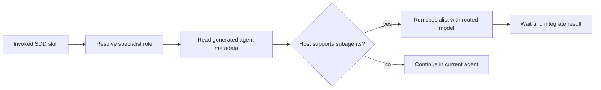

# SDD-MCP Agent Model Routing

This guide explains how SDD-MCP assigns models to specialized agents and what happens when a skill delegates work.

## Short version

For Codex installs:

- `gpt-5.6-luna` with `max` reasoning is the default route for implementation and TDD work.
- `gpt-5.6-sol` with `xhigh` reasoning is reserved for high-level advisor work: requirements planning, architecture, review, and security.
- `gpt-5.6-terra` remains a supported model identifier, but no default SDD role selects it.

For Claude Code installs, the equivalent aliases are `sonnet` for implementation/TDD and `opus` for high-level advisor work.

The model policy is target-specific. Claude Code model aliases do not affect Codex, and Codex model identifiers do not affect Claude Code.

## Role routing

The installer assigns a model from the agent's role, not from the filename alone:

| Role | SDD skills | Codex | Claude Code |
|---|---|---|---|
| `planner` | `/sdd-requirements`, `/sdd-tasks`, `/sdd-steering`, `/sdd-steering-custom` | `gpt-5.6-sol` / `xhigh` | `opus` |
| `architect` | `/sdd-design` | `gpt-5.6-sol` / `xhigh` | `opus` |
| `reviewer` | `/sdd-review` | `gpt-5.6-sol` / `xhigh` | `opus` |
| `security-auditor` | `/sdd-security-check` | `gpt-5.6-sol` / `xhigh` | `opus` |
| `implementer` | `/sdd-implement`, `/simple-task` | `gpt-5.6-luna` / `max` | `sonnet` |
| `tdd-guide` | `/sdd-test-gen` | `gpt-5.6-luna` / `max` | `sonnet` |

`/sdd-commit` deliberately has no specialist route. Commit guidance stays with the current agent because it needs the current session's complete implementation and verification context.

## How model metadata is generated

The repository keeps one source agent definition under `agents/*.md`. Each definition contains a role such as `planner` or `implementer`. The installer resolves that role through the central policy in `src/cli/install-target.ts`, then renders native metadata for the selected target.

### Codex output

Codex agents are written as TOML under `.codex/agents/`:

```toml
# High-level advisor
name = "planner"
model = "gpt-5.6-sol"
model_reasoning_effort = "xhigh"
```

```toml
# Default implementation agent
name = "implementer"
model = "gpt-5.6-luna"
model_reasoning_effort = "max"
```

The `model` field selects the model identifier. `model_reasoning_effort` controls the reasoning setting requested for that model. The installer does not call a model API or check entitlement; the Codex host applies the generated configuration and handles availability.

GPT-5.6 preview access depends on the user's eligible Codex workspace or API organization. Generated agent metadata does not grant access or bypass host entitlement checks.

### Claude Code output

Claude Code agents are written as Markdown under `.claude/agents/` with a frontmatter model alias:

```yaml
model: opus
```

or:

```yaml
model: sonnet
```

Claude Code uses its own aliases, so Codex effort values such as `xhigh` and `max` are not emitted into Claude Code agent files.

## What happens when a skill runs

1. You invoke a skill such as `/sdd-review`.
2. The skill identifies its specialist role (`reviewer` in this example).
3. If the host supports subagents, it sends that specialist a compact handoff containing only the relevant scope, requirements, conventions, and verification evidence.
4. The host starts the generated specialist agent, which uses the model metadata for that role.
5. The current workflow waits for the result and integrates it.
6. If subagent delegation is unavailable, the skill reports the fallback and continues in the current agent. The repository cannot force a model switch in that fallback path.

This means model routing affects delegated specialist work. It does not automatically change the model of the parent conversation.

Specialist delegation can consume more total tokens than an equivalent single-agent run because the host pays for handoffs, specialist work, and result integration. Compact handoffs reduce unnecessary context but do not eliminate that additional cost.



## Installation and rerun behavior

Agent files are installed by a full profile or by selecting `--agents` explicitly:

```bash
npx sdd-mcp-server install --profile full --target codex
npx sdd-mcp-server install --target codex --agents
```

The default lean profile does not install agent files, so its skills cannot use locally generated specialist metadata until agents are installed.

Installation is preserve-first. Existing agent files are skipped on reruns rather than overwritten. If a project already has agents generated under the previous model policy, inspect and update those generated files deliberately, or install into a fresh project directory. The source policy change alone does not rewrite existing files.

## Source of truth

The model and effort mapping is defined once in `src/cli/install-target.ts`:

- `DEFAULT_CODEX_MODEL` identifies the default Codex model.
- `ROLE_MODEL_ROUTES` maps each role to Codex and Claude Code metadata.
- `SKILL_AGENT_ROUTES` maps skills to specialist roles.

The generated files under `.codex/agents/` and `.claude/agents/` are target-specific outputs; do not edit them as the package source of truth.
