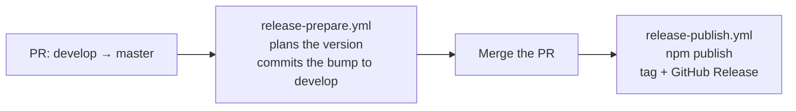

# Releasing

A merge from `develop` to `master` releases a new version. GitHub Actions bumps the version, tags it, creates a GitHub Release, and publishes the package to npm. Nobody edits version numbers by hand.

## How a release flows



1. You open a pull request from `develop` to `master`.
2. `release-prepare.yml` plans the next version. It commits `chore(release): prepare X.Y.Z` to `develop`. The pull request then contains the bump.
3. You review and merge the pull request.
4. `release-publish.yml` runs on `master`. It builds and tests the package. Then it publishes `X.Y.Z` to npm and creates the `vX.Y.Z` tag and GitHub Release.

`ci.yml` builds and tests every pull request to `develop` or `master`, and every push to `develop`.

## How the version is chosen

The planner starts from the highest `vX.Y.Z` tag. It reads the Conventional Commit messages since that tag:

| Commits since the last tag | Bump |
|---|---|
| Any `type!:` subject or `BREAKING CHANGE:` footer | major |
| Any `feat:` or `feat(scope):` subject | minor |
| Anything else | patch |

To override the result, add one label to the pull request: `release:patch`, `release:minor`, or `release:major`. The planner fails when the pull request has more than one release label. A label change reruns the planner, and it replaces the earlier bump.

The planner always counts from the released tag. So a rerun gives the same target, and the job commits nothing when `develop` already holds that version.

## What the bump changes

`scripts/release.mjs apply` writes the new version into these files:

- `package.json` and `package-lock.json` (root entries only)
- `.claude-plugin/plugin.json`
- `src/shared/version.ts`
- The pinned `sdd-mcp-server@X.Y.Z` commands and `sdd-mcp-server-X.Y.Z.tgz` names in `README.md` and `docs/INSTALL-GUIDE.md`
- `CHANGELOG.md`: the `[Unreleased]` entries move into a dated `[X.Y.Z]` section, and an empty `[Unreleased]` section stays on top

The script does not write release prose. Update these parts by hand when a release needs them:

- The `> **vX.Y.Z** —` highlight line at the top of `README.md`
- Upgrade notes such as "For an update from 5.2.0 to 5.3.0" in `docs/INSTALL-GUIDE.md`

Write changelog entries under `[Unreleased]` as you merge work to `develop`. The GitHub Release uses that section as its notes.

## Credentials

| Credential | Service | Used for | Setup |
|---|---|---|---|
| `RELEASE_TOKEN` secret | GitHub | `release-prepare.yml` pushes the bump commit to the protected `develop` branch. Nothing else uses it. | You create it once (step 1) |
| `GITHUB_TOKEN` | GitHub | `release-publish.yml` creates the tag and the GitHub Release | None. Actions provides it on each run |
| None | npm | `release-publish.yml` publishes the package | None. Trusted publishing uses a short-lived OIDC credential (step 2) |

No npm token exists anywhere in this pipeline.

## One-time setup

Do these steps once. Without them, the release jobs fail with an error that names the missing part.

The script `scripts/setup-release.sh` guides you through steps 1 to 3. It checks that you are a repository admin. It reads the token from a hidden prompt, checks it, and stores it as the secret. It creates the labels. Then it prints the values for step 2.

```bash
scripts/setup-release.sh
```

### 1. Release token for the bump commit

`develop` is protected, so the default Actions token cannot push to it. Admins bypass that protection, so a token from an admin account can.

1. Create a fine-grained personal access token from an admin account of this repository.
2. Limit it to the `yi-john-huang/sdd-mcp` repository.
3. Give it the **Contents: Read and write** permission. It needs no other permission.
4. Store it as the Actions secret `RELEASE_TOKEN` (Settings → Secrets and variables → Actions).
5. Set a calendar reminder to rotate it before it expires.

Pushes made with this token start the CI workflow for the pull request. The prepare job runs again too, but it commits nothing because the version already matches.

### 2. npm trusted publishing

Trusted publishing uses a short-lived OIDC credential instead of a stored npm token. It also adds provenance to each published version.

1. Sign in to npmjs.com as a maintainer of `sdd-mcp-server`.
2. Open the package settings and add a trusted publisher of type GitHub Actions.
3. Enter the organization or user `yi-john-huang`, the repository `sdd-mcp`, and the workflow file name `release-publish.yml`. Leave the environment empty.

### 3. Labels

Create the labels `release:patch`, `release:minor`, and `release:major` in the repository. You only need them when you want to override the planned bump.

## When something fails

| Symptom | Cause | Fix |
|---|---|---|
| Prepare fails with "Add the RELEASE_TOKEN secret" | The secret is missing | Do setup step 1 |
| Prepare fails on `git push` | The token is expired, or its account is not an admin | Create a new token from an admin account |
| Publish fails with a 404 or an OIDC error | Trusted publishing is not configured for `release-publish.yml` | Do setup step 2, then rerun the job |
| Publish says "Nothing to release" | `package.json` holds a version that is already tagged and published | Open the release pull request from `develop` so that the prepare job runs |

The publish job checks npm and the tag separately. When one part already exists, the job skips it. So you can rerun a failed publish job safely.
