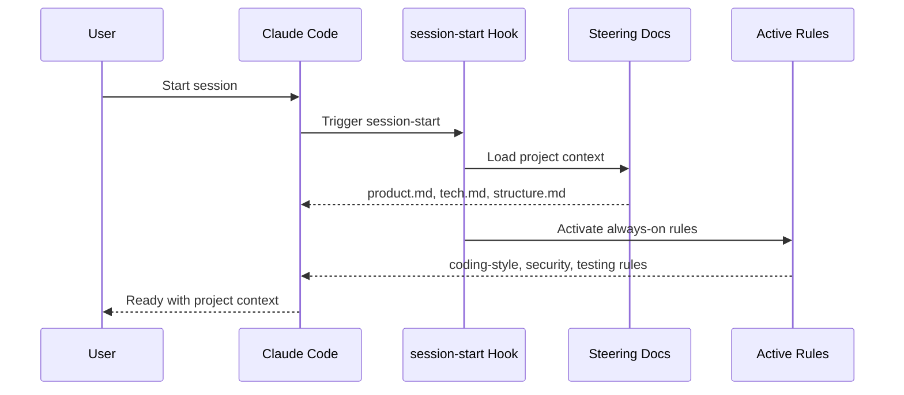
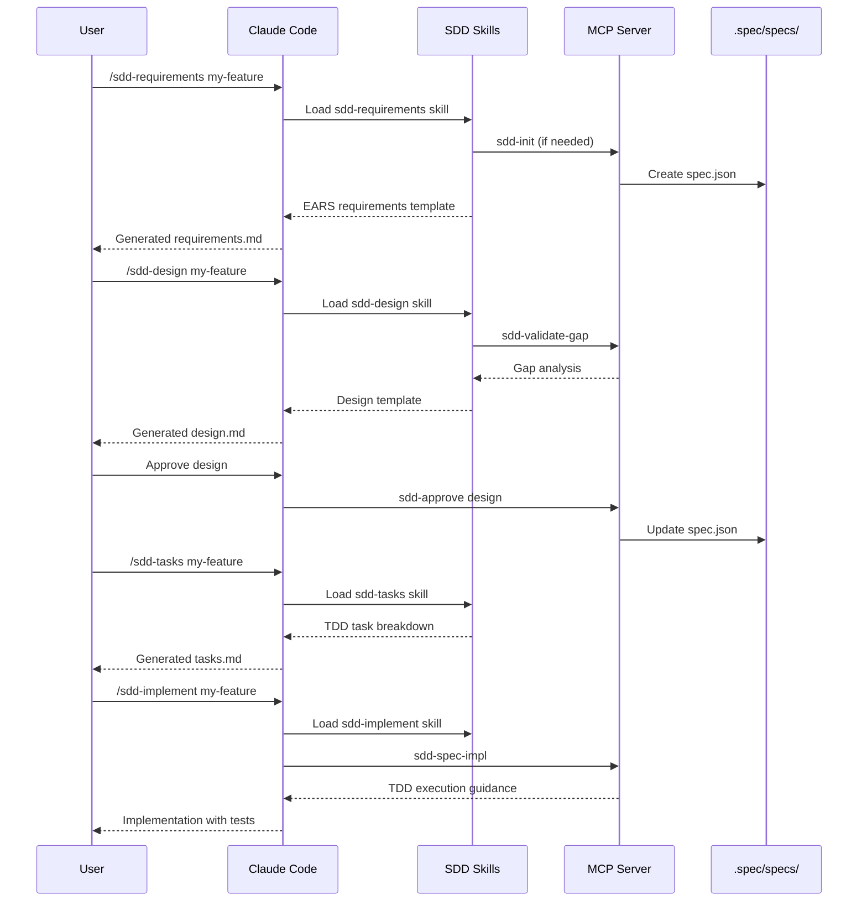
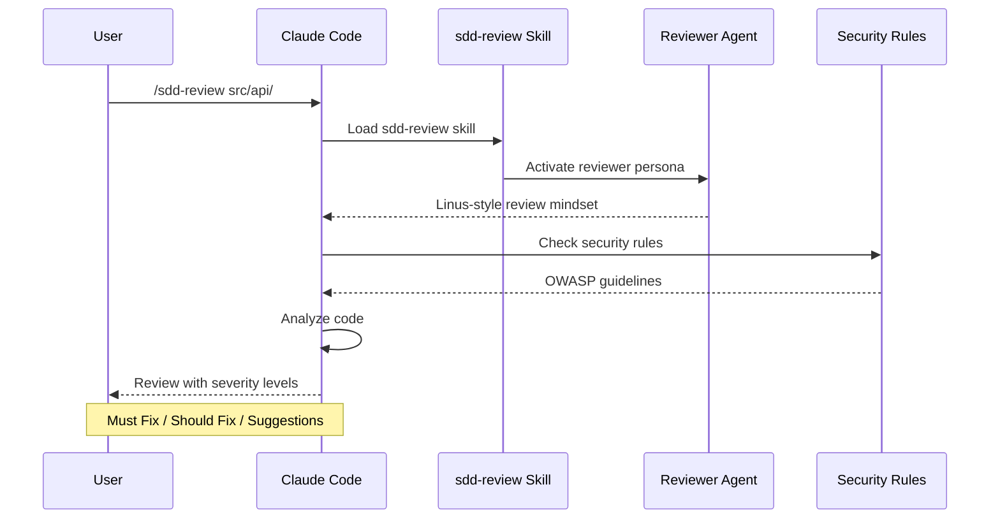
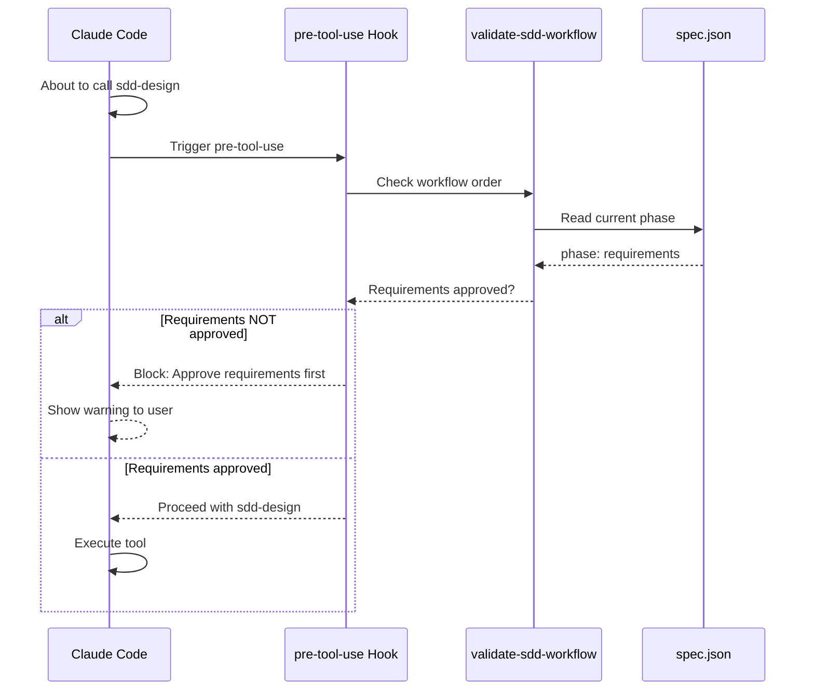
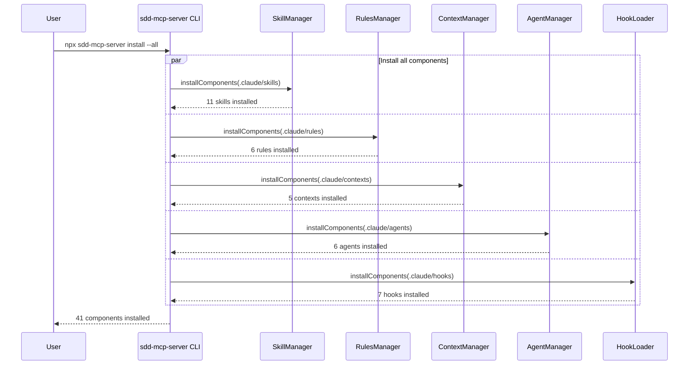

# SDD-MCP Workflow

This document explains how the SDD-MCP plugin system works with Claude Code.

## Architecture Overview

```
┌─────────────────────────────────────────────────────────────────┐
│                        Claude Code                               │
├─────────────────────────────────────────────────────────────────┤
│                                                                  │
│  ┌──────────┐  ┌──────────┐  ┌──────────┐  ┌──────────┐        │
│  │  Rules   │  │ Contexts │  │  Agents  │  │  Hooks   │        │
│  │ (always) │  │  (mode)  │  │ (persona)│  │ (events) │        │
│  └────┬─────┘  └────┬─────┘  └────┬─────┘  └────┬─────┘        │
│       │             │             │             │               │
│       └─────────────┴──────┬──────┴─────────────┘               │
│                            │                                     │
│                    ┌───────▼───────┐                            │
│                    │    Skills     │                            │
│                    │ (/sdd-* cmds) │                            │
│                    └───────┬───────┘                            │
│                            │                                     │
├────────────────────────────┼────────────────────────────────────┤
│                            │                                     │
│                    ┌───────▼───────┐                            │
│                    │  MCP Server   │                            │
│                    │  (sdd-mcp)    │                            │
│                    └───────┬───────┘                            │
│                            │                                     │
│       ┌────────────────────┼────────────────────┐               │
│       │                    │                    │               │
│  ┌────▼────┐         ┌─────▼─────┐        ┌────▼────┐          │
│  │ Project │         │  Workflow │        │ Quality │          │
│  │  Init   │         │  Engine   │        │  Check  │          │
│  └─────────┘         └───────────┘        └─────────┘          │
│                                                                  │
└─────────────────────────────────────────────────────────────────┘
```

## Component Interaction Sequence

### 1. Session Start



### 2. SDD Workflow (Feature Development)



### 3. Code Review Flow



### 4. Pre-Tool Hook Flow



### 5. Component Installation



## Component Responsibilities

### Rules (Always Active)
```
rules/
├── coding-style.md    → TypeScript/JS conventions
├── testing.md         → TDD requirements
├── security.md        → OWASP guidelines
├── git-workflow.md    → Commit conventions
├── error-handling.md  → Error patterns
└── sdd-workflow.md    → Phase order enforcement
```

### Contexts (Mode-Specific)
```
contexts/
├── dev.md            → Implementation focus
├── review.md         → Quality focus
├── planning.md       → Architecture focus
├── security-audit.md → Threat focus
└── research.md       → Exploration focus
```

### Agents (Specialized Personas)
```
agents/
├── planner.md         → Roadmap & planning
├── architect.md       → System design
├── reviewer.md        → Code review (Linus-style)
├── implementer.md     → TDD implementation
├── security-auditor.md → Vulnerability assessment
└── tdd-guide.md       → Test-driven coaching
```

### Hooks (Event Automation)
```
hooks/
├── pre-tool-use/
│   ├── validate-sdd-workflow.md  → Enforce phase order
│   └── check-test-coverage.md    → TDD reminder
├── post-tool-use/
│   ├── update-spec-status.md     → Auto-update spec.json
│   └── log-tool-execution.md     → Audit logging
├── session-start/
│   └── load-project-context.md   → Load steering docs
└── session-end/
    ├── save-session-summary.md   → Session notes
    └── remind-uncommitted-changes.md → Git reminder
```

## Data Flow

```
User Request
     │
     ▼
┌─────────────┐     ┌─────────────┐
│   Hooks     │────▶│   Rules     │
│ (pre-tool)  │     │  (always)   │
└─────────────┘     └─────────────┘
     │                    │
     ▼                    ▼
┌─────────────┐     ┌─────────────┐
│  Context    │────▶│   Agent     │
│   (mode)    │     │  (persona)  │
└─────────────┘     └─────────────┘
     │                    │
     └────────┬───────────┘
              ▼
       ┌─────────────┐
       │   Skill     │
       │  (action)   │
       └─────────────┘
              │
              ▼
       ┌─────────────┐
       │ MCP Server  │
       │  (tools)    │
       └─────────────┘
              │
              ▼
       ┌─────────────┐
       │   Hooks     │
       │ (post-tool) │
       └─────────────┘
              │
              ▼
        Response
```

## Key Concepts

1. **Layered Guidance**: Each layer adds context without conflicting
2. **Event-Driven**: Hooks automate repetitive checks
3. **Phase Enforcement**: SDD workflow order is validated automatically
4. **Persona Switching**: Agents provide specialized expertise on demand
5. **Mode Awareness**: Contexts adjust behavior for different tasks
