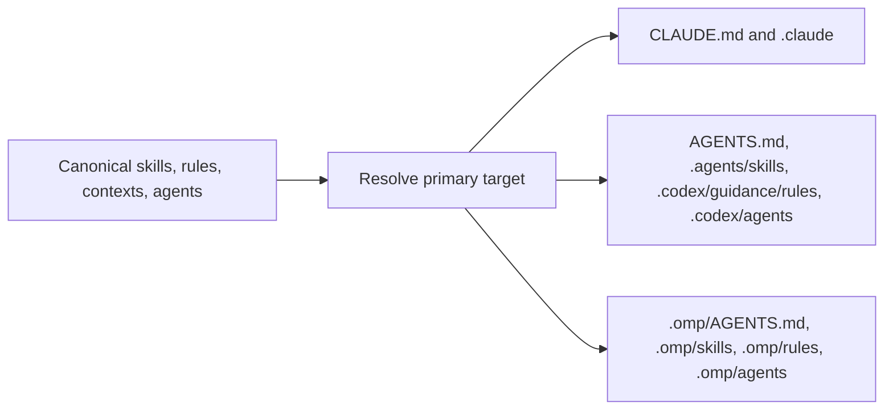
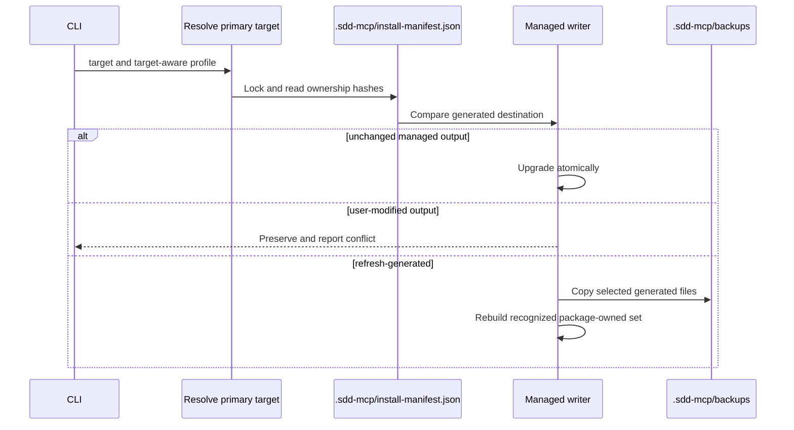

# SDD-MCP Workflow

SDD-MCP uses one durable workflow rendered for Claude Code, Codex, and Oh My Pi (OMP). Users operate manual-only phase Skills; the registered MCP runtime remains behind the Skill boundary.

## Start in the host

1. Install the target-native profile.
2. Reload or restart the host and accept project trust. Claude organization/project `ask` or `deny` rules can still take precedence.
3. Invoke the native Skill:

| Path | Claude Code | Codex | OMP |
|---|---|---|---|
| Small change | `/simple-task` | `$simple-task` | `/skill:simple-task` |
| Formal SDD | `/sdd-requirements <feature>` | `$sdd-requirements <feature>` | `/skill:sdd-requirements <feature>` |

Continue Formal SDD with the same host prefix for `sdd-design`, `sdd-tasks`, and `sdd-implement`. Do not call backend tools or paste workflow JSON; each Skill restores durable state and approved compact context.

## Formal phase flow


```mermaid
flowchart LR
    User --> Skill
    Skill --> MCP
    MCP --> Spec[".spec/specs/<feature>"]
```

The Skill-governed journey is:

1. Requirements resolves the feature. It initializes a named missing feature, presents clarification questions when needed, or resumes/selects incomplete work without relying on process memory.
2. Requirements creates and internally submits the canonical artifact. Deterministic validation must pass before the Skill asks the human to approve.
3. Design and tasks each load the latest approved compact context, create and submit their artifact, present validation, and ask a separate explicit approval question.
4. Tasks asks once whether test-case review is required. When enabled, confirmation of the presented cases is one human gate; tasks approval is another.
5. Implementation resumes persisted task state and records observed RED, GREEN, blocking, affected artifacts, and final verification internally.

Only an unambiguous affirmative response inside the active phase Skill can approve that exact revision. Host permission is not approval. Invoking a later Skill early presents the persisted blocker and makes no file change.

## Durable authority and continuation

`.spec/specs/<feature>/spec.json` is the sole workflow authority. Phase Markdown is human-readable governed input, while `context/handoff.md` is a bounded rebuildable cache. Skills load approved context by default. A failed or unapproved draft is loaded only explicitly in full mode for revision; it never leaks into later approved context.

Durable status determines the next action across sessions: submit or revise a phase, request approval/review, begin implementation, continue/select a task, report an artifact-drift blocker, or complete. Approved artifact drift blocks rather than silently overwriting the reviewed bytes. Implementation completion derives only from persisted task states, never chat output or task checkboxes.

## Responsibility boundary

| Layer | Owns |
|---|---|
| User | Goals, clarification, explicit test-review and phase-approval decisions |
| Skill | Method, artifact composition, concise validation presentation, human gates, and host-native invocation |
| MCP runtime | Feature identity, canonical writes, deterministic structure/traceability gates, revisions/hashes, approvals/checkpoints, task progress, recovery, and handoff |
| `.spec` | Durable workflow record and readable artifacts |

Target renderers add native invocation and model metadata only; they do not duplicate this choreography.

## Target-native guidance flow


```mermaid
flowchart LR
    Source[Canonical skills, rules, contexts, agents] --> Resolver[Resolve primary target]
    Resolver --> Claude[CLAUDE.md and .claude]
    Resolver --> Codex[AGENTS.md, .agents/skills, .codex/guidance/rules, .codex/agents]
    Resolver --> OMP[.omp/AGENTS.md, .omp/skills, .omp/rules, .omp/agents]
```

| Component | Claude Code | Codex | OMP |
|---|---|---|---|
| Skills | `.claude/skills` | `.agents/skills` | `.omp/skills` |
| Rules | `.claude/rules` with `paths` | `.codex/guidance/rules` pointers | `.omp/rules` with `globs`, `alwaysApply: false` |
| Agents | `.claude/agents` | `.codex/agents` | `.omp/agents` |
| Contexts | `.claude/contexts` | `.codex/guidance/contexts` | `.omp/contexts` |

Rules and references are progressive guidance, not always-on workflow authority. Mandatory checks stay in the invoked skill and MCP state machine.

Claude Code and Codex may install only their supported lifecycle/hook integration. OMP does **not** execute packaged Markdown as a hook: no native executable OMP hook is claimed, and an explicit `--target omp --hooks` request fails.

## Model execution during a skill

### Claude Code

The invoked skill applies its routed model in the current turn: Opus for high-level work and Sonnet for implementation/TDD. It does not spawn a second specialist merely to change models.

### Codex

Implementation/TDD runs on Sol/medium. A high-level skill may request one generated Sol/xhigh custom advisor. The child cannot nest, and unavailable delegation records a single fallback before inline continuation. The repository cannot force a model switch when the host does not honor the request.

### Oh My Pi

OMP runs high-level work inline on the Sol/medium parent by default. Automatic Sol/xhigh children are intentionally disabled because real A/B runs increased median cost. A user may explicitly opt into one native `.omp/agents` Sol/xhigh advisor; that child has no spawn capability and no nesting or retry path. Implementation, TDD, and simple tasks also remain inline unless at least two independent slices are truly dispatched concurrently.

## Installation and migration flow


```mermaid
sequenceDiagram
    participant CLI
    participant Resolver as Resolve primary target
    participant Manifest as .sdd-mcp/install-manifest.json
    participant Writer as Managed writer
    participant Backup as .sdd-mcp/backups
    CLI->>Resolver: target and target-aware profile
    Resolver->>Manifest: Lock and read ownership hashes
    Manifest->>Writer: Compare generated destination
    alt unchanged managed output
        Writer->>Writer: Upgrade atomically
    else user-modified output
        Writer-->>CLI: Preserve and report conflict
    else refresh-generated
        Writer->>Backup: Copy selected generated files
        Writer->>Writer: Rebuild recognized package-owned set
    end
```

The two operator journeys are deliberately different:

- **New project:** install the chosen target with the lean or full profile and do not pass `--refresh-generated`; runtime registration is mandatory.
- **Upgrade from sdd-mcp 3.x or 4.x:** preserve the repository, select the host that will execute v5, and run one `--refresh-generated` migration. Review `.sdd-mcp/backups/` and conflicts; omit the flag on subsequent v5 updates.

An old OMP-via-Codex project must select `--target omp`. Codex TOML agents remain preserved but are never treated as executable OMP agents. See [INSTALL-GUIDE.md](INSTALL-GUIDE.md) for target mapping and commands.

## Integrator/runtime reference: exact inventory

For protocol integrators and runtime maintainers, the sole packaged runtime exposes exactly 16 tools. End users invoke phase Skills instead:

`sdd-init`, `sdd-requirements`, `sdd-design`, `sdd-tasks`, `sdd-implement`, `sdd-status`, `sdd-approve`, `sdd-review-test-cases`, `sdd-quality-check`, `sdd-context-load`, `sdd-template-render`, `sdd-steering`, `sdd-steering-custom`, `sdd-validate-design`, `sdd-validate-gap`, and `sdd-spec-impl`.

The offline `context-report` command is not an MCP tool.

These names are a transport contract, not the user workflow.

## Measurement and verified outcomes

```bash
npx sdd-mcp-server context-report --before ./before --after ./after
```

Repository `estimatedTokens` uses `ceil(characters / 4)` and must not be read as actual tokenizer usage. The report separately shows static installed bytes, invoked/dynamic payload, provider usage/cost, and unknown host payload.

Static fresh-install reductions were **74.37% Codex**, **83.21% OMP**, and **95.64% Claude Code**. Comparable three-run provider median cost improved **6.83% simple**, **11.79% medium**, **14.09% requirements**, **9.12% design**, **1.74% security**, and **1.87% repeated context**; all task-quality checks passed.
