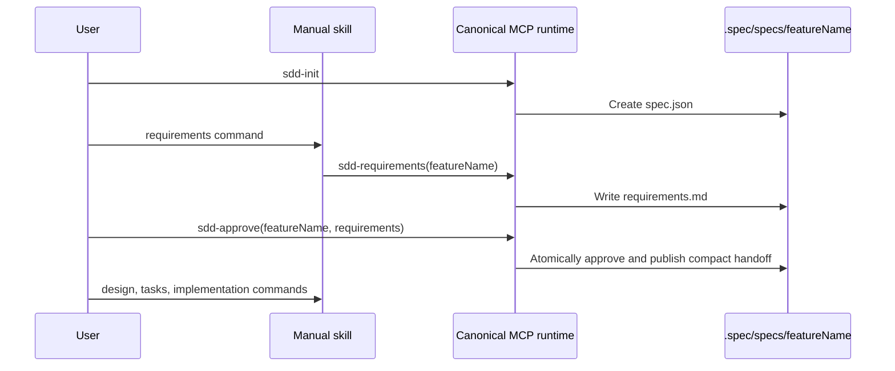
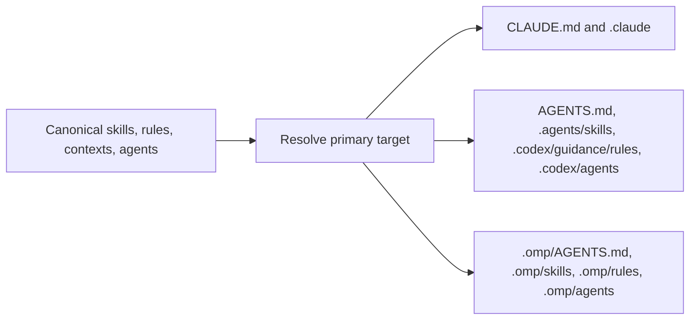
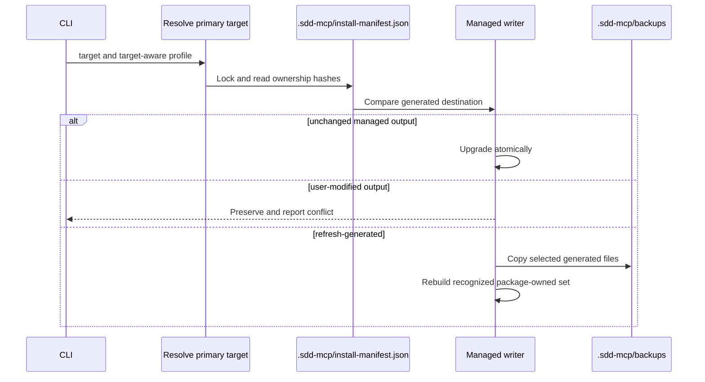

# SDD-MCP Workflow

SDD-MCP uses one durable workflow and renders its guidance for Claude Code, Codex, and Oh My Pi (OMP). Skills are manual-only; MCP tools own state changes.

## Choose the development path

| Path | Claude Code | Codex | OMP |
|---|---|---|---|
| Small change | `/simple-task` | `$simple-task` | `/skill:simple-task` |
| Formal SDD | `/sdd-requirements` | `$sdd-requirements` | `/skill:sdd-requirements` |

Continue formal work with the same host prefix for `sdd-design`, `sdd-tasks`, and `sdd-implement`. Manual invocation prevents stateful workflow skills from activating from incidental prose.

## Formal phase flow


```mermaid
sequenceDiagram
    participant User
    participant Skill as Manual skill
    participant MCP as Canonical MCP runtime
    participant Disk as .spec/specs/featureName
    User->>MCP: sdd-init
    MCP->>Disk: Create spec.json
    User->>Skill: requirements command
    Skill->>MCP: sdd-requirements(featureName)
    MCP->>Disk: Write requirements.md
    User->>MCP: sdd-approve(featureName, requirements)
    MCP->>Disk: Atomically approve and publish compact handoff
    User->>Skill: design, tasks, implementation commands
```

The governed order is:

1. `sdd-init` returns the canonical `featureName`.
2. Generate requirements and approve them.
3. Generate design and approve it.
4. Generate tasks.
5. If configured, call `sdd-review-test-cases { featureName }`.
6. Approve tasks.
7. Implement and run focused verification.

Disk `spec.json` is authoritative; phase approval and test review do not depend on an in-memory project identifier. v4 public calls use `featureName`, not `projectId`.

## Continue with bounded context

Load the latest approved context:

```json
{ "featureName": "checkout", "mode": "compact" }
```

The result includes `sourceFingerprint`, the exact-response `fingerprint`, effective phase, status, payload estimates, omissions, and content. Save `fingerprint`, then avoid resending unchanged content:

```json
{
  "featureName": "checkout",
  "mode": "compact",
  "ifNoneMatch": "<previous fingerprint>"
}
```

An exact match returns `cacheStatus: "not-modified"` without `content`. Changing mode, budget, phase, or inclusion options changes the response fingerprint even if sources are unchanged.

| Mode | Default maximum | Selection |
|---|---:|---|
| compact | 2,048 `estimatedTokens` | bounded workflow state and concise approved-phase context |
| standard | 4,096 `estimatedTokens` | broader approved-phase context |
| full | 16,384 `estimatedTokens` | selected raw documents; overflow is an error |

Before any approval, compact/standard return bounded `init` state and “generate requirements” as the next action; they do not include draft bodies. An explicitly requested unapproved phase is rejected except for full mode with explicit `includeUnapproved: true`.

Only the canonical compact cache is stored at `.spec/specs/<featureName>/context/handoff.md`. It is rebuildable and never workflow authority. A committed approval whose handoff publication fails remains valid and reports `pending-regeneration`; the next context load repairs it.

## Target-native guidance flow


```mermaid
flowchart LR
    Source[Canonical skills, rules, contexts, agents] --> Resolver[Resolve primary target]
    Resolver --> Claude[CLAUDE.md and .claude]
    Resolver --> Codex[AGENTS.md, .agents/skills, .codex/guidance/rules, .codex/agents]
    Resolver --> OMP[.omp/AGENTS.md, .omp/skills, .omp/rules, .omp/agents]
```

| Component | Claude Code | Codex | OMP |
|---|---|---|---|
| Skills | `.claude/skills` | `.agents/skills` | `.omp/skills` |
| Rules | `.claude/rules` with `paths` | `.codex/guidance/rules` pointers | `.omp/rules` with `globs`, `alwaysApply: false` |
| Agents | `.claude/agents` | `.codex/agents` | `.omp/agents` |
| Contexts | `.claude/contexts` | `.codex/guidance/contexts` | `.omp/contexts` |

Rules and references are progressive guidance, not always-on workflow authority. Mandatory checks stay in the invoked skill and MCP state machine.

Claude Code and Codex may install only their supported lifecycle/hook integration. OMP does **not** execute packaged Markdown as a hook: no native executable OMP hook is claimed, and an explicit `--target omp --hooks` request fails.

## Model execution during a skill

### Claude Code

The invoked skill applies its routed model in the current turn: Opus for high-level work and Sonnet for implementation/TDD. It does not spawn a second specialist merely to change models.

### Codex

Implementation/TDD runs on Sol/medium. A high-level skill may request one generated Sol/xhigh custom advisor. The child cannot nest, and unavailable delegation records a single fallback before inline continuation. The repository cannot force a model switch when the host does not honor the request.

### Oh My Pi

OMP runs high-level work inline on the Sol/medium parent by default. Automatic Sol/xhigh children are intentionally disabled because real A/B runs increased median cost. A user may explicitly opt into one native `.omp/agents` Sol/xhigh advisor; that child has no spawn capability and no nesting or retry path. Implementation, TDD, and simple tasks also remain inline unless at least two independent slices are truly dispatched concurrently.

## Installation and migration flow


```mermaid
sequenceDiagram
    participant CLI
    participant Resolver as Resolve primary target
    participant Manifest as .sdd-mcp/install-manifest.json
    participant Writer as Managed writer
    participant Backup as .sdd-mcp/backups
    CLI->>Resolver: target and target-aware profile
    Resolver->>Manifest: Lock and read ownership hashes
    Manifest->>Writer: Compare generated destination
    alt unchanged managed output
        Writer->>Writer: Upgrade atomically
    else user-modified output
        Writer-->>CLI: Preserve and report conflict
    else refresh-generated
        Writer->>Backup: Copy selected generated files
        Writer->>Writer: Rebuild recognized package-owned set
    end
```

The two operator journeys are deliberately different:

- **New project:** install the chosen target with the lean or full profile and do not pass `--refresh-generated`.
- **Upgrade from sdd-mcp 3.x:** preserve the current repository state, select the host that will execute v4, and run one `--refresh-generated` migration. Review `.sdd-mcp/backups/` and conflicts before removing old files; omit the flag on subsequent v4 updates.

An old OMP-via-Codex project must select `--target omp`. Codex TOML agents remain preserved but are never treated as executable OMP agents. See [INSTALL-GUIDE.md](INSTALL-GUIDE.md) for target mapping and commands.

## Runtime inventory

The sole packaged runtime exposes exactly 16 tools:

`sdd-init`, `sdd-requirements`, `sdd-design`, `sdd-tasks`, `sdd-implement`, `sdd-status`, `sdd-approve`, `sdd-review-test-cases`, `sdd-quality-check`, `sdd-context-load`, `sdd-template-render`, `sdd-steering`, `sdd-steering-custom`, `sdd-validate-design`, `sdd-validate-gap`, and `sdd-spec-impl`.

The offline `context-report` command is not an MCP tool.

## Measurement and verified outcomes

```bash
npx sdd-mcp-server context-report --before ./before --after ./after
```

Repository `estimatedTokens` uses `ceil(characters / 4)` and must not be read as actual tokenizer usage. The report separately shows static installed bytes, invoked/dynamic payload, provider usage/cost, and unknown host payload.

Static fresh-install reductions were **74.37% Codex**, **83.21% OMP**, and **95.64% Claude Code**. Comparable three-run provider median cost improved **6.83% simple**, **11.79% medium**, **14.09% requirements**, **9.12% design**, **1.74% security**, and **1.87% repeated context**; all task-quality checks passed.
