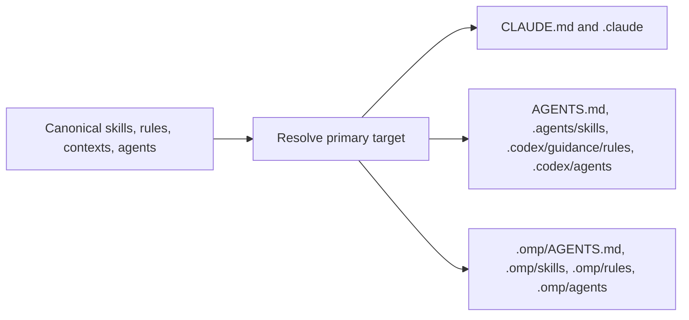
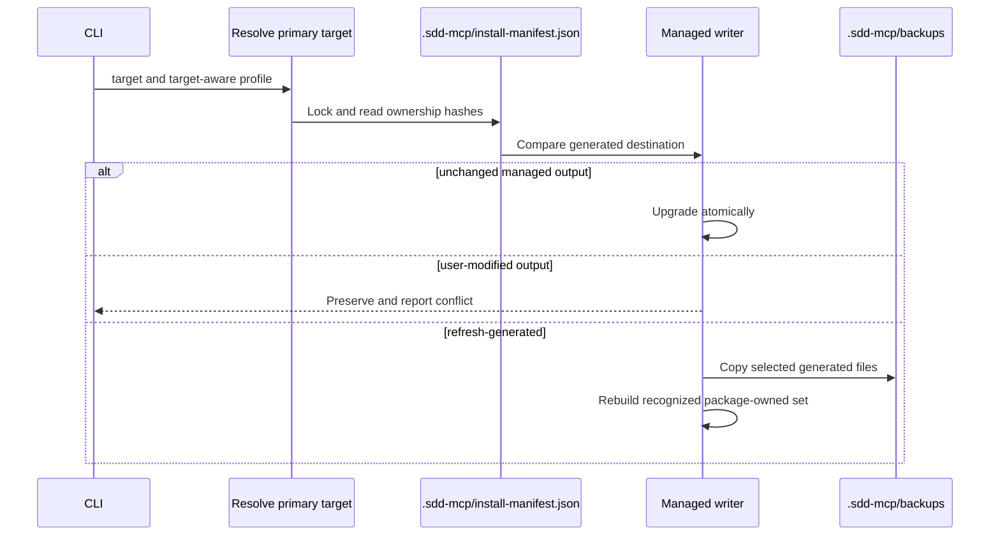

# SDD-MCP Workflow

SDD-MCP uses one durable workflow. It renders that workflow for Claude Code, Codex, and Oh My Pi (OMP). Users run manual-only workflow Skills. The registered MCP runtime stays behind the Skill boundary.

## Start in the host

1. Run `npx -y sdd-mcp-server@latest setup-global` once per local user or OMP profile. From a POSIX source checkout, run `./bootstrap.sh` instead. You can select one host with `--target claude-code`, `--target codex`, or `--target omp`. A repository-scoped or team-scoped `install` is an alternative, not a required second step. If you want personal scope, do not run `install` in the `sdd-mcp-server` checkout.
2. Reload or restart the host, and accept project trust. Claude organization or project `ask` or `deny` rules can still take precedence.
3. Invoke the native Skill:

| Path | Claude Code | Codex | OMP |
|---|---|---|---|
| Small change | `/simple-task` | `$simple-task` | `/skill:simple-task` |
| Formal SDD | `/sdd-requirements <feature>` | `$sdd-requirements <feature>` | `/skill:sdd-requirements <feature>` |

Continue Formal SDD with the same host prefix for `sdd-design`, `sdd-tasks`, and `sdd-implement`. Do not call backend tools. Do not paste workflow JSON. Each Skill restores durable state and approved compact context.

Personal runtime files are `~/.claude.json` (or `<CLAUDE_CONFIG_DIR>/.claude.json`), `~/.codex/config.toml` (or `<CODEX_HOME>/config.toml`), and `<omp config path>/mcp.json`. Personal Skills live in `~/.claude/skills/` (or `<CLAUDE_CONFIG_DIR>/skills/`), `~/.agents/skills/`, and `<omp config path>/skills/`. OMP defaults to `~/.omp/agent`. OMP needs one setup per named profile. Global setup leaves Claude permissions unchanged. It installs no repository guidance and no agents. Its scope is the local machine or profile. It is not Claude cloud or Cowork Skill distribution.

Verify with `claude mcp get sdd-mcp`, `codex mcp get sdd-mcp`, or OMP `/mcp test sdd-mcp`. Run the command from a directory that is not this package checkout and has no project `sdd-mcp` entry. Project entries in `.mcp.json`, `.codex/config.toml`, and `.omp/mcp.json` win. Remove only that entry yourself. In this checkout, the pinned `npx` command exits with `sh: sdd-mcp-server: command not found`. This lasts until `node_modules/.bin/sdd-mcp-server` executes `node ./sdd-entry.js`. Skill-name precedence is a separate host rule. See the [installation guide](INSTALL-GUIDE.md#one-time-personal-setup) for exact overrides, OMP fallback, ownership, and safe reruns.

The runtime resolves project operations from a nonempty `CLAUDE_PROJECT_DIR`. Otherwise it uses its working directory. Specifications and approvals stay in that project's `.spec`. Personal setup does not create workflow state in the user configuration directory.

## Formal phase flow


```mermaid
flowchart LR
    User --> Skill
    Skill --> MCP
    MCP --> Spec[".spec/specs/<feature>"]
```

The Skill-governed journey is:

1. Requirements resolves the feature. It initializes a named missing feature. It presents clarification questions when needed. Otherwise it resumes or selects incomplete work without relying on process memory.
2. Requirements creates the canonical artifact and submits it internally. Deterministic validation must pass before the Skill asks the human to approve.
3. Design and tasks each load the latest approved compact context. Each creates and submits its artifact and presents validation. Each then asks a separate explicit approval question.
4. Tasks asks once whether test-case review is required. When test-case review is enabled, the human confirms the presented cases. That confirmation is one human gate. Tasks approval is another.
5. Implementation resumes persisted task state. It internally records observed RED, GREEN, blocking, affected artifacts, and final verification.

Only an unambiguous affirmative response inside the active phase Skill can approve that exact revision. Host permission is not approval. If you invoke a later Skill early, it presents the persisted blocker. It makes no file change.

Requirement metadata accepts inline values. It also accepts values on lines below their labels. For example, a numbered list may follow `**Acceptance Criteria:**` on later lines. The runtime accepts this documented shape starting in 5.0.1. See the [Requirements Reference](../skills/sdd-requirements/REFERENCE.md) for the complete document shape.

## Durable authority and continuation

`.spec/specs/<feature>/spec.json` is the sole workflow authority. Phase Markdown is human-readable governed input. `context/handoff.md` is a bounded, rebuildable cache. Skills load approved context by default. A Skill loads a failed or unapproved draft only when asked, in full mode, for revision. That draft never leaks into later approved context.

Durable status decides the next action across sessions. The next action can be to submit or revise a phase, request approval or review, or begin implementation. It can also be to continue or select a task, report an artifact-drift blocker, or complete. Approved artifact drift blocks the workflow. The runtime does not silently overwrite the reviewed bytes. Implementation completion comes only from persisted task states. It never comes from chat output or task checkboxes.

## Responsibility boundary

| Layer | Owns |
|---|---|
| User | Goals, clarification, explicit test-review and phase-approval decisions |
| Skill | Method, artifact composition, concise validation presentation, human gates, and host-native invocation |
| MCP runtime | Feature identity, canonical writes, deterministic structure/traceability gates, revisions/hashes, approvals/checkpoints, task progress, recovery, and handoff |
| `.spec` | Durable workflow record and readable artifacts |

Target renderers add only native invocation and model metadata. They do not duplicate this choreography.

## Output clarity skill

`output-clarity-ladder` is the only model-invocable skill. The model applies it to explanation, summary, and teaching replies. The user does not type a command. It has no agent route, so it always runs in the current reply.

- **Writing (default):** about 80% of the way to ASD-STE100. Write one idea per sentence. Name the actor. Use one word for one thing. Keep every number and condition.
- **Ladder:** writing, then a diagram, then a self-contained HTML page, then an explainer video. The model moves up only when the next format makes the same facts easier to understand. A requested artifact, such as an email or code, keeps its form.
- **Languages:** `SKILL.md` holds the English rules. `references/` holds Japanese (`ja`) and Traditional Chinese (`zh-TW`) guidance. Any other language uses the English rules. The reply uses the user's language.
- **Limits:** there is no approved-word check. The output is not ASD-STE100 conformant. The skill never asks the user to paste a secret into chat.

MCP runtime blockers and errors follow the same writing rules. Each message has at most 2 sentences. Each sentence has at most 25 words. When the user can act, the message gives a next action. Error codes do not change.

## Optional project-native guidance flow


```mermaid
flowchart LR
    Source[Canonical skills, rules, contexts, agents] --> Resolver[Resolve primary target]
    Resolver --> Claude[CLAUDE.md and .claude]
    Resolver --> Codex[AGENTS.md, .agents/skills, .codex/guidance/rules, .codex/agents]
    Resolver --> OMP[.omp/AGENTS.md, .omp/skills, .omp/rules, .omp/agents]
```

| Component | Claude Code | Codex | OMP |
|---|---|---|---|
| Skills | `.claude/skills` | `.agents/skills` | `.omp/skills` |
| Rules | `.claude/rules` with `paths` | `.codex/guidance/rules` pointers | `.omp/rules` with `globs`, `alwaysApply: false` |
| Agents | `.claude/agents` | `.codex/agents` | `.omp/agents` |
| Contexts | `.claude/contexts` | `.codex/guidance/contexts` | `.omp/contexts` |

Rules and references are progressive guidance. They are not always-on workflow authority. Mandatory checks stay in the invoked skill and the MCP state machine.

Claude Code and Codex may install only their supported lifecycle or hook integration. OMP does **not** execute packaged Markdown as a hook. This project claims no native executable OMP hook. An explicit `--target omp --hooks` request fails.

## Model execution during a skill

### Claude Code

The invoked skill applies its resolved model and effort in the current turn. The defaults are `claude-opus-5-5`/high for high-level work and `claude-sonnet-5-5`/medium for implementation and TDD. Installed `.claude/agents` subagents receive the same per-role metadata. The skill does not spawn a specialist only to change models.

### Codex

Implementation and TDD run inline on the parent. Generated agent definitions default to `gpt-6-luna`/medium. They do not switch that parent. Review and security skills may use one generated custom agent (default `gpt-6-sol`/xhigh). The user must choose it once per session first. The child cannot nest. When delegation is unavailable, the skill records a single fallback and continues inline. The repository cannot force a model switch when the host does not honor the request.

### Oh My Pi

OMP runs invoked SDD skills inline. The installed `.omp/extensions/sdd-skill-routing.js` switches the parent to the role's configured model and thinking level for that skill turn. The defaults are `openai-codex/gpt-6-sol`/xhigh and `openai-codex/gpt-6-luna`/medium. The extension then restores the prior route. Automatic high-effort children are intentionally disabled, because real A/B runs increased median cost. A user may explicitly opt into one generated `.omp/agents` advisor. That child has no spawn capability, no nesting path, and no retry path. Implementation, TDD, and simple tasks also stay inline. They change only when at least two independent slices are truly dispatched concurrently.

Pass `--model-roles <file>` at install time to override SDD role models and efforts per host. The installer validates the YAML before it writes. Generic host agents stay unchanged. OMP requires project extension discovery. If the model is unavailable, the invocation aborts instead of falling back. See [MODEL-ROUTING.md](MODEL-ROUTING.md#configure-installed-model-routes) for the six role keys, selector syntax, and the Claude/Codex/OMP execution boundaries.

## Installation and migration flow


```mermaid
sequenceDiagram
    participant CLI
    participant Resolver as Resolve primary target
    participant Manifest as .sdd-mcp/install-manifest.json
    participant Writer as Managed writer
    participant Backup as .sdd-mcp/backups
    CLI->>Resolver: target and target-aware profile
    Resolver->>Manifest: Lock and read ownership hashes
    Manifest->>Writer: Compare generated destination
    alt unchanged managed output
        Writer->>Writer: Upgrade atomically
    else user-modified output
        Writer-->>CLI: Preserve and report conflict
    else refresh-generated
        Writer->>Backup: Copy selected generated files
        Writer->>Writer: Rebuild recognized package-owned set
    end
```

The two operator journeys are different on purpose:

- **New project:** install the chosen target with the lean or full profile. Do not pass `--refresh-generated`. Runtime registration is mandatory.
- **Upgrade from sdd-mcp 3.x or 4.x:** keep the repository. Select the host that will execute v5. Run one `--refresh-generated` migration. Review `.sdd-mcp/backups/` and conflicts. Omit the flag on later v5 updates.

An old OMP-via-Codex project must select `--target omp`. The installer preserves Codex TOML agents. It never treats them as executable OMP agents. See [INSTALL-GUIDE.md](INSTALL-GUIDE.md) for target mapping and commands.

## Integrator/runtime reference: exact inventory

This section is for protocol integrators and runtime maintainers. The sole packaged runtime exposes exactly 16 tools. End users invoke phase Skills instead:

`sdd-init`, `sdd-requirements`, `sdd-design`, `sdd-tasks`, `sdd-implement`, `sdd-status`, `sdd-approve`, `sdd-review-test-cases`, `sdd-quality-check`, `sdd-context-load`, `sdd-template-render`, `sdd-steering`, `sdd-steering-custom`, `sdd-validate-design`, `sdd-validate-gap`, and `sdd-spec-impl`.

The offline `context-report` command is not an MCP tool.

These names are a transport contract. They are not the user workflow.

## Measurement and verified outcomes

```bash
npx sdd-mcp-server context-report --before ./before --after ./after
```

Repository `estimatedTokens` uses `ceil(characters / 4)`. Do not read it as actual tokenizer usage. The report shows these separately: static installed bytes, invoked or dynamic payload, provider usage and cost, and unknown host payload.

Static fresh-install reductions were **74.37% Codex**, **83.21% OMP**, and **95.64% Claude Code**. Comparable three-run provider median cost improved **6.83% simple**, **11.79% medium**, **14.09% requirements**, **9.12% design**, **1.74% security**, and **1.87% repeated context**; all task-quality checks passed.
